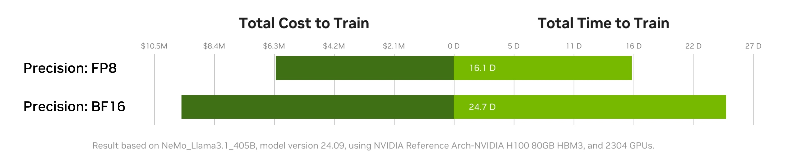

..
    Copyright (c) 2022-2025, NVIDIA CORPORATION & AFFILIATES. All rights reserved.

    See LICENSE for license information.

|License|

Transformer Engine
==================

`Quickstart <#examples>`_ | `Installation <#installation>`_ | `User Guide <https://docs.nvidia.com/deeplearning/transformer-engine/user-guide/index.html>`_ | `Examples <https://github.com/NVIDIA/TransformerEngine/tree/main/examples>`_ | `FP8 Convergence <#fp8-convergence>`_ | `Integrations <#integrations>`_ | `Release notes <https://docs.nvidia.com/deeplearning/transformer-engine/documentation-archive.html>`_

Latest News
===========
* [03/2025] `Stable and Scalable FP8 Deep Learning Training on Blackwell | GTC 2025 <https://www.nvidia.com/en-us/on-demand/session/gtc25-s72778/>`_
* [03/2025] `Measure and Improve AI Workload Performance with NVIDIA DGX Cloud Benchmarking <https://developer.nvidia.com/blog/measure-and-improve-ai-workload-performance-with-nvidia-dgx-cloud-benchmarking/>`_

* [02/2025] `Understanding the Language of Life's Biomolecules Across Evolution at a New Scale with Evo 2 <https://developer.nvidia.com/blog/understanding-the-language-of-lifes-biomolecules-across-evolution-at-a-new-scale-with-evo-2/>`_
* [02/2025] `NVIDIA DGX Cloud Introduces Ready-To-Use Templates to Benchmark AI Platform Performance <https://developer.nvidia.com/blog/nvidia-dgx-cloud-introduces-ready-to-use-templates-to-benchmark-ai-platform-performance/>`_
* [01/2025] `Continued Pretraining of State-of-the-Art LLMs for Sovereign AI and Regulated Industries with iGenius and NVIDIA DGX Cloud <https://developer.nvidia.com/blog/continued-pretraining-of-state-of-the-art-llms-for-sovereign-ai-and-regulated-industries-with-igenius-and-nvidia-dgx-cloud/>`_

`Previous News <#previous-news>`_

What is Transformer Engine?
===========================
.. overview-begin-marker-do-not-remove

Transformer Engine (TE) is a library for accelerating Transformer models on NVIDIA GPUs, including
using 8-bit floating point (FP8) precision on Hopper, Ada, and Blackwell GPUs, to provide better
performance with lower memory utilization in both training and inference. TE provides a collection
of highly optimized building blocks for popular Transformer architectures and an automatic mixed
precision-like API that can be used seamlessly with your framework-specific code. TE also includes a
framework agnostic C++ API that can be integrated with other deep learning libraries to enable FP8
support for Transformers.

As the number of parameters in Transformer models continues to grow, training and inference for
architectures such as BERT, GPT and T5 become very memory and compute-intensive. Most deep learning
frameworks train with FP32 by default. This is not essential, however, to achieve full accuracy for
many deep learning models. Using mixed-precision training, which combines single-precision (FP32)
with lower precision (e.g. FP16) format when training a model, results in significant speedups with
minimal differences in accuracy as compared to FP32 training. With Hopper GPU
architecture FP8 precision was introduced, which offers improved performance over FP16 with no
degradation in accuracy. Although all major deep learning frameworks support FP16, FP8 support is
not available natively in frameworks today.

TE addresses the problem of FP8 support by providing APIs that integrate with popular Large Language
Model (LLM) libraries. It provides a Python API consisting of modules to easily build a Transformer
layer as well as a framework-agnostic library in C++ including structs and kernels needed for FP8
support. Modules provided by TE internally maintain scaling factors and other values needed for FP8
training, greatly simplifying mixed precision training for users.

Highlights
==========

* Easy-to-use modules for building Transformer layers with FP8 support
* Optimizations (e.g. fused kernels) for Transformer models
* Support for FP8 on NVIDIA Hopper, Ada, and Blackwell GPUs
* Support for optimizations across all precisions (FP16, BF16) on NVIDIA Ampere GPU architecture generations and later

Examples
========

PyTorch
^^^^^^^

.. code-block:: python

  import torch
  import transformer_engine.pytorch as te
  from transformer_engine.common import recipe

  # Set dimensions.
  in_features = 768
  out_features = 3072
  hidden_size = 2048

  # Initialize model and inputs.
  model = te.Linear(in_features, out_features, bias=True)
  inp = torch.randn(hidden_size, in_features, device="cuda")

  # Create an FP8 recipe. Note: All input args are optional.
  fp8_recipe = recipe.DelayedScaling(margin=0, fp8_format=recipe.Format.E4M3)

  # Enable autocasting for the forward pass
  with te.fp8_autocast(enabled=True, fp8_recipe=fp8_recipe):
      out = model(inp)

  loss = out.sum()
  loss.backward()

JAX
^^^

Flax
~~~~

.. code-block:: python

  import flax
  import jax
  import jax.numpy as jnp
  import transformer_engine.jax as te
  import transformer_engine.jax.flax as te_flax
  from transformer_engine.common import recipe

  BATCH = 32
  SEQLEN = 128
  HIDDEN = 1024

  # Initialize RNG and inputs.
  rng = jax.random.PRNGKey(0)
  init_rng, data_rng = jax.random.split(rng)
  inp = jax.random.normal(data_rng, [BATCH, SEQLEN, HIDDEN], jnp.float32)

  # Create an FP8 recipe. Note: All input args are optional.
  fp8_recipe = recipe.DelayedScaling(margin=0, fp8_format=recipe.Format.HYBRID)

  # Enable autocasting for the forward pass
  with te.fp8_autocast(enabled=True, fp8_recipe=fp8_recipe):
      model = te_flax.DenseGeneral(features=HIDDEN)

      def loss_fn(params, other_vars, inp):
        out = model.apply({'params':params, **other_vars}, inp)
        return jnp.mean(out)

      # Initialize models.
      variables = model.init(init_rng, inp)
      other_variables, params = flax.core.pop(variables, 'params')

      # Construct the forward and backward function
      fwd_bwd_fn = jax.value_and_grad(loss_fn, argnums=(0, 1))

      for _ in range(10):
        loss, (param_grads, other_grads) = fwd_bwd_fn(params, other_variables, inp)

For a more comprehensive tutorial, check out our `Quickstart Notebook <https://github.com/NVIDIA/TransformerEngine/blob/main/docs/examples/quickstart.ipynb>`_.

.. overview-end-marker-do-not-remove

Installation
============

System Requirements
^^^^^^^^^^^^^^^^^^^

* **Hardware:** Blackwell, Hopper, Grace Hopper/Blackwell, Ada, Ampere

* **OS:** Linux (official), WSL2 (limited support)

* **Software:**

  * CUDA: 12.1+ (Hopper/Ada/Ampere), 12.8+ (Blackwell) with compatible NVIDIA drivers
  * cuDNN: 9.3+
  * Compiler: GCC 9+ or Clang 10+ with C++17 support
  * Python: 3.12 recommended

* **Source Build Requirements:** CMake 3.18+, Ninja, Git 2.17+, pybind11 2.6.0+

* **Notes:** FP8 features require Compute Capability 8.9+ (Ada/Hopper/Blackwell)

Installation Methods
^^^^^^^^^^^^^^^^^^^^

Docker (Recommended)
^^^^^^^^^^^^^^^^^^^^
The quickest way to get started with Transformer Engine is by using Docker images on
`NVIDIA GPU Cloud (NGC) Catalog <https://catalog.ngc.nvidia.com/orgs/nvidia/containers/pytorch>`_.

For example to use the NGC PyTorch container interactively,

.. code-block:: bash

    docker run --gpus all -it --rm nvcr.io/nvidia/pytorch:25.04-py3

For example to use the NGC JAX container interactively,

.. code-block:: bash

    docker run --gpus all -it --rm nvcr.io/nvidia/jax:25.04-py3

Where 25.04 (corresponding to April 2025 release) is the container version.

**Benefits of using NGC containers:**

* All dependencies pre-installed with compatible versions and optimized configurations
* NGC PyTorch 23.08+ containers include FlashAttention-2

pip Installation
^^^^^^^^^^^^^^^^

**Prerequisites for pip installation:**

* A compatible C++ compiler
* CUDA Toolkit with cuDNN and NVCC (NVIDIA CUDA Compiler) installed

To install the latest stable version with pip:

.. code-block:: bash

    # For PyTorch integration
    pip install --no-build-isolation transformer_engine[pytorch]
    
    # For JAX integration
    pip install --no-build-isolation transformer_engine[jax]
    
    # For both frameworks
    pip install --no-build-isolation transformer_engine[pytorch,jax]

Alternatively, install directly from the GitHub repository:

.. code-block:: bash

    pip install git+https://github.com/NVIDIA/TransformerEngine.git@stable

When installing from GitHub, you can explicitly specify frameworks using the environment variable:

.. code-block:: bash

    NVTE_FRAMEWORK=pytorch,jax pip install git+https://github.com/NVIDIA/TransformerEngine.git@stable

Source Installation
^^^^^^^^^^^^^^^^^^^

`See the installation guide <https://docs.nvidia.com/deeplearning/transformer-engine/user-guide/installation.html#installation-from-source>`_

Environment Variables
^^^^^^^^^^^^^^^^^^^^^
These environment variables can be set before installation to customize the build process:

* **CUDA_PATH**: Path to CUDA installation
* **CUDNN_PATH**: Path to cuDNN installation
* **CXX**: Path to C++ compiler
* **NVTE_FRAMEWORK**: Comma-separated list of frameworks to build for (e.g., ``pytorch,jax``)
* **MAX_JOBS**: Limit number of parallel build jobs (default varies by system)
* **NVTE_BUILD_THREADS_PER_JOB**: Control threads per build job

Compiling with FlashAttention
^^^^^^^^^^^^^^^^^^^^^^^^^^^^^
Transformer Engine supports both FlashAttention-2 and FlashAttention-3 in PyTorch for improved performance. FlashAttention-3 was added in release v1.11 and is prioritized over FlashAttention-2 when both are present in the environment.

You can verify which FlashAttention version is being used by setting these environment variables:

.. code-block:: bash

    NVTE_DEBUG=1 NVTE_DEBUG_LEVEL=1 python your_script.py

It is a known issue that FlashAttention-2 compilation is resource-intensive and requires a large amount of RAM (see `bug <https://github.com/Dao-AILab/flash-attention/issues/358>`_), which may lead to out of memory errors during the installation of Transformer Engine. Please try setting **MAX_JOBS=1** in the environment to circumvent the issue.

.. troubleshooting-begin-marker-do-not-remove

Troubleshooting
^^^^^^^^^^^^^^^

**Common Issues and Solutions:**

1. **ABI Compatibility Issues:**

   * **Symptoms:** ``ImportError`` with undefined symbols when importing transformer_engine
   * **Solution:** Ensure PyTorch and Transformer Engine are built with the same C++ ABI setting. Rebuild PyTorch from source with matching ABI.
   * **Context:** If you're using PyTorch built with a different C++ ABI than your system's default, you may encounter these undefined symbol errors. This is particularly common with pip-installed PyTorch outside of containers.

2. **Missing Headers or Libraries:**

   * **Symptoms:** CMake errors about missing headers (``cudnn.h``, ``cublas_v2.h``, ``filesystem``, etc.)
   * **Solution:** Install missing development packages or set environment variables to point to correct locations:

     .. code-block:: bash

         export CUDA_PATH=/path/to/cuda
         export CUDNN_PATH=/path/to/cudnn

   * If CMake can't find a C++ compiler, set the ``CXX`` environment variable.
   * Ensure all paths are correctly set before installation.

3. **Build Resource Issues:**

   * **Symptoms:** Compilation hangs, system freezes, or out-of-memory errors
   * **Solution:** Limit parallel builds:

     .. code-block:: bash

         MAX_JOBS=1 NVTE_BUILD_THREADS_PER_JOB=1 pip install ...

4. **Verbose Build Logging:**

   * For detailed build logs to help diagnose issues:

     .. code-block:: bash

         cd transformer_engine
         pip install -v -v -v --no-build-isolation .

.. troubleshooting-end-marker-do-not-remove

Breaking Changes
================

v1.7: Padding mask definition for PyTorch
^^^^^^^^^^^^^^^^^^^^^^^^^^^^^^^^^^^^^^^^^
In an effort to unify the definition and usage of the attention mask across all three frameworks in Transformer Engine, the padding mask has changed from `True` meaning inclusion of the corresponding position in attention to exclusion of that position in our PyTorch implementation. Since v1.7, all attention mask types follow the same definition where `True` means masking out the corresponding position and `False` means including that position in attention calculation.

An example of this change is,

.. code-block:: bash

    # for a batch of 3 sequences where `a`s, `b`s and `c`s are the useful tokens
    # and `0`s are the padding tokens,
    [a, a, a, 0, 0,
     b, b, 0, 0, 0,
     c, c, c, c, 0]
    # the padding mask for this batch before v1.7 is,
    [ True,  True,  True, False, False,
      True,  True, False, False, False,
      True,  True,  True,  True, False]
    # and for v1.7 onwards it should be,
    [False, False, False,  True,  True,
     False, False,  True,  True,  True,
     False, False, False, False,  True]

FP8 Convergence
===============

FP8 has been tested extensively across different model architectures and configurations and we found **no significant difference** between FP8 and BF16 training loss curves. FP8 has also been validated for accuracy on downstream LLM tasks (e.g. LAMBADA and WikiText). Below are examples of models tested for convergence across different frameworks.

+------------+------------------+---------------------------------------------------------------------------------------------------------+
| Model      | Framework        | Source                                                                                                  |
+============+==================+=========================================================================================================+
| T5-770M    |  JAX/T5x         | https://github.com/NVIDIA/JAX-Toolbox/tree/main/rosetta/rosetta/projects/t5x#convergence-and-performance|
+------------+------------------+---------------------------------------------------------------------------------------------------------+
| MPT-1.3B   |  Mosaic Composer | https://www.mosaicml.com/blog/coreweave-nvidia-h100-part-1                                              |
+------------+------------------+---------------------------------------------------------------------------------------------------------+
| GPT-5B     |  JAX/Paxml       | https://github.com/NVIDIA/JAX-Toolbox/tree/main/rosetta/rosetta/projects/pax#h100-results               |
+------------+------------------+---------------------------------------------------------------------------------------------------------+
| GPT-5B     |  NeMo Framework  | Available on request                                                                                    |
+------------+------------------+---------------------------------------------------------------------------------------------------------+
| LLama2-7B  |  Alibaba Pai     | https://mp.weixin.qq.com/s/NQT0uKXLbXyh5031zBdeBQ                                                       |
+------------+------------------+---------------------------------------------------------------------------------------------------------+
| T5-11B     |  JAX/T5x         | Available on request                                                                                    |
+------------+------------------+---------------------------------------------------------------------------------------------------------+
| MPT-13B    |  Mosaic Composer | https://www.databricks.com/blog/turbocharged-training-optimizing-databricks-mosaic-ai-stack-fp8         |
+------------+------------------+---------------------------------------------------------------------------------------------------------+
| GPT-22B    |  NeMo Framework  | Available on request                                                                                    |
+------------+------------------+---------------------------------------------------------------------------------------------------------+
| LLama2-70B |  Alibaba Pai     | https://mp.weixin.qq.com/s/NQT0uKXLbXyh5031zBdeBQ                                                       |
+------------+------------------+---------------------------------------------------------------------------------------------------------+
| GPT-175B   |  JAX/Paxml       | https://github.com/NVIDIA/JAX-Toolbox/tree/main/rosetta/rosetta/projects/pax#h100-results               |
+------------+------------------+---------------------------------------------------------------------------------------------------------+

Integrations
============

Transformer Engine has been integrated with popular LLM frameworks such as:

* `DeepSpeed <https://github.com/deepspeedai/DeepSpeed/blob/master/tests/unit/runtime/half_precision/test_fp8.py>`_
* `Hugging Face Accelerate <https://huggingface.co/docs/accelerate/main/en/usage_guides/low_precision_training#configuring-transformersengine>`_
* `Lightning <https://github.com/Lightning-AI/lightning/issues/17172>`_
* `MosaicML Composer <https://github.com/mosaicml/composer/releases/tag/v0.13.1>`_
* `NVIDIA JAX Toolbox <https://github.com/NVIDIA/JAX-Toolbox>`_
* `NVIDIA Megatron-LM <https://github.com/NVIDIA/Megatron-LM>`_
* `NVIDIA NeMo Framework <https://github.com/NVIDIA/NeMo-Megatron-Launcher>`_
* `Amazon SageMaker Model Parallel Library <https://docs.aws.amazon.com/sagemaker/latest/dg/model-parallel-core-features-v2-tensor-parallelism.html>`_
* `Levanter <https://github.com/stanford-crfm/levanter>`_
* `GPT-NeoX <https://github.com/EleutherAI/gpt-neox>`_
* `Hugging Face Nanotron <https://github.com/huggingface/nanotron>`_ - Coming soon!
* `Colossal-AI <https://github.com/hpcaitech/ColossalAI>`_ - Coming soon!
* `PeriFlow <https://github.com/friendliai/periflow-python-sdk>`_ - Coming soon!

Contributing
============

We welcome contributions to Transformer Engine! To contribute to Transformer Engine and make pull requests,
follow the guidelines outlined in the `<CONTRIBUTING.rst>`_ guide.

Papers
======

* `Attention original paper <https://proceedings.neurips.cc/paper/2017/file/3f5ee243547dee91fbd053c1c4a845aa-Paper.pdf>`_
* `Megatron-LM tensor parallel <https://arxiv.org/pdf/1909.08053.pdf>`_
* `Megatron-LM sequence parallel <https://arxiv.org/pdf/2205.05198.pdf>`_
* `FP8 Formats for Deep Learning <https://arxiv.org/abs/2209.05433>`_

Videos
======

* `Stable and Scalable FP8 Deep Learning Training on Blackwell | GTC 2025 <https://www.nvidia.com/en-us/on-demand/session/gtc24-s62457/>`__
* `Blackwell Numerics for AI | GTC 2025 <https://www.nvidia.com/en-us/on-demand/session/gtc25-s72458/>`_
* `Building LLMs: Accelerating Pretraining of Foundational Models With FP8 Precision | GTC 2025 <https://www.nvidia.com/gtc/session-catalog/?regcode=no-ncid&ncid=no-ncid&tab.catalogallsessionstab=16566177511100015Kus&search=zoho#/session/1726152813607001vnYK>`_
* `From FP8 LLM Training to Inference: Language AI at Scale | GTC 2025 <https://www.nvidia.com/en-us/on-demand/session/gtc25-s72799/>`_
* `What's New in Transformer Engine and FP8 Training | GTC 2024 <https://www.nvidia.com/en-us/on-demand/session/gtc24-s62457/>`_
* `FP8 Training with Transformer Engine | GTC 2023 <https://www.nvidia.com/en-us/on-demand/session/gtcspring23-s51393>`_
* `FP8 for Deep Learning | GTC 2023 <https://www.nvidia.com/en-us/on-demand/session/gtcspring23-s52166/>`_
* `Inside the Hopper Architecture | GTC 2022 <https://www.nvidia.com/en-us/on-demand/session/gtcspring22-s42663/>`_

.. |License| image:: https://img.shields.io/badge/License-Apache%202.0-blue.svg
   :target: https://opensource.org/licenses/Apache-2.0

Previous News
=============

* [11/2024] `Developing a 172B LLM with Strong Japanese Capabilities Using NVIDIA Megatron-LM <https://developer.nvidia.com/blog/developing-a-172b-llm-with-strong-japanese-capabilities-using-nvidia-megatron-lm/>`_
* [11/2024] `How FP8 boosts LLM training by 18% on Amazon SageMaker P5 instances <https://aws.amazon.com/blogs/machine-learning/how-fp8-boosts-llm-training-by-18-on-amazon-sagemaker-p5-instances/>`_
* [11/2024] `Efficiently train models with large sequence lengths using Amazon SageMaker model parallel <https://aws.amazon.com/blogs/machine-learning/efficiently-train-models-with-large-sequence-lengths-using-amazon-sagemaker-model-parallel/>`_
* [09/2024] `Reducing AI large model training costs by 30% requires just a single line of code from FP8 mixed precision training upgrades <https://company.hpc-ai.com/blog/reducing-ai-large-model-training-costs-by-30-requires-just-a-single-line-of-code-from-fp8-mixed-precision-training-upgrades>`_
* [05/2024] `Accelerating Transformers with NVIDIA cuDNN 9 <https://developer.nvidia.com/blog/accelerating-transformers-with-nvidia-cudnn-9/>`_
* [03/2024] `Turbocharged Training: Optimizing the Databricks Mosaic AI stack with FP8 <https://www.databricks.com/blog/turbocharged-training-optimizing-databricks-mosaic-ai-stack-fp8>`_
* [03/2024] `FP8 Training Support in SageMaker Model Parallelism Library <https://docs.aws.amazon.com/sagemaker/latest/dg/model-parallel-release-notes.html>`_
* [12/2023] `New NVIDIA NeMo Framework Features and NVIDIA H200 <https://developer.nvidia.com/blog/new-nvidia-nemo-framework-features-and-nvidia-h200-supercharge-llm-training-performance-and-versatility/>`_

.. image:: docs/examples/H200-NeMo-performance.png
  :width: 600
  :alt: H200

* [11/2023] `Inflection-2: The Next Step Up <https://inflection.ai/inflection-2>`_
* [11/2023] `Unleashing The Power Of Transformers With NVIDIA Transformer Engine <https://lambdalabs.com/blog/unleashing-the-power-of-transformers-with-nvidia-transformer-engine>`_
* [11/2023] `Accelerating PyTorch Training Workloads with FP8 <https://towardsdatascience.com/accelerating-pytorch-training-workloads-with-fp8-5a5123aec7d7>`_
* [09/2023] `Transformer Engine added to AWS DL Container for PyTorch Training <https://github.com/aws/deep-learning-containers/pull/3315>`_
* [06/2023] `Breaking MLPerf Training Records with NVIDIA H100 GPUs <https://developer.nvidia.com/blog/breaking-mlperf-training-records-with-nvidia-h100-gpus/>`_
* [04/2023] `Benchmarking Large Language Models on NVIDIA H100 GPUs with CoreWeave (Part 1) <https://www.mosaicml.com/blog/coreweave-nvidia-h100-part-1>`_
