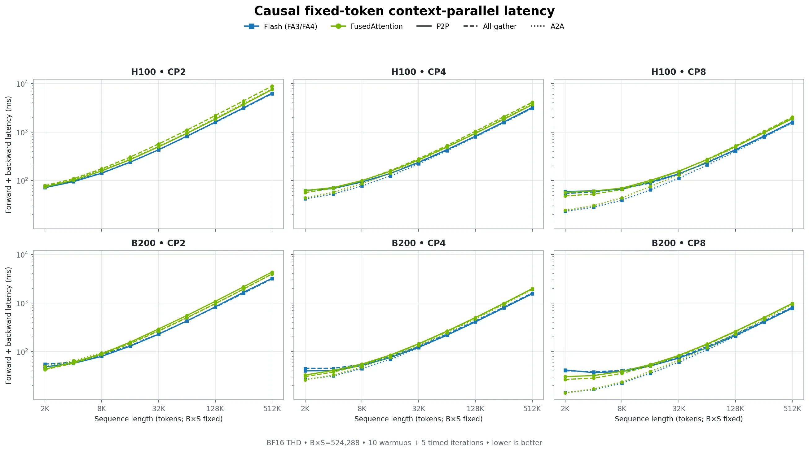
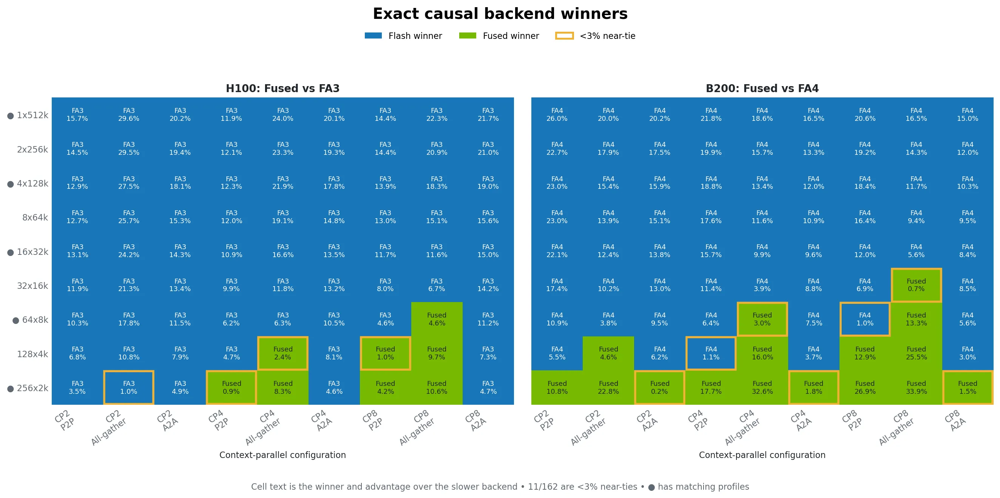
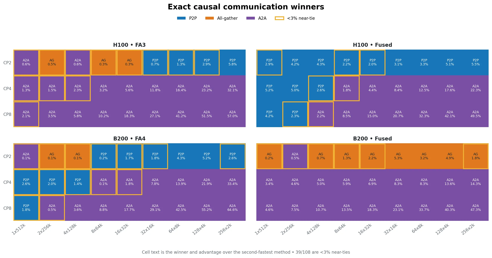
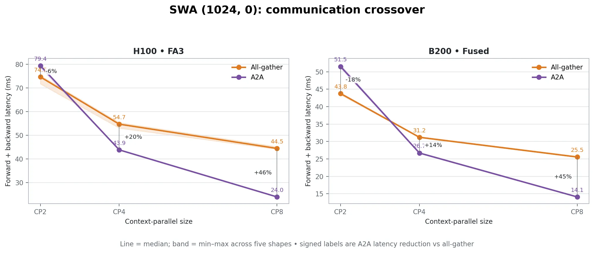
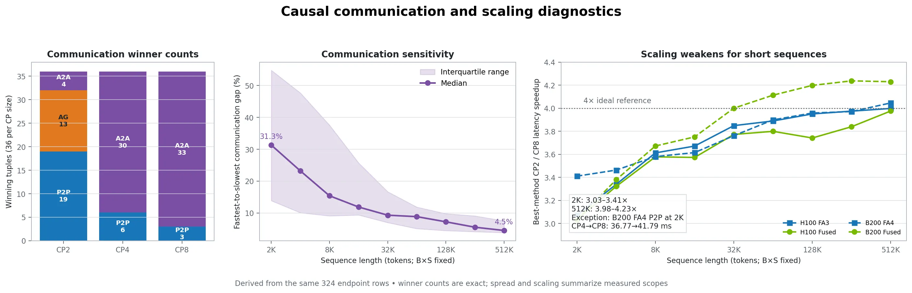
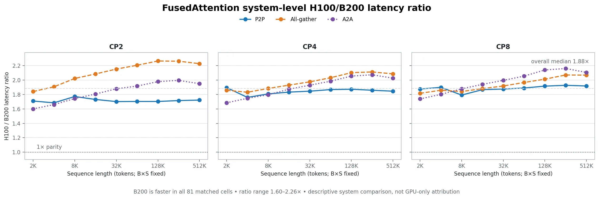
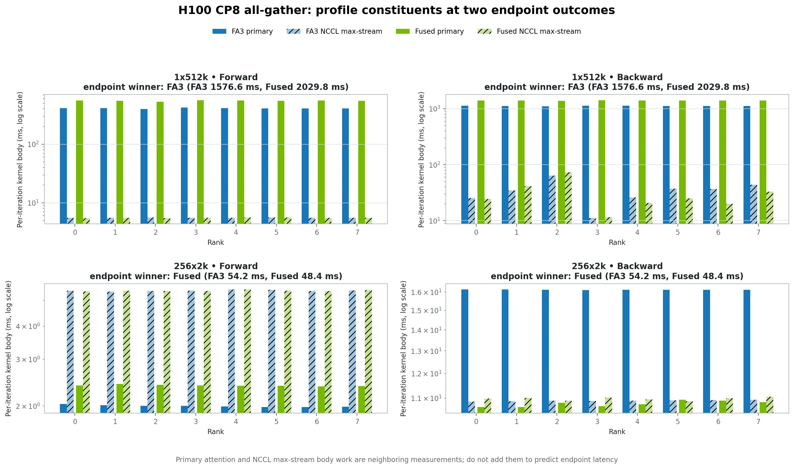

# Choosing Context-Parallel Attention Paths from Measured Data

Context-parallel attention has three communication choices and, on current
NVIDIA GPUs, more than one attention backend. The fastest combination changes
with GPU generation, CP size, communication method, and sequence shape. Our
measurements therefore support a small lookup-based selector—not one universal
backend rule.

## Measurement scope

The causal study covers BF16 THD training on H100 and B200 with CP sizes 2, 4,
and 8; P2P, all-gather, and all-to-all (A2A); FusedAttention and FA3/FA4; and
nine uniform shapes with fixed `B*S=524288`. Each endpoint value is forward plus
backward latency after 10 warmups and 5 timed iterations. The 324 endpoint rows
form 81 same-hardware backend pairs on each GPU.

The SWA snapshot covers five fixed-token shapes with a fixed left window of
1024. It has only H100/FA3 and B200/FusedAttention data and uses an older worker
path, so it supports communication-method observations but not a Fused-versus-
Flash or causal-versus-SWA comparison.

### Benchmarked configurations

The main causal matrix uses BF16 training with packed THD inputs, 32 query
heads, 8 grouped-query heads, head dimension 128, and causal masking. It keeps
`B*S=524288` tokens fixed across nine shapes: `1x512k`, `2x256k`, `4x128k`,
`8x64k`, `16x32k`, `32x16k`, `64x8k`, `128x4k`, and `256x2k`. Every shape was
run at CP2, CP4, and CP8 with P2P, all-gather, and A2A. H100 compares
FusedAttention with FA3; B200 compares FusedAttention with FA4. Each value is
forward plus backward latency from a CP-only run with 10 warmups and 5 timed
iterations.

The SWA subset uses the first five fixed-token shapes and a causal left window
of `(1024, 0)`. It covers CP2/4/8 with all-gather and A2A for H100/FA3 and
B200/FusedAttention; P2P does not support this windowed path. Matching causal
profiles are available for alternating shapes (`1x512k`, `4x128k`, `16x32k`,
`64x8k`, and `256x2k`) and are used only to explain endpoint behavior. These
matrices are measured samples, not the limits of supported CP configurations.



*Figure 1. Causal endpoint latency across the 324-row fixed-token grid. Color
identifies the attention backend and line style identifies the communication
method. Both axes are logarithmic.*

## What the measurements say

### Flash leads most causal points, but Fused wins selected short shapes

FA3 wins 73 of 81 H100 pairs, including every measured A2A pair. FA4 wins 65
of 81 B200 pairs. The Fused wins cluster in short-sequence P2P and all-gather
cases and become more common at larger CP sizes.

The cleanest observed intersection is `uniform_256x2k`: every profiled H100/B200
CP4/CP8 P2P and all-gather pair favors Fused end to end and has a lower Fused
primary-attention body. This is an observed point, not a sequence-length cutoff.
At `uniform_64x8k`, the winner is mixed; H100 CP2 P2P and all-gather remain
Flash-winning throughout the measured grid.



*Figure 2. Exact backend winner and advantage for every causal tuple. Gold
outlines mark differences below 3%; bullets mark the five shapes with matching
profiles.*

The winner label is not equally strong in every cell. Eleven of the 162 pairs
differ by less than 3%, including five below 1%. We retain the lower measured
value as the observed winner, but treat these cells as **near ties—rerun before
making a durable recommendation**. The 3% marker is a reporting convention,
not a confidence interval.

### A2A becomes more attractive as CP grows

Communication choice is backend- and shape-dependent at CP2. Across the 36
hardware/backend/shape tuples at each CP size, the winning communication counts
are P2P 19, all-gather 13, and A2A 4 at CP2; A2A 30 and P2P 6 at CP4; and A2A
33 and P2P 3 at CP8. All-gather wins no causal cell at CP4 or CP8 in this grid.
A2A wins every fixed-token row at CP4/8 for H100/FA3 and
B200/FusedAttention; the other two hardware/backend combinations retain a few
P2P wins. This makes A2A the first CP4/8 candidate to benchmark, not a universal
replacement for endpoint comparison. Communication winners can also be close:
39 of 108 selections lead the second-fastest method by less than 3%.



*Figure 3. Exact communication winner and advantage over the second-fastest
method for every causal tuple. Gold outlines mark differences below 3%.*

Backend choice within A2A is also unusually consistent. FA3 wins all 27 H100
causal pairs. FA4 wins 24 of 27 B200 pairs; Fused wins only the three
`uniform_256x2k` cells, by 0.18%--1.84%. Thus Flash is the first A2A backend
candidate in this measured family, while the B200 2k results remain near ties.

For the available SWA runs, P2P is unsupported. All-gather leads A2A at CP2,
while A2A leads at CP4 and CP8 on both measured backend/hardware pairs. Runtime
is nearly flat across the five shapes because both total tokens and window size
are fixed: the largest within-series max/min ratio is 1.05. At CP2, A2A is
4.9%--9.5% slower than all-gather on H100/FA3 and 17.7%--18.3% slower on
B200/Fused. At CP4, A2A is 17.5%--20.5% and 14.4%--14.9% faster, respectively;
at CP8 its advantage grows to 45.6%--46.9% and 44.5%--45.1%. These are
communication observations within each measured scope, not a cross-hardware or
Fused-versus-Flash comparison.



*Figure 4. Median SWA latency and min–max range across five fixed-token shapes;
signed labels show A2A latency reduction relative to all-gather. The panels use
different hardware/backend pairs and must not be read as a backend or hardware
comparison.*

### Short sequences expose overhead and diminishing scale

Fixed tokens do not mean fixed dense-attention work: halving sequence length
halves the leading `B*S^2` term in this matrix. Latency follows that reduction
more closely on long sequences and then flattens. The final `128x4k` to
`256x2k` step has a median 17.3% latency reduction across 36 matched series,
ranging from a 28.3% reduction to a 13.7% regression. The regression is
B200/FA4 CP8 P2P, which rises from 36.77 ms to 41.79 ms.

As compute shrinks, communication choice becomes proportionally more important:
the median gap between the fastest and slowest communication methods grows from
4.5% at `1x512k` to 31.3% at `256x2k`. Scaling also becomes less ideal. Using
the best communication method independently at CP2 and CP8, `1x512k` improves
by 3.98x--4.23x across the four hardware/backend scopes, while `256x2k`
improves by only 3.03x--3.41x. More CP is therefore not automatically better
for a fixed short shape and communication method.



*Figure 5. Exact communication-winner counts, the median and interquartile
communication spread, and best-method CP2-to-CP8 speedup. The callout preserves
the one non-monotonic CP4-to-CP8 P2P series.*

### A descriptive hardware comparison

B200 FusedAttention is faster than H100 FusedAttention in all 81 matched
causal cells. The H100/B200 latency ratio ranges from 1.60x to 2.26x, with a
1.88x median. This is a useful platform-level observation under the recorded
environments, not attribution to the GPU alone or a portable hardware speedup
factor.



*Figure 6. H100/B200 FusedAttention endpoint ratio for all 81 matched causal
cells. This compares the recorded systems and software environments; it does
not isolate GPU architecture.*

### Profiles explain decisions; they do not replace endpoint timing

Across 50 comparable profiled causal P2P/all-gather cells, the direction of the
primary compute-body ratio agrees with the endpoint winner in 46 cells. Four
contradictions are enough to rule out selecting a backend from compute kernels
alone. NCCL bodies are also not elapsed communication latency: CP4/CP8 P2P uses
multiple overlapping streams, so the visualizer reports the busiest stream as
a concurrency-aware work proxy.

The practical rule is therefore to choose from exact paired end-to-end latency,
then use primary compute, communication, and helper-kernel views to explain the
result. Adding those kernel-body bars does not reconstruct endpoint latency.



*Figure 7. Primary attention and NCCL max-stream body work for a long-sequence
FA3 endpoint win and a short-sequence Fused endpoint win. Forward and backward
use separate panels and logarithmic scales. Neighboring bars are not additive.*

## A small decision procedure

1. Match the complete tuple: GPU, workload and window, dtype/layout, CP size,
   communication method, and shape.
2. If an exact causal backend pair exists, return the lower end-to-end latency.
   On H100 compare Fused with FA3; on B200 compare Fused with FA4. Tag a result
   below 3% as **near tie—rerun** rather than a durable recommendation.
3. Choose communication from exact endpoint measurements too. For a new run,
   the current grid suggests testing P2P and all-gather first at CP2, and A2A
   first at CP4/8, while retaining all methods allowed by the workload. Treat a
   communication lead below 3% as a near tie too.
4. For the measured SWA scopes, use all-gather as the first CP2 communication
   candidate and A2A as the first CP4/8 candidate. SWA backend choice remains
   **unknown—benchmark both** because there is no same-hardware Fused/Flash pair.
5. If any workload dimension changes or the tuple is missing, return
   **unknown—benchmark both**.
6. Inspect a matching profile only as an explanation of the measured winner.

For exploration, short CP4/CP8 P2P or all-gather workloads are reasonable places
to benchmark Fused first. This prioritization hint must not override an exact
lookup or turn an unmeasured neighbor into a recommendation.

## Running one benchmark or profile

Benchmark aliases are defined in
`tests/pytorch/attention/benchmark_cp.py`. For example, this runs the fixed-token
`64x8k` BF16 THD training case with CP8 and A2A:

```bash
NVTE_CP_BENCH_ONLY=1 NVTE_NVTX_ENABLED=0 \
torchrun --standalone --nproc-per-node=8 \
  tests/pytorch/attention/run_attention_with_cp.py \
  dtype=bf16 model=uniform_64x8k qkv_format=thd \
  kernel_backend=FusedAttention cp_comm_type=a2a \
  thd_seqlen_pattern=max benchmark=5 log_level=WARNING
```

The rank-zero `CP_BENCH_RESULT` JSON line reports each iteration's rank-max
latency and their mean. Input-leaf construction, rank synchronization, and the
result-reduction collective are outside the timed samples. Use an Nsight Systems
CUDA-profiler-API capture around the same command to consume the phase-level
`transformer_engine.cp.*` NVTX ranges. Benchmark mode intentionally supports
FP16 and BF16 only in this change.

## Limitations and next measurements

- The current endpoint values are single five-iteration summaries without
  repeat-based confidence intervals; near-ties need reruns.
- The 3% near-tie label is an operational review threshold, not a measured
  variance bound.
- SWA lacks same-hardware Fused/Flash pairs and matching CP-only execution.
- Only five of nine causal shapes have matching profile summaries.
- B200/FA4 CP2 legacy compute bars mix primary and helper scope and should not
  enter primary-only comparisons until normalized.
- The H100/B200 ratio compares complete measured systems and software
  environments; it does not isolate architectural contribution.
