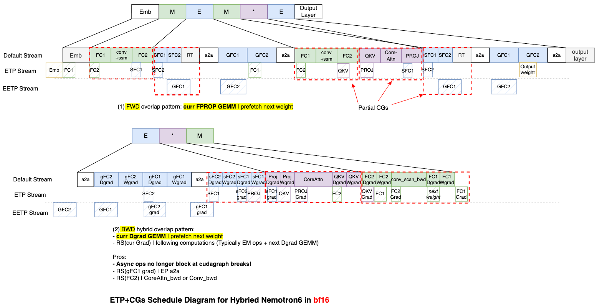

# Extended Tensor Parallelism (ETP)

## Overview

Extended Tensor Parallelism (ETP) is a **light-weight**, **high-performance** and **memory-efficient** distributed training strategy implemented in TransformerEngine. It shards weight tensors across an ETP process group and reconstructs them on-demand via async all-gather, enabling training of larger models without sacrificing throughput by overlapping communication with computation.

ETP applies to any TE module that wraps a `Linear` layer: `Linear`, `LayerNormLinear`, `LayerNormMLP` (for dense models), and `GroupedLinear` (for MoE models). When used with `GroupedLinear`, ETP provides additional batched coalesced all-gather support for gathering multiple expert weights in a single NCCL operation.

ETP supports all TE low-precision formats (FP8, MXFP8, NVFP4) with a **quantize-then-gather** strategy: each rank quantizes only its local shard before the all-gather, so wire bandwidth scales with the quantized size (0.5× for FP8, 0.25× for NVFP4) rather than the full BF16 weight.

---

## Performance

TODO(shiqingf): add performance for Ultra model in nvfp4.

----

## Features

### User-Visible Features

| Feature | Description |
|---|---|
| **Weight sharding** | Weights sharded 1/N across ETP group along `out_features`, reducing per-GPU VRAM |
| **Async prefetch** | Next layer's weight all-gather overlaps with current layer's GEMM in both forward (prefetches `next_w`) and backward (prefetches `prev_w`); controlled by `ETPConfig.weight_prefetch` |
| **NVFP4 support** | Full 4-bit quantized all-gather with interleaved-format post-processing |
| **FP8 / MXFP8 support** | Quantized shards with ETP-group amax reduction |
| **Routed expert support** | Batched coalesced all-gather for all experts in a MoE layer (GroupedLinear) |
| **Composable with TP/SP** | Orthogonal to tensor parallelism and sequence parallelism |
| **CUDA Graphs compatible** | ETP is compatible with CUDA Graphs. |
| **Debug naming** | `tag_etp_params_with_names(model)` populates human-readable names on every `ETPShardedParam`; the prefetch-link table is printed atomically at the start of the second forward pass |

### Implementation Mechanisms

| Mechanism | Description |
|---|---|
| **Alignment padding** | Shards padded to `ETPConfig.pad_for_alignment × etp_size` rows at construction via `get_padded_shard()`; only last rank carries padding (`is_padded_last_rank`); padding stripped in `_strip_padding()` both post-gather (before GEMM) and post-reduce-scatter (before wgrad accumulation) |
| **Fine-grained weight scheduling** | Each weight has its own `ETPWeightState` lifecycle and is scheduled independently via a doubly-linked list (`next_w`/`prev_w`), enabling per-weight AG/RS overlap at single-weight granularity |
| **Separate AG and RS state** | All-gather state (`state`) and reduce-scatter state (`rs_state`) are tracked independently per param, allowing forward and backward async ops to proceed without interference |
| **Dedicated CUDA streams** | AG and RS run on separate global CUDA streams (`AG_STREAM`, `RS_STREAM`), decoupled from the default compute stream; completion is signaled back via per-param CUDA events (`ag_event`, `rs_event`) that the compute stream waits on before consuming the result |
| **Ticket-based buffer cache** | `ETPWeightCache` assigns persistent tickets via `reserve()`; buffers are lazily allocated on `get()` and returned to the pool on `release()`; `clear()` drops all buffers while keeping tickets valid for lazy re-allocation (used for CUDA Graph re-capture) |
| **Wgrad reduce-scatter** | Async reduce-scatter of weight gradients, deferred to overlap with next layer's wgrad RS; padding stripped and grad accumulated in `_finalize_wgrad()` |

---

## Design

### Core Idea

In standard Tensor Parallelism (TP), each GPU holds a shard of each weight and communicates activations. ETP goes one level deeper: **each weight is sharded along the `out_features` dimension (dim 0) across an ETP group of N GPUs**, so each GPU stores only 1/N of the weight. Before each GEMM, an all-gather reconstructs the full weight; after the backward GEMM, a reduce-scatter propagates the weight gradient back to the shards.

```
Standard column-parallel TP (TP=2, 2 GPUs, weight W of shape [K, M]):
  GPU0 owns W[:K/2, :]   (first half of out_features)
  GPU1 owns W[K/2:, :]   (second half of out_features)

ETP (on top of column-parallel TP, ETP=2 per TP rank, 4 GPUs):
  GPU0 (TP0, ETP0) owns W[:K/4, :]    (first quarter of out_features)
  GPU1 (TP0, ETP1) owns W[K/4:K/2, :] (second quarter of out_features)
  GPU2 (TP1, ETP0) owns W[K/2:3K/4, :]
  GPU3 (TP1, ETP1) owns W[3K/4:K, :]
```

ETP always shards along `out_features` regardless of the TP parallel mode (`column` or `row`). For `row` parallel mode, TP shards `in_features` while ETP shards `out_features`, making the two dimensions orthogonal.

ETP is composable with TP and Sequence Parallelism for `Linear`, `LayerNormLinear`, and `LayerNormMLP`. The `etp_group` process group is orthogonal to the `tp_group`, giving a 2D parallelism grid.


### Weight Sharding

#### Initialization

Every rank independently allocates and initializes the **full** weight tensor, then slices out its local portion — there is no broadcast or communication during construction.

```
te.Linear.__init__(out_features=F, in_features=K, etp_group=group)
│
├─ 1. Every rank: weight_tensor = torch.empty(F, K)   ← full weight, same shape on all ranks
│
├─ 2. reset_parameters()                              ← Kaiming-uniform init on every rank
│      identical seed ⇒ identical values on all ranks; slice is consistent without any comm
│
└─ 3. wrap_module_params_etp(self, weight_names, etp_group)
       │
       ├─ alignment  = pad_for_alignment(16) × etp_size
       │  pad_length = (alignment − F % alignment) % alignment
       │  shard_size = (F + pad_length) // etp_size
       │
       ├─ start = rank × shard_size
       │  end   = min((rank+1) × shard_size, F)   ← clips real rows for last rank
       │  shard = weight_tensor[start : end].clone()
       │
       ├─ ETPShardedParam(shard)
       │    .pad_length          = pad_length
       │    .is_padded_last_rank = (rank == etp_size−1 and pad_length > 0)
       │    .group               = etp_group
       │
       ├─ module._parameters["weight"] = etp_shard   ← replace nn.Parameter
       │
       └─ del weight_tensor                           ← full buffer freed
```

Example: `F=63, K=32, etp_size=4, pad_for_alignment=16`

```
alignment=64, pad_length=1, shard_size=16

rank 0: rows [ 0:16] → ETPShardedParam [16, 32]  pad_length=0  is_padded=False
rank 1: rows [16:32] → ETPShardedParam [16, 32]  pad_length=0  is_padded=False
rank 2: rows [32:48] → ETPShardedParam [16, 32]  pad_length=0  is_padded=False
rank 3: rows [48:63] → ETPShardedParam [15, 32]  pad_length=1  is_padded=True
```

#### Padding and strip flow

Padding is added **entering** each collective so all ranks contribute equal-sized chunks; it is stripped **exiting** each collective so downstream consumers see the real shape.

```
FORWARD
  local shard  [real_rows, K]                 (e.g. [15, 32] on last rank)
    └─ get_padded_shard()  →  [shard_size, K] (e.g. [16, 32]  zero row appended)
         └─ all-gather    →  [padded_F, K]   (e.g. [64, 32]  across etp_size ranks)
              └─ _strip_padding  →  [F, K]   (e.g. [63, 32]  ← weight seen by GEMM)
                   └─ GEMM  →  output [B, F]

BACKWARD  (wgrad path)
  wgrad [B, F]  (computed against stripped weight, so first dim is F not padded_F)
    └─ _reduce_scatter pads:  [F, K]  →  [padded_F, K]  (re-pads before RS so chunks are equal)
         └─ reduce-scatter   →  [shard_size, K]  per rank
              └─ _finalize_wgrad → _strip_padding  →  [real_rows, K]
                   └─ stored as param.grad  (matches local shard shape)
```

#### Wrapping call

```python
# Called in Linear/LayerNormLinear/LayerNormMLP/GroupedLinear __init__
if etp_group is not None:
    wrap_module_params_etp(self, self.weight_names, etp_group)
    del weight_tensor   # free the temporary full-weight buffer
```

For `GroupedLinear` (MoE), `wrap_module_params_etp` is called with `is_grouped=True`, which additionally sets `weight_list` on the first expert's `ETPShardedParam` so all experts' weights can be batched together in a single coalesced all-gather.

### State Machine

Each `ETPShardedParam` tracks two independent state machines: one for the all-gather (`state`) and one for the reduce-scatter (`rs_state`). Each uses the same four-state enum:

```
NONE ──────────► ASYNC_WAIT ──────────► DATA_READY ──────────► NONE
(shard only)    (AG/RS launched)       (AG/RS complete,        (consumed,
                                        result in cache)        back to shard)

NONE ─────────────────────────────────► DATA_READY_SYNC ──────► NONE
                                        (sync gather,           (consumed)
                                         result available)
```

The `DATA_READY_SYNC` state is used for on-demand synchronous gathers (cold start or when prefetch is disabled). `DATA_READY` is used after an async gather completes via `handle.wait()`.

Invalid transitions are guarded by `_set_state()` / `_set_rs_state()`.

### Class Diagram

```mermaid
classDiagram

    %% ── Enums ────────────────────────────────────────────────────────────────
    class ETPWeightState {
        <<enumeration>>
        NONE
        ASYNC_WAIT
        DATA_READY
        DATA_READY_SYNC
    }

    %% ── Config ───────────────────────────────────────────────────────────────
    class ETPConfig {
        <<dataclass>>
        +int pad_for_alignment
        +bool check_param_states
        +bool weight_prefetch
    }

    %% ── Core parameter class ─────────────────────────────────────────────────
    class ETPShardedParam {
        <<nn.Parameter subclass>>
        $ _pending_rs_weight : ETPShardedParam
        $ _first_weight_flag : bool
        $ _last_weight : ETPShardedParam
        $ _link_node_count : int
        $ _link_table_buffer : List[str]
        $ _link_table_flushed : bool
        +ETPWeightState state
        +ETPWeightState rs_state
        +int _ag_ticket_fwd
        +int _ag_ticket_bwd
        +int _rs_ticket
        +Event ag_event
        +Event rs_event
        +ETPShardHandle _prefetch_handle
        +ETPShardHandle _wgrad_rs_handle
        +callable _grad_accum_node
        +callable _grad_accum_hook
        +Quantizer _quantizer
        +bool did_cast_to_low_precision
        +QuantizedTensor quantized
        +int pad_length
        +bool is_padded_last_rank
        +bool prefetch_initialized
        +ETPShardedParam next_w
        +ETPShardedParam prev_w
        +bool is_routed_expert
        +int expert_idx
        +ProcessGroup group
        +List weight_list
        +Tensor wgrad_rs
        +bool fuse_wgrad_accumulation
        +str _debug_name
        +setup(weight_quantizer)
        +_weights() List
        +_set_state(new_state)
        +_set_rs_state(new_state)
        +_get_cache_key(dtype, fwd, reduce_scatter) tuple
        +_unsharded_shape_padded() tuple
        +_unsharded_shape() tuple
        +_sharded_padded_shape() tuple
        +get_padded_shard() Tensor
        +_strip_padding(tensor) Tensor
        +_quantize_if_needed(skip, flag)
        +_all_gather_weight(async_op, ...) tuple
        +_all_gather_weight_on_demand(fwd, ...) Tensor
        +_get_prefetched_weight(fwd, ...) Tensor
        +_wait_param_gather()
        +_wait_reduce_scatter()
        +all_gather_and_prefetch(fwd, ...) Tensor
        +all_gather_and_prefetch_bwd() Tensor
        +get_wgrad_tensor() Tensor
        +register_grad_accum_hook(node, hook)
        +_finalize_wgrad(param, wgrad_rs, fuse) [staticmethod]
        +_reduce_scatter(wgrads, async_op) tuple
        +wgrad_reduce_scatter(wgrad, fuse)
    }

    %% ── Async all-gather handles ─────────────────────────────────────────────
    class ETPShardHandle {
        +Work handle
        +List etp_shards
        +bool reduce_scatter
        +wait()
    }

    class BatchedNVFP4AllGatherAsyncHandle {
        <<dataclass>>
        +List output_handles
        +Work outer_async_handle
        +bool _synchronized
        +wait()
    }

    class _NVFP4AllGatherAsyncHandle {
        +NVFP4TensorStorage output
        +Tensor columnwise_data_interleaved
        +Tensor columnwise_scale_inv_interleaved
        +int world_size
        +Work async_handle
        +bool _synchronized
        +post_process_nvfp4_gather()
        +wait()
    }

    %% ── Buffer pool / ticket cache ───────────────────────────────────────────
    class _TicketSlot {
        <<dataclass>>
        +tuple key
        +ETPShardedParam param
        +dtype
        +bool reduce_scatter
        +bool fwd
        +Tensor buf
    }

    class ETPWeightCache {
        -Dict _pool
        -Dict _slots
        -int _next_ticket
        -int _total_bytes
        +reserve(param, dtype, fwd, reduce_scatter) int
        +get(ticket) Tensor
        +release(ticket)
        +clear()
        +reallocate_to_mempool(device, mempool)
        -_allocate_buffer(param, dtype, reduce_scatter, fwd) Tensor
        -_buf_bytes(shape, dtype) int
    }

    %% ── External bases (simplified) ──────────────────────────────────────────
    class torch_nn_Parameter {
        <<torch.nn.Parameter>>
    }
    class QuantizedTensor {
        <<torch.Tensor subclass>>
    }
    class NVFP4TensorStorage {
        <<QuantizedTensorStorage subclass>>
    }

    %% ── Relationships ────────────────────────────────────────────────────────

    %% inheritance
    torch_nn_Parameter <|-- ETPShardedParam

    %% state machine ownership
    ETPShardedParam --> ETPWeightState : state / rs_state

    %% doubly-linked prefetch list (self-referential)
    ETPShardedParam --> ETPShardedParam : next_w / prev_w

    %% grouped expert list (self-referential)
    ETPShardedParam --> ETPShardedParam : weight_list

    %% in-flight prefetch / RS handles
    ETPShardedParam --> ETPShardHandle : _prefetch_handle / _wgrad_rs_handle

    %% handle back-reference to shards for state transitions
    ETPShardHandle --> ETPShardedParam : etp_shards

    %% handle polymorphism: plain Work or NVFP4-batched
    ETPShardHandle --> BatchedNVFP4AllGatherAsyncHandle : handle (NVFP4 path)

    %% batched handle contains one entry per expert
    BatchedNVFP4AllGatherAsyncHandle --> _NVFP4AllGatherAsyncHandle : output_handles

    %% config singleton controls all params
    ETPShardedParam ..> ETPConfig : ETP_CONFIG

    %% buffer pool used via global singleton
    ETPShardedParam ..> ETPWeightCache : reserve / get / release

    %% ticket slots
    ETPWeightCache --> _TicketSlot : _slots

    %% quantized tensor stored per param
    ETPShardedParam --> QuantizedTensor : quantized

    %% NVFP4 storage is a QuantizedTensor
    NVFP4TensorStorage --|> QuantizedTensor

    %% NVFP4 handle output type
    _NVFP4AllGatherAsyncHandle --> NVFP4TensorStorage : output
```

<details>
<summary>Click to expand</summary>



</details>

---

## Difference with FSDP

FSDP (Fully Sharded Data Parallelism) and ETP both shard weight parameters, but they target different axes and serve different purposes:

| Dimension | FSDP | ETP |
|---|---|---|
| **Sharding axis** | Data-parallel replicas | ETP process group (model-parallel dimension) |
| **Target layer** | All parameters uniformly | Any TE Linear, LayerNormLinear, LayerNormMLP, or GroupedLinear weight |
| **Communication** | All-gather before fwd, reduce-scatter after bwd | Same pattern, but orthogonal group |
| **State tracked** | PyTorch handles lifecycle | `ETPWeightState` state machine per param (separate for AG and RS) |
| **Quantization** | Framework-level, post-gather | **Quantize-then-gather** (lower bandwidth) |
| **Buffer management** | PyTorch flat-param storage | Ticket-based buffer pool per shape/dtype |
| **Prefetching** | PyTorch forward-hook prefetch | Lazy linked-list async prefetch across layers |
| **Gradient flow** | Reduce over data-parallel dim | Reduce-scatter over ETP dim |
| **Composability** | Wraps module hierarchy | Opt-in per-module via `etp_group` arg |

**Key distinction**: FSDP shards across the *data-parallel dimension* (replicas processing different samples), while ETP shards across the *model-parallel dimension* (GPUs processing the same sample). They can coexist: a model can use FSDP for data parallelism and ETP for weight memory reduction simultaneously.

A further practical difference is that ETP is **quantization-aware**: shards are quantized *before* the all-gather, so the wire bandwidth is proportional to the quantized size (e.g., FP4 = 1/4 of BF16), not the original weight size. FSDP gathers in full precision by default.

---

## Scalability

ETP scales along two independent dimensions:

1. **ETP group size (N)**: Divides per-GPU weight memory by N. With N=8 and BF16 weights, a weight of 8 GB is reduced to 1 GB per GPU. With NVFP4, the same weight becomes 250 MB per GPU.

2. **Number of experts (E)** (MoE only): Expert weights are gathered in parallel via a batched coalesced all-gather (`grouped_gather_along_first_dim`), so adding more experts within a MoE layer does not serialize the communication.

**Combined scaling**: In a model with TP×ETP parallelism, the effective per-GPU weight size is `W / (TP × ETP)`. For example, TP=4 + ETP=8 gives 32× weight compression before training data parallelism is even considered.

**Prefetch chain amortizes communication**: The linked-list prefetch means that for an L-layer model, L-1 all-gathers are completely hidden behind compute. Only the very first layer's all-gather (or the first backward layer) may stall, and only if the GPU compute is faster than the network.


TODO: add scalability perf of Ultra in nvfp4.

---

## Schedule Details

### Forward Pass

```
Layer i-1 fwd                   Layer i fwd                    Layer i+1 fwd
┌─────────────────────────┐     ┌─────────────────────────┐     ┌──────────────
│ all_gather_and_prefetch │     │ all_gather_and_prefetch │     │ ...
│  ├─ get W_i-1 (cached)  │     │  ├─ get W_i (cached)    │     │
│  └─ async AG W_i ─────  │─────▶ ready at use time       │     │
│                         │     │                         │     │
│ GEMM(input, W_i-1)      │     │ GEMM(input, W_i)        │     │
└─────────────────────────┘     └─────────────────────────┘     └──────────────
         ↑ Overlap                        ↑ Overlap
   AG(W_i) ∥ GEMM(W_i-1)          AG(W_i+1) ∥ GEMM(W_i)
```

Step by step for layer `i`:

1. **Lazy linked-list construction** (first pass only): Each `ETPShardedParam` has a `prefetch_initialized` flag. On the first call to `all_gather_and_prefetch`, this flag is `False`. The weight links itself to the previous weight (`cls._last_weight`) by setting `prev_w` / `next_w`, then sets `prefetch_initialized = True`. On subsequent passes the linking block is skipped. The complete link table is buffered during the first pass and flushed atomically as a single log print at the start of the second pass.
2. **Retrieve current weight**:
   - `prev_w is not None` and `_ag_ticket_fwd is not None` → pull from buffer cache (ticket already reserved by async prefetch)
   - otherwise → synchronous on-demand all-gather (only on very first use or when prefetch is disabled)
3. **Quantize if needed** (FP8/NVFP4/MXFP8): re-quantize the local shard into its pre-allocated quantized buffer before communication.
4. **Run GEMM** using the gathered full weight.
5. **Async prefetch next weight**: kick off `_all_gather_weight(async_op=True)` for `next_w` and store the handle in `next_w._prefetch_handle`.
6. **Release buffer**: after returning the gathered weight to the caller, the buffer for the current weight is returned to the pool via `cache.release(ticket)`.
7. **Save sharded weight** (not gathered) for the backward pass: `weight_etp_sharded` is stored in `ctx`; the gathered buffer is transient.

#### Prefetch implementation sketch

```python
# all_gather_and_prefetch (simplified)
if self.prev_w is not None and self._ag_ticket_fwd is not None:
    result = self._get_prefetched_weight(fwd=True, ...)   # cached
else:
    result = self._all_gather_weight_on_demand(fwd=True, ...)  # sync fallback

if ETP_CONFIG.weight_prefetch and self.next_w is not None:
    _, handle = self.next_w._all_gather_weight(async_op=True, ...)
    self.next_w._prefetch_handle = handle

if self.prev_w is not None:
    cache.release(self._ag_ticket_fwd)   # return consumed buffer to pool

# First-pass only: link into prefetch chain
if not self.prefetch_initialized:
    if cls._last_weight is not None and cls._last_weight.next_w is None:
        cls._buffer_link_table_row(cls._last_weight, self)
        cls._last_weight.next_w = self
        self.prev_w = cls._last_weight
    self.prefetch_initialized = True
elif not cls._link_table_flushed and cls._link_table_buffer:
    cls._link_table_flushed = True
    print_rank_0("\n".join(cls._link_table_buffer) + "\n")   # atomic flush
cls._last_weight = self
```

The all-gather for layer `i+1` runs on the dedicated `AG_STREAM` while the GEMM for layer `i` runs on the compute stream, giving near-perfect overlap for GPU-compute-bound models. Similarly, the wgrad reduce-scatter runs on `RS_STREAM`. Both streams signal completion via CUDA events (`ag_event`, `rs_event`) that are waited on the compute stream before the result is consumed, ensuring correct ordering without blocking either communication stream.

### Backward Pass

The backward schedule mirrors forward, but traverses the layer chain in reverse:

```
Layer i+1 bwd                   Layer i bwd                    Layer i-1 bwd
┌─────────────────────────┐     ┌─────────────────────────┐     ┌──────────────
│ all_gather_and_prefetch │     │ all_gather_and_prefetch │     │ ...
│  ├─ get W_i+1 (cached)  │     │  ├─ get W_i (cached)    │     │
│  └─ async AG W_i ────── │─────▶ ready at use time       │     │
│                         │     │                         │     │
│ dgrad GEMM(grad, W_i+1) │     │ dgrad GEMM(grad, W_i)   │     │
│ wgrad GEMM(act, grad)   │     │ wgrad GEMM(act, grad)   │     │
│ async RS(wgrad_i+1) ─── │─────▶ finish RS before use    │     │
└─────────────────────────┘     └─────────────────────────┘     └──────────────
```

Step by step for layer `i` backward:

1. **`all_gather_and_prefetch_bwd()`**: Gather `W_i` for the dgrad GEMM; simultaneously async-prefetch `W_i-1` (the `prev_w`) for the next backward step. Uses `skip_weight_cast=True` — no re-quantization needed since scales are already valid from the forward pass.
2. **dgrad GEMM**: Compute `dX = dY × W_i` using the gathered weight.
3. **wgrad GEMM**: Compute `dW = X^T × dY` using the saved input activation.
4. **`wgrad_reduce_scatter(wgrad, fuse_wgrad_accumulation)`**:
   - **Non-last layer** (`prev_w is not None`): Launch async reduce-scatter; store `ETPShardHandle` in `self._wgrad_rs_handle`. Return `None` to backward (gradient deferred).
   - **Last layer** (`prev_w is None`): Synchronous reduce-scatter. Call `_finalize_wgrad()` immediately — strips padding, accumulates into `main_grad`, fires grad-accum hook.
5. **Deferred finish**: At the start of each subsequent layer's `wgrad_reduce_scatter`, `self.next_w._wait_reduce_scatter()` is called, which waits on `next_w._wgrad_rs_handle` and records a CUDA event. Then `_finalize_wgrad()` is called for `next_w` to strip padding, accumulate, and fire the hook. The RS buffer is returned to the pool via `cache.release()`.


Here is an example of ETP schedule diagram for Hybried Nemotron6 in bf16 as an example (ETP+EP with partial CGs):




### Coalesced Expert Communication

For MoE layers with multiple routed experts, all experts' all-gathers are coalesced into a single NCCL operation via `torch.distributed._coalescing_manager`. This reduces NCCL kernel launch overhead and improves bus utilization compared to E sequential all-gathers. The wgrad reduce-scatter for all experts is similarly coalesced.

---

## Low-Precision Details

### FP8 (per-tensor scaling)

- Each `ETPShardedParam` is assigned a quantizer via `setup(weight_quantizer)`.
- The quantizer is configured with `amax_reduction_group=etp_group` (the group is already stored in the param from construction), so the amax is all-reduced across the ETP group before scaling—ensuring all GPUs in the group use the same scale factor for the full weight.
- On the first microbatch (`is_first_microbatch=True`), `_quantize_if_needed()` re-quantizes the shard. On subsequent microbatches, `skip_weight_cast=True` reuses the existing quantized buffer, saving re-quantization cost.
- A `cast_noop_flag` tensor (from the FP8 recipe) can signal that no scale update is needed, enabling a no-op cast path.

### NVFP4 (4-bit, block-scaled)

NVFP4 requires special communication handling because:
- Each 4-bit value shares a scale with its 16-element block.
- The layout has both rowwise and columnwise views, each with separate data and `scale_inv` tensors.
- After all-gather, the interleaved format must be re-assembled into a GEMM-ready layout.

The `_all_gather_nvfp4()` function in `distributed.py` handles this:
1. **Pre-communication**: Strips padding from `scale_inv` tensors (padding ensures alignment to communication boundaries).
2. **All-gather**: Gathers both `data` and `scale_inv` for the rowwise view; similarly for the columnwise view (with transposed tensor handling).
3. **Post-processing** (`_post_process_nvfp4_gather` / `post_process_nvfp4_gather`):
   - Fixes interleaved data layout back to packed format.
   - Re-pads `scale_inv` to the GEMM-required alignment.
   - Transitions the tensor to `GEMM_READY` state.

For async all-gathers, post-processing is deferred into `_NVFP4AllGatherAsyncHandle.wait()`, keeping it off the critical path.

For routed experts, `BatchedNVFP4AllGatherAsyncHandle` wraps one handle per expert; the single outer coalescing-manager handle is waited first, then each expert's NVFP4 post-processing is applied sequentially.

`_strip_padding` handles NVFP4 scale_inv correctly:
- `rowwise_scale_inv`: strip to `round_up(M, 128)` rows (dim 0)
- `columnwise_scale_inv`: strip to `round_up(ceil(M / 16), 4)` columns (dim 1, transposed)

### MXFP8 (microscaling FP8)

MXFP8 follows the same quantize-then-gather pattern as FP8. The amax reduction for microscaling is handled within the quantizer; ETP configures the reduction group to be the ETP group.

`_strip_padding` handles MXFP8 scale_inv correctly:
- `rowwise_scale_inv`: strip to `round_up(M, 128)` rows (dim 0)
- `columnwise_scale_inv`: strip to `round_up(M // 32, 4)` rows (dim 0; columnwise is not transposed for MXFP8)

### Bandwidth Savings from Quantization

| Dtype | Size vs BF16 | Example: 8B param weight |
|---|---|---|
| BF16 | 1× | 16 GB per ETP group |
| FP8 | 0.5× | 8 GB |
| NVFP4 | 0.25× | 4 GB |

With ETP size N=8 and NVFP4, each GPU holds and gathers 0.5 GB instead of the full 16 GB.

---

## Memory Savings

### Per-GPU Weight Memory

With ETP group size N, each GPU stores only `1/N` of each weight at rest. The gathered weight is transient (lives only during the GEMM) and reused from the pool.

### Ticket-Based Buffer Pool

`ETPWeightCache` pools gathered weight buffers by `(shape, dtype, fwd, expert_idx, reduce_scatter)` key so that same-shaped weights across layers reuse a single GPU allocation instead of allocating per-layer.

#### Data structures

```
_pool    : { cache_key → [buf, buf, ...] }   available (released) buffers
_slots   : { ticket_id → _TicketSlot }       persistent per-param ticket slots
                                              (key, param, dtype, fwd, reduce_scatter, buf)
_next_ticket : int                            monotonically increasing ticket ID counter
```

Each `ETPShardedParam` holds up to three tickets:
- `_ag_ticket_fwd` — forward all-gather buffer
- `_ag_ticket_bwd` — backward all-gather buffer
- `_rs_ticket` — reduce-scatter buffer

A buffer lives in **exactly one** place at a time:

```
reserve()    → slot created, buf=None (no allocation yet)
get(ticket)  → buf allocated lazily from pool or fresh; stored in slot
release(ticket) → buf returned to pool; slot.buf set to None
clear()      → all slot.buf = None, pool cleared (tickets stay valid; next get() re-allocates)
```

#### CUDA Graph support

Before graph capture, call `reallocate_etp_cache_to_mempool(device, mempool)` to migrate all pool buffers into the CUDA graph memory pool. This ensures no allocations occur inside the captured graph.

### No Activation Duplication

The sharded weight (`weight_etp_sharded`) is saved for the backward pass instead of the gathered weight. This avoids keeping a full-size weight copy in the gradient tape, which would negate the memory savings.

### Quantized Shard Storage

When using FP8/NVFP4/MXFP8, only the quantized shard (not BF16) is stored persistently in `ETPShardedParam.quantized`. The full-precision master weight can reside in the optimizer state on CPU or be managed separately, keeping GPU footprint at quantized shard size.

---

## API Usage

<details>
<summary>Click to expand</summary>

```python
import torch.distributed as dist
from transformer_engine.pytorch import Linear, LayerNormLinear, LayerNormMLP
from transformer_engine.pytorch.module.extended_tensor_parallelism import (
    tag_etp_params_with_names,
    update_config,
)

# Set up process groups
tp_group = ...   # Tensor-parallel group
etp_group = ...  # ETP group (orthogonal to TP)

# Drop-in replacement for standard TE Linear (dense model)
# Weights are sharded at construction time by wrap_module_params_etp
layer = Linear(
    in_features=4096,
    out_features=4096,
    parallel_mode="column",   # or "row"
    tp_group=tp_group,
    etp_group=etp_group,      # Enable ETP
)

# Also works with LayerNormLinear and LayerNormMLP (dense or MoE feed-forward)
ffn = LayerNormMLP(
    hidden_size=4096,
    ffn_hidden_size=16384,
    tp_group=tp_group,
    etp_group=etp_group,      # Enable ETP
)

# Weight is automatically an ETPShardedParam holding only the local shard
assert isinstance(layer.weight, ETPShardedParam)

# Call setup() once after constructing quantizers (FP8/NVFP4).
# Note: etp_group is already stored in the param; setup() only takes quantizers.
layer.weight.setup(weight_quantizer=quantizers)

# Optionally tag all ETP params with human-readable names for the link table log.
# Call once after full model construction.
tag_etp_params_with_names(model)

# Forward/backward are transparent — ETP handles all-gather/reduce-scatter internally
output = layer(input)
```

</details>

For MoE layers with routed experts, `GroupedLinear` uses the same `etp_group` argument and handles batched expert weight gathers automatically.

---

## Implementation Files

| File | Role |
|---|---|
| `transformer_engine/pytorch/module/extended_tensor_parallelism.py` | Core ETP: `ETPShardedParam`, `ETPWeightCache`, `_TicketSlot`, `ETPWeightState`, `ETPConfig`, `wrap_module_params_etp`, `tag_etp_params_with_names`, `update_config`, `reallocate_etp_cache_to_mempool`, `wait_async_comms` |
| `transformer_engine/pytorch/module/linear.py` | ETP integration in `Linear` forward/backward |
| `transformer_engine/pytorch/module/layernorm_linear.py` | ETP integration in `LayerNormLinear` forward/backward |
| `transformer_engine/pytorch/module/layernorm_mlp.py` | ETP integration in `LayerNormMLP` forward/backward |
| `transformer_engine/pytorch/module/grouped_linear.py` | ETP integration for MoE routed-expert grouped GEMMs |
| `transformer_engine/pytorch/distributed.py` | `gather_along_first_dim`, `_all_gather_nvfp4`, `_NVFP4AllGatherAsyncHandle` |
| `tests/pytorch/distributed/test_etp.py` | ETP unit tests: state machine, buffer cache, weight sharding, module param replacement, `Linear`/`LayerNormLinear`/`GroupedLinear` fwd/bwd correctness, prefetch chain, wgrad reduce-scatter, microbatches, NVFP4 fwd/bwd (aligned + unaligned), MXFP8 fwd/bwd (aligned + unaligned) |
| `tests/pytorch/distributed/test_tp_etp.py` | TP+ETP integration tests: process group layout, `Linear` (column/row parallel) weight shape and fwd/bwd correctness, `LayerNormLinear` and `LayerNormMLP` fwd/bwd smoke tests; runs on 4 GPUs with TP=2, ETP=2 |

----

## Best Practice

TODO

----

## Caveats

- First forward pass always stalls (cold start)

  On the very first forward pass, `state == NONE` for all weights (no prefetch has run yet), so every weight does a synchronous all-gather. Only from the second pass onward does the async prefetch chain kick in. For frameworks that benchmark the first iteration (e.g., profilers, compilation warmup), this cold-start stall looks like a regression.

- Link table logged on second forward pass

  The prefetch-link table (printed via `tag_etp_params_with_names` + the built-in logging) is buffered during the first forward pass and flushed atomically at the start of the second forward pass. This ensures it is not interleaved with other logs, but means it will not appear until the second iteration.

----

## Future Work

TODO

----
