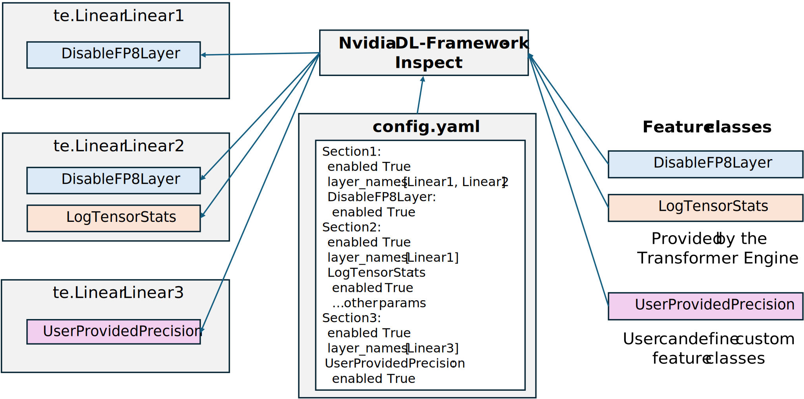
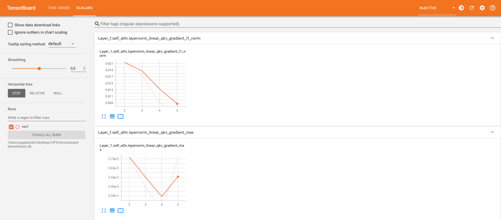

..
    Copyright (c) 2022-2025, NVIDIA CORPORATION & AFFILIATES. All rights reserved.

    See LICENSE for license information.

Getting started
==============

.. note::

   Precision debug tools with `Nvidia-DL-Framework-Inspect <https://github.com/NVIDIA/nvidia-dlfw-inspect>`_ for Transformer Engine are currently supported only for PyTorch.

Transformer Engine provides a set of precision debug tools which allow you to easily:

- log the statistics for each of the tensors in every matrix multiply (GEMM) operation,
- run selected GEMMs in higher precision,
- run current scaling - with one scaling factor per tensor - for particular GEMMs,
- test new precisions and integrate them with FP8 training,
- ... and many more.

There are 4 things one needs to do to use Transformer Engine debug features:

1. Create a configuration YAML file to configure the desired features.
2. Import, initialize, and install the `Nvidia-DL-Framework-Inspect <https://github.com/NVIDIA/nvidia-dlfw-inspect>`_ tool.
3. One can pass ``name="..."`` when creating TE layers to easier identify layer names. If this is not provided, names will be inferred automatically.
4. Invoke ``debug_api.step()`` at the end of one forward-backward pass.

To start debugging, one needs to create a configuration YAML file. This file lists the features to be used in particular layers. There are 2 kinds of features:

- provided by the Transformer Engine - for example, DisableFP8GEMM or LogTensorStats - they are listed in the :doc:`debug features API <3_api_features>` section
- defined by the user. For details on how to create a custom feature - please read the :doc:`calls to Nvidia-DL-Framework-Inspect <3_api_te_calls>` section.

   Fig 1: Example of Nvidia-DL-Framework-Inspect affecting training script with 3 TE Linear Layers. 
   ``config.yaml`` contains the specification of the features used for each Linear layer. Some feature classes are provided by TE,
   one - ``UserProvidedPrecision`` - is a custom feature implemented by the user. Nvidia-DL-Framework-Inspect inserts features into the layers according to the config.

Example training script
----------------------

Let's look at a simple example of training a Transformer layer using Transformer Engine with FP8 precision. This example demonstrates how to set up the layer, define an optimizer, and perform a few training iterations using synthetic data.

.. code-block:: python

    # train.py

    from transformer_engine.pytorch import TransformerLayer
    import torch
    import torch.nn as nn
    import torch.optim as optim
    import transformer_engine.pytorch as te

    hidden_size = 512
    num_attention_heads = 8

    transformer_layer = TransformerLayer(
        hidden_size=hidden_size,
        ffn_hidden_size=hidden_size,
        num_attention_heads=num_attention_heads
    ).cuda()

    dummy_input = torch.randn(10, 32, hidden_size).cuda()
    criterion = nn.MSELoss()
    optimizer = optim.Adam(transformer_layer.parameters(), lr=1e-4)
    dummy_target = torch.randn(10, 32, hidden_size).cuda()

    for epoch in range(5):
        transformer_layer.train()
        optimizer.zero_grad()
        with te.fp8_autocast(enabled=True):
            output = transformer_layer(dummy_input)
        loss = criterion(output, dummy_target)
        loss.backward()
        optimizer.step()

We will demonstrate two debug features on the code above:

1. Disabling FP8 precision for specific GEMM operations, such as the FC1 and FC2 forward propagation GEMM.
2. Logging statistics for other GEMM operations, such as gradient statistics for data gradient GEMM within the LayerNormLinear sub-layer of the TransformerLayer.

Config file
----------

We need to prepare the configuration YAML file, as below

.. code-block:: yaml

    # config.yaml

    fc1_fprop_to_fp8:
      enabled: True
      layers:
        layer_types: [fc1, fc2] # contains fc1 or fc2 in name
      transformer_engine:
        DisableFP8GEMM:
          enabled: True
          gemms: [fprop]

    log_tensor_stats:
      enabled: True
      layers:
        layer_types: [layernorm_linear] # contains layernorm_linear in name
      transformer_engine:
        LogTensorStats:
          enabled: True
          stats: [max, min, mean, std, l1_norm]
          tensors: [activation]
          freq: 1
          start_step: 2
          end_step: 5

Further explanation on how to create config files is in the :doc:`next part of the documentation <2_config_file_structure>`.

Adjusting Python file
--------------------

.. code-block:: python

    # (...)

    import nvdlfw_inspect.api as debug_api
    debug_api.initialize(
        config_file="./config.yaml",
        feature_dirs=["/path/to/transformer_engine/debug/features"],
        log_dir="./log",
        default_logging_enabled=True)

    # initialization of the TransformerLayer with the name
    transformer_layer = TransformerLayer(
      name="transformer_layer",
      # ...)

    # (...)
    for epoch in range(5):
      # forward and backward pass
      # ...
      debug_api.step()

In the modified code above, the following changes were made:

1. Added an import for ``nvdlfw_inspect.api``.
2. Initialized the Nvidia-DL-Framework-Inspect by calling ``debug_api.initialize()`` with appropriate configuration, specifying the path to the config file, feature directories, and log directory. The directory with Transformer Engine features is located `here <https://github.com/NVIDIA/TransformerEngine/tree/main/transformer_engine/debug/features>`_. The full parameters description could be found :doc:`here <3_api_debug_setup>`.
3. Added ``debug_api.step()`` after each of the forward-backward pass.

Inspecting the logs
------------------

Let's look at the files with the logs. Two files will be created:

1. debug logs.
2. statistics logs.

Let's look inside them!

In the main log file, you can find detailed information about the transformer layer's GEMMs behavior. You can see that ``fc1`` and ``fc2`` fprop GEMMs are run in high precision, as intended.

.. code-block:: text

    # log/nvdlfw_inspect_logs/nvdlfw_inspect_globalrank-0.log

    INFO - Default logging to file enabled at ./log
    INFO - Reading config from ./config.yaml.
    INFO - Loaded configs for dict_keys(['fc1_fprop_to_fp8', 'log_tensor_stats']).
    INFO - transformer_layer.self_attention.layernorm_qkv: Tensor: activation, gemm fprop - FP8 quantization
    INFO - transformer_layer.self_attention.layernorm_qkv: Tensor: activation, gemm wgrad - FP8 quantization
    INFO - transformer_layer.self_attention.layernorm_qkv: Tensor: weight, gemm fprop - FP8 quantization
    INFO - transformer_layer.self_attention.layernorm_qkv: Tensor: weight, gemm dgrad - FP8 quantization
    INFO - transformer_layer.self_attention.layernorm_qkv: Tensor: gradient, gemm dgrad - FP8 quantization
    INFO - transformer_layer.self_attention.layernorm_qkv: Tensor: gradient, gemm wgrad - FP8 quantization
    INFO - transformer_layer.self_attention.proj: Tensor: activation, gemm fprop - FP8 quantization
    INFO - transformer_layer.self_attention.proj: Tensor: activation, gemm wgrad - FP8 quantization
    INFO - transformer_layer.self_attention.proj: Tensor: weight, gemm fprop - FP8 quantization
    INFO - transformer_layer.self_attention.proj: Tensor: weight, gemm dgrad - FP8 quantization
    INFO - transformer_layer.self_attention.proj: Tensor: gradient, gemm dgrad - FP8 quantization
    INFO - transformer_layer.self_attention.proj: Tensor: gradient, gemm wgrad - FP8 quantization
    INFO - transformer_layer.layernorm_mlp.fc1: Tensor: activation, gemm fprop - High precision
    INFO - transformer_layer.layernorm_mlp.fc1: Tensor: activation, gemm wgrad - FP8 quantization
    INFO - transformer_layer.layernorm_mlp.fc1: Tensor: weight, gemm fprop - High precision
    INFO - transformer_layer.layernorm_mlp.fc1: Tensor: weight, gemm dgrad - FP8 quantization
    INFO - transformer_layer.layernorm_mlp.fc1: Tensor: gradient, gemm dgrad - FP8 quantization
    INFO - transformer_layer.layernorm_mlp.fc1: Tensor: gradient, gemm wgrad - FP8 quantization
    INFO - transformer_layer.layernorm_mlp.fc2: Tensor: activation, gemm fprop - High precision
    INFO - transformer_layer.layernorm_mlp.fc2: Tensor: activation, gemm wgrad - FP8 quantization
    INFO - transformer_layer.layernorm_mlp.fc2: Tensor: weight, gemm fprop - High precision
    INFO - transformer_layer.layernorm_mlp.fc2: Tensor: weight, gemm dgrad - FP8 quantization
    INFO - transformer_layer.layernorm_mlp.fc2: Tensor: gradient, gemm dgrad - FP8 quantization
    INFO - transformer_layer.layernorm_mlp.fc2: Tensor: gradient, gemm wgrad - FP8 quantization
    INFO - transformer_layer.self_attention.layernorm_qkv: Feature=LogTensorStats, API=look_at_tensor_before_process: activation
    ....

The second log file (``nvdlfw_inspect_statistics_logs/nvdlfw_inspect_globalrank-0.log``) contains statistics for tensors we requested in ``config.yaml``.

.. code-block:: text

    # log/nvdlfw_inspect_statistics_logs/nvdlfw_inspect_globalrank-0.log

    INFO - transformer_layer.self_attention.layernorm_qkv_activation_max                 iteration=000002                  value=4.3188
    INFO - transformer_layer.self_attention.layernorm_qkv_activation_min                 iteration=000002                  value=-4.3386
    INFO - transformer_layer.self_attention.layernorm_qkv_activation_mean                iteration=000002                  value=0.0000
    INFO - transformer_layer.self_attention.layernorm_qkv_activation_std                 iteration=000002                  value=0.9998
    INFO - transformer_layer.self_attention.layernorm_qkv_activation_l1_norm             iteration=000002                  value=130799.6953
    INFO - transformer_layer.self_attention.layernorm_qkv_activation_max                 iteration=000003                  value=4.3184
    INFO - transformer_layer.self_attention.layernorm_qkv_activation_min                 iteration=000003                  value=-4.3381
    INFO - transformer_layer.self_attention.layernorm_qkv_activation_mean                iteration=000003                  value=0.0000
    INFO - transformer_layer.self_attention.layernorm_qkv_activation_std                 iteration=000003                  value=0.9997
    INFO - transformer_layer.self_attention.layernorm_qkv_activation_l1_norm             iteration=000003                  value=130788.1016
    INFO - transformer_layer.self_attention.layernorm_qkv_activation_max                 iteration=000004                  value=4.3181
    INFO - transformer_layer.self_attention.layernorm_qkv_activation_min                 iteration=000004                  value=-4.3377
    INFO - transformer_layer.self_attention.layernorm_qkv_activation_mean                iteration=000004                  value=0.0000
    INFO - transformer_layer.self_attention.layernorm_qkv_activation_std                 iteration=000004                  value=0.9996
    INFO - transformer_layer.self_attention.layernorm_qkv_activation_l1_norm             iteration=000004                  value=130776.7969

Logging using TensorBoard
------------------------

Precision debug tools support logging using `TensorBoard <https://www.tensorflow.org/tensorboard>`_. To enable it, one needs to pass the argument ``tb_writer`` to the ``debug_api.initialize()``.  Let's modify ``train.py`` file.

.. code-block:: python

    # (...)

    from torch.utils.tensorboard import SummaryWriter
    tb_writer = SummaryWriter('./tensorboard_dir/run1')

    # add tb_writer to the Debug API initialization
    debug_api.initialize(
        config_file="./config.yaml",
        feature_dirs=["/path/to/transformer_engine/debug/features"],
        log_dir="./log",
        tb_writer=tb_writer)

    # (...)

Let's run training and open TensorBoard by ``tensorboard --logdir=./tensorboard_dir/run1``:

   Fig 2: TensorBoard with plotted stats.
