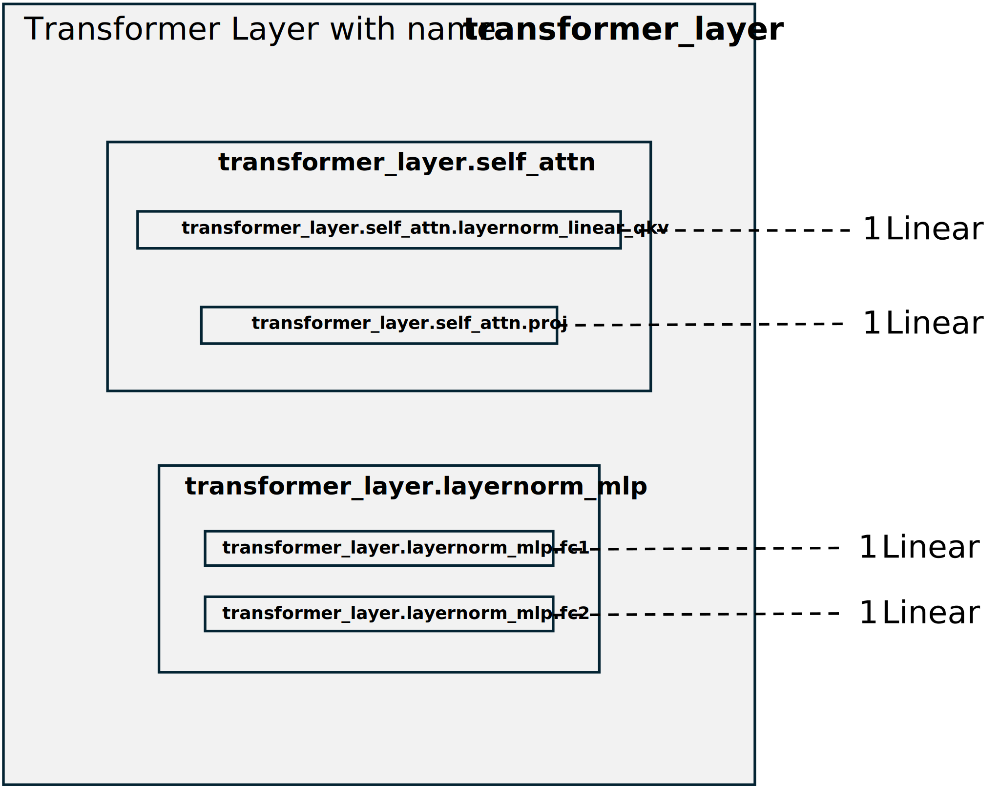

..
    Copyright (c) 2022-2025, NVIDIA CORPORATION & AFFILIATES. All rights reserved.

    See LICENSE for license information.

Config File Structure
====================

To enable debug features, create a configuration YAML file to specify the desired behavior, such as determining which GEMMs (General Matrix Multiply operations) should run in higher precision rather than FP8 and defining which statistics to log. 
Below, we outline how to structure the configuration YAML file.

General Format
-------------

A config file can have one or more sections, each containing settings for specific layers and features:

.. code-block:: yaml

    section_name_1:
      enabled: ...
      layers:
        # Specify layers here...
      transformer_engine:
        Feature1Name:
          enabled: ...
          # Feature details...
        Feature2Name:
          enabled: ...
          # Feature details...

    section_name_2:
      enabled: ...
      layers:
        # Specify layers here...
      Feature1Name: # If feature has no namespace, then it is in the default namespace.
        enabled: ...
        # Feature details...

    section_name_3:
      enabled: ...
      layers:
        # Specify layers here...
      transformer_engine:
        Feature1Name:
          enabled: ...
          # Feature details...
        Feature2Name:
          enabled: ...
          # Feature details...

Sections may have any name and must contain:

1. An ``enabled`` field that specifies whether the features in that section will be active.
2. A ``layers`` field specifying which layers the section applies to. Each layer can belong to only one section.
3. Additional fields describing features for those layers.

Layer Specification
------------------

Debug layers can be identified by a ``name`` parameter:

.. code-block:: python

    linear = transformer_engine.debug.pytorch.Linear(in_features, out_features, name="linear1")

This name is used in the config file to identify the layer. To specify the ``layers`` field, you can use one of the following methods:

1. ``layer_name_regex_pattern``: Use a regular expression to match layer names. This expression must adhere to the Python ``re`` module syntax.
2. ``layer_types``: Provide a list of strings, where a layer will be selected if any string matches part of its name.

Examples:

.. code-block:: yaml

    # Example 1: Using regular expression to select layers
    my_section:
      enabled: ...
      layers:
        layer_name_regex_pattern: 'self_attn.*'
      transformer_engine:
        (...)

    # Example 2: Using layer type to select layers
    another_section:
      enabled: ...
      layers:
        layer_types: ['fc1', 'layernorm_linear']
      transformer_engine:
        (...)

Names in Transformer Layers
--------------------------

There are three ways to assign a name to a layer in the Transformer Engine:

- Initialize the layer with the ``name=...`` argument.
- Use ``debug_api.infer_and_assign_layer_names(model)``, which assigns names based on class names.
- Rely on the default names assigned during module initialization, such as ``Layer_n``, where ``n`` represents the layer number.

The ``TransformerLayer`` in Transformer Engine is a composition of multiple sub-layers. We can modify some of these layers using precision debug tools, particularly those that contain exactly one linear layer. To see the names of all such layers, we can inspect log files. For instance, a ``TransformerLayer`` named ``transformer_layer`` might consist of:

- ``transformer_layer.self_attn.layernorm_linear_qkv`` / ``transformer_layer.self_attn.linear_qkv`` / ``transformer_layer.self_attn.layernorm_linear_q`` / ``transformer_layer.self_attn.linear_q`` / ``transformer_layer.self_attn.linear_kv``,
- ``transformer_layer.self_attn.proj``,
- ``transformer_layer.inter_attn.*`` for ``layer_type="decoder"``,
- ``transformer_layer.layernorm_mlp.fc1``,
- ``transformer_layer.layernorm_mlp.fc2``,

depending on the configuration. Some layers, like ``LayerNormLinear``, are fusions of two layers: ``LayerNorm`` and ``Linear``. When referring to such layers in precision debug tools, only the ``Linear`` part is affected.

Below is an example ``TransformerLayer`` with four linear layers that can be influenced by the precision debug tools.

   Fig 1: Names of layers in an example configuration of TransformerLayer. The most nested blocks represent the most basic layers, each containing one linear layer. Layers that do not contain linear layers, such as ``DotProductAttention``, are omitted.

**Configuration File Example**

.. code-block:: yaml

    # Disables wgrad in all 4 GEMMs
    section1:
      enabled: True
      layers:
        layer_types: [transformer_layer]
      transformer_engine:
        DisableFP8GEMM:
          enabled: True
          gemms: [wgrad]

    # Disables all GEMMs in layernorm_mlp layer
    section2:
      enabled: True
      layers:
        layer_types: [layernorm_mlp]
      transformer_engine:
        DisableFP8Layer:
          enabled: True
      
    # Logs wgrad stats in fc1
    section3:
      enabled: True
      layers:
        layer_types: [fc1]
      transformer_engine:
        LogTensorStats:
          enabled: True
          stats: [min]
          tensors: [wgrad]
          freq: 1
          start_step: 0
          end_step: 50

Structured Configuration for GEMMs and Tensors
---------------------------------------------

Sometimes a feature is parameterized by a list of tensors or by a list of GEMMs.
There are multiple ways of describing this parameterization.

We can pass lists, as below.

.. code-block:: yaml

    Feature:
      enabled: ...
      gemms: [gemm1, gemm2]
      tensors: [tensor1, tensor2]
      ...

We can use struct for tensors.

.. code-block:: yaml

    Feature:
      gemms: [gemm1, gemm2]
      tensors_struct:
      - tensor: tensor1
        feature_param1: value
      - tensor: tensor2
        feature_param1: value
      gemm_feature_param1: value

Similarly, we can use struct for GEMMs.

.. code-block:: yaml

    Feature:
      enabled: ...
      tensors: [tensor1, tensor2]
      gemms_struct:
      - gemm: gemm1
        feature_param1: value
      - gemm: gemm2
        feature_param1: value
      gemm_feature_param1: value

We can use both structs for tensors and GEMMs. The tensors_struct should be nested inside gemms_struct.

.. code-block:: yaml

    Feature:
      enabled: ...
      gemms_struct:
        - gemm: gemm1
          tensors: [tensor1, tensor2]
          tensor_feature_param1: value
          gemm_feature_param1: value
        - gemm: gemm2
          tensors_struct:
          - tensor: tensor1
            tensor_feature_param1: value
          - tensor: tensor2
            tensor_feature_param2: value
          gemm_feature_param1: value

Enabling or Disabling Sections and Features
------------------------------------------

Debug features can be enabled or disabled with the ``enabled`` keyword:

.. code-block:: yaml

    section1:
      enabled: True
      layers:
        layer_types: [self_attention]
      transformer_engine:
        LogTensorStats:
          enabled: False # Disables the LogTensorStats feature
          stats: [max, min, mean, std, l1_norm]

    section2:
      enabled: False # Disables entire section2
      transformer_engine:
        LogFp8TensorStats:
          enabled: True # Does not enable the LogFp8TensorStats feature, because section2 is disabled
          stats: [underflows, overflows]

By organizing your ``config.yaml`` properly, you can easily manage debugging features, ensuring a more streamlined and customizable debugging experience.
