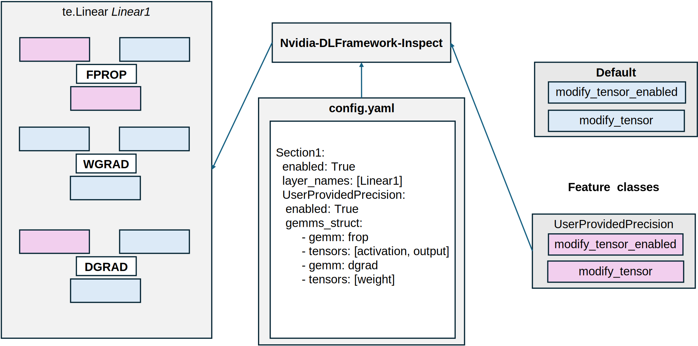

..
    Copyright (c) 2022-2025, NVIDIA CORPORATION & AFFILIATES. All rights reserved.

    See LICENSE for license information.

Calls to Nvidia-DL-Framework-Inspect
====================================
Let's look deeper into how Nvidia-DL-Framework-Inspect with Transformer Engine work together. TransformerEngine layers have some hook calls inside each of the GEMMs. Users can define feature classes or use feature classes provided with TE. File ``config.yaml`` describes which hooks need to be used for which layers. Nvidia-DL-Framework-Inspect combines 3 things: TE training, feature classes and ``config.yaml`` and takes care of inserting hooks in the correct places. This process is illustrated in the image below.

   Fig 1: Example of Nvidia-DL-Framework-Inspect affecting training script with 1 Linear Layer. For tensors mentioned in ``config.yaml``, behavior of ``modify_tensor_enabled()`` and ``modify_tensor()`` calls are substituted with definitions from the feature class. Other calls return default values - in fact they do nothing.

In this page, all calls from TransformerEngine to the Nvidia-DL-Framework-Inspect for each GEMM are listed. The order of these calls is illustrated in the image below.

.. figure:: ./img/api_calls2.svg
   :align: center

   Fig 2: The calls to Nvidia-DL-Framework-Inspect done for Transformer Engine. There are 2 types of calls: GEMM calls and routing calls.

There are 2 categories of API calls, each is used for different purposes:

- GEMM calls - invoked during every GEMM, used to process or quantize tensors and collect information about them,
- Routing calls - invoked at the beginning of every forward pass - they indicate whether a feature is going to use `modify_tensor()`, etc.

If all routing calls for the layer return `False`, then the layer is invoked in an optimized version with Transformer Engine fusions.
If any of the routing calls return `True`, layers are run without the fusions. This is necessary because otherwise some tensors cannot be accessed
if fusions happen. An important remark is that if no feature is used for the layer, then it should perform as fast as the layer without initializing `debug_api`.

.. autoapifunction:: transformer_engine.debug.features.api.TEDefaultFeatures.modify_tensor

.. autoapifunction:: transformer_engine.debug.features.api.TEDefaultFeatures.inspect_tensor

.. autoapifunction:: transformer_engine.debug.features.api.TEDefaultFeatures.inspect_tensor_postquantize

.. autoapifunction:: transformer_engine.debug.features.api.TEDefaultFeatures.modify_tensor_enabled

.. autoapifunction:: transformer_engine.debug.features.api.TEDefaultFeatures.fp8_gemm_enabled

.. autoapifunction:: transformer_engine.debug.features.api.TEDefaultFeatures.inspect_tensor_enabled

.. autoapifunction:: transformer_engine.debug.features.api.TEDefaultFeatures.inspect_tensor_postquantize_enabled
