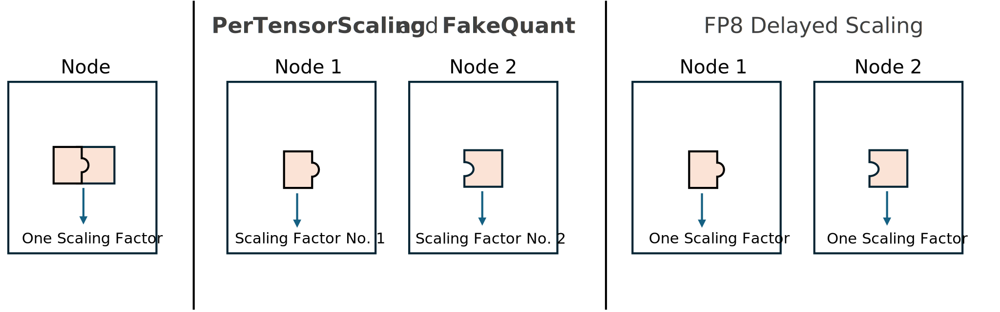

..
    Copyright (c) 2022-2025, NVIDIA CORPORATION & AFFILIATES. All rights reserved.

    See LICENSE for license information.

Distributed training
===================

Nvidia-Pytorch-Inspect with Transformer Engine supports multi-GPU training. This guide describes how to run it and how the supported features work in the distributed setting.

To use precision debug tools in multi-GPU training, one needs to:

1. Run ``debug_api.initialize(...)`` and provide the same configuration YAML file on every node.
2. If one wants to log stats, one may want to invoke ``debug_api.set_tensor_reduction_group`` with a proper reduction group.

Behavior of the features
-----------------------

In a distributed setting, **DisableFP8GEMM** and **DisableFP8Layer** function similarly to the single-GPU case, with no notable differences. 

**PerTensorScaling** and **FakeQuant** calculate FP8 scaling factors independently on each node, meaning the number of GPUs may affect results. This differs from the delayed scaling FP8 recipe behavior, in which scaling factors are synchronized.

   Fig 1:  For **PerTensorScaling** and **FakeQuant** tensor scaling factors are computed separately for each of the tensor shards. This is not the case for delayed scaling FP8 scaling factors, which are synchronized.

Logging-related features are more complex and will be discussed further in the next sections.

Reduction groups
--------------

In setups with tensor, data, or pipeline parallelism, some tensors are distributed across multiple GPUs, requiring a reduction operation to compute statistics for these tensors.

The weight tensor is always split among the tensor parallel group, and debug tools automatically reduce statistics within this group by default. To disable this automatic reduction, use:

.. code-block:: python

    transformer_engine.debug.set_weight_tensor_tp_group_reduce(False)

In cases of data parallelism, Transformer Engine modules lack the process group needed for reduction. To manually specify the group, use:

.. code-block:: python

    debug_api.set_tensor_reduction_group(group)

This command ensures statistics are reduced across the defined group. Activation statistics are logged after the forward pass (immediately after exiting autocast), while gradient (dgrad and wgrad) statistics are logged following the backward pass.

Below, we illustrate configurations for a 4-node setup with tensor parallelism size 2 and data parallelism size 2, showcasing different reduction configurations.

   Fig 2: There is a single tensor reduction group composed of all nodes. As a result, each node logs the same statistics for the tensors, as they are fully reduced across all nodes.

   Fig 3: Every node is set with a tensor reduction group consisting of itself. Every node prints the same statistics for weights (which are still synchronized within TP groups), but the statistics of activations and gradients are not synchronized.

   Fig 4: Weight synchronization is disabled by ``set_weight_tensor_tp_group_reduce(False)``, so every node logs stats for its shard of the weight.

Microbatching
-----------

Let's dive into how statistics collection works with microbatching. By microbatching, we mean invoking multiple ``forward()`` calls for each ``debug_api.step()``. The behavior is as follows:

- For weight tensors, the stats remain the same for each microbatch because the weight does not change.
- For other tensors, the stats are accumulated.

Logging to files and TensorBoard
------------------------------

In a single-node setup with ``default_logging_enabled=True``, all logs are saved by default to ``log_dir/nvdlfw_inspect_statistics_logs/nvdlfw_inspect_globalrank-0.log``. In multi-GPU training, each node writes its reduced statistics to its unique file, named ``log_dir/nvdlfw_inspect_statistics_logs/nvdlfw_inspect_globalrank-i.log`` for rank i. Because these logs contain reduced statistics, the logged values are identical for all nodes within a reduction group.

If certain nodes are given a TensorBoard writer, only those nodes will log to TensorBoard. This is useful in scenarios involving pipeline, data, and tensor parallelism, such as with two transformer layers and settings TP_SIZE = 2, DP_SIZE = 2, and PP_SIZE = 2. To log all stats to TensorBoard, you should pass a TensorBoard writer to one process in each pipeline parallel group.

   Fig 5: Example with pipeline parallelism, where a ``tb_writer`` is assigned to one node within each pipeline parallel group, setting these as tensor reduction groups.

Alternatively, setting the tensor reduction group to None will yield unreduced statistics for wgrad and dgrad tensors on each node, allowing for post-processing. For weight statistics without reduction in the TP parallel group, use:

.. code-block:: python

    transformer_engine.debug.set_weight_tensor_tp_group_reduce(False)