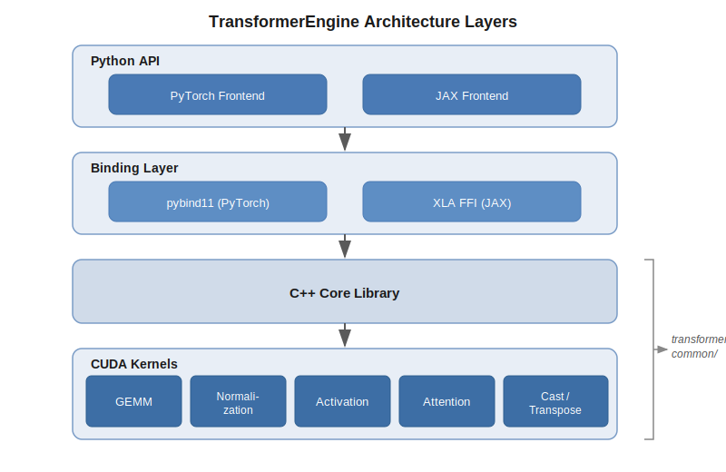
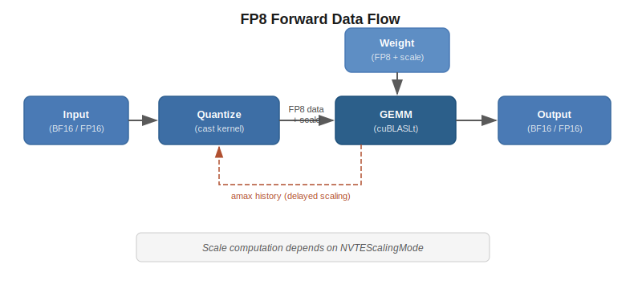

..
    Copyright (c) 2022-2026, NVIDIA CORPORATION & AFFILIATES. All rights reserved.

    See LICENSE for license information.

.. _architecture-overview:

Architecture Overview
=====================

Transformer Engine is structured as a layered system: framework-specific Python frontends
sit on top of a shared C++ core that dispatches to optimized CUDA kernels.

   The four layers of Transformer Engine.

..
   Diagram description for ``architecture_layers.svg``:
   Four horizontal bands stacked vertically.
   Top band: "Python API" with two sub-boxes "PyTorch Frontend" and "JAX Frontend".
   Second band: "Binding Layer" with sub-boxes "pybind11 (PyTorch)" and "XLA FFI (JAX)".
   Third band: "C++ Core Library" (single box spanning full width).
   Bottom band: "CUDA Kernels" with sub-boxes for major areas: GEMM, Normalization,
   Quantize, Activation, Attention, Other.
   Arrows flow downward between bands. A side annotation shows "transformer_engine/common/"
   pointing at the bottom two bands.

Layer Diagram
-------------

**Python API** (``transformer_engine/pytorch/``, ``transformer_engine/jax/``)
   Framework-specific modules, autograd functions, quantized tensor types, and distributed
   utilities. This is what users import and interact with.

**Binding Layer** (``transformer_engine/pytorch/csrc/``, ``transformer_engine/jax/csrc/``)
   pybind11 extensions (PyTorch) and XLA custom-call registrations (JAX) that bridge
   Python to C++. These translate framework tensor types into the C API's ``NVTETensor``.

**C++ Core** (``transformer_engine/common/``)
   Framework-agnostic library implementing the actual computation logic. Exposes a C API
   (``transformer_engine.h``, etc.) for stability across framework bindings.

**CUDA Kernels** (within ``transformer_engine/common/``)
   Hand-optimized CUDA kernels and cuDNN/cuBLASLt integrations organized by functional
   area.

Directory Map
-------------

.. code-block:: text

   transformer_engine/
   ├── common/                        # C++ core (framework-agnostic)
   │   ├── include/transformer_engine/ # Public C API headers
   │   │   ├── transformer_engine.h    #   Base types: NVTEDType, NVTETensor, NVTEScalingMode
   │   │   ├── fused_attn.h           #   Attention C API
   │   │   ├── gemm.h                 #   GEMM C API
   │   │   └── ...                    #   Other kernel APIs
   │   ├── common.h                   #   C++ types: DType, SimpleTensor, Tensor
   │   ├── gemm/                      #   cuBLASLt GEMM kernels
   │   ├── fused_attn/                #   Fused attention (cuDNN + custom)
   │   ├── normalization/             #   LayerNorm, RMSNorm kernels
   │   ├── activation/                #   GeLU, SiLU, etc.
   │   ├── cast/                      #   Quantization cast kernels
   │   ├── transpose/                 #   Transpose + cast fusion
   │   ├── fused_rope/                #   Rotary positional embeddings
   │   ├── fused_softmax/             #   Scaled softmax variants
   │   ├── fused_router/              #   MoE router kernels
   │   └── comm_gemm/                 #   Communication-GEMM overlap
   │
   ├── pytorch/                       # PyTorch frontend
   │   ├── module/                    #   nn.Module subclasses (Linear, LN, Attention, etc.)
   │   ├── tensor/                    #   Quantized tensor implementations
   │   ├── attention/                 #   Attention backends and dispatch
   │   ├── ops/                       #   Op fusion framework
   │   ├── cpp_extensions/            #   Python wrappers for C++ extensions
   │   ├── csrc/                      #   pybind11 C++ source
   │   ├── distributed.py             #   TP/SP/FSDP utilities
   │   ├── quantized_tensor.py        #   Base quantization classes
   │   └── transformer.py             #   TransformerLayer composition
   │
   └── jax/                           # JAX frontend
       ├── flax/                      #   Flax nn.Module wrappers
       ├── cpp_extensions/            #   XLA FFI primitive registration
       ├── quantize/                  #   JAX quantizer and ScaledTensor
       ├── attention.py               #   JAX attention entry points
       ├── sharding.py                #   Mesh and sharding utilities
       └── dense.py                   #   JAX dense (linear) layer

Data Flow: Forward Pass
-----------------------

A typical forward pass through a quantized linear layer follows this path (see
:doc:`linear_walkthrough` for a detailed end-to-end trace):

   Data flow through a quantized linear forward pass.

..
   Diagram description for ``data_flow_forward.svg``:
   Left-to-right flow diagram.
   1. Box "Input (BF16/FP16)" with arrow to
   2. Box "Quantize (cast kernel)" which outputs "FP8 data + scale" arrow to
   3. Box "GEMM (cuBLASLt)" which also receives "Weight (FP8 + scale)" from above, arrow to
   4. Box "Output (BF16/FP16)".
   A dashed feedback arrow from GEMM back to Quantize labeled "amax history (delayed scaling)".
   Below the main flow, a note: "Scale computation depends on NVTEScalingMode".

1. **Input arrives** in high precision (BF16 or FP16).
2. **Quantization** casts the input to FP8 (or other low-precision format), producing
   quantized data and associated scaling factors. The specific cast kernel and scale
   granularity depend on the :ref:`scaling mode <scaling-modes>`.
3. **GEMM** executes in low precision via cuBLASLt, consuming quantized activations and
   weights along with their scale inverses.
4. **Output** is produced in high precision.

For delayed tensor scaling, an amax (absolute maximum) feedback loop maintains scaling
factor history across iterations.

The backward pass follows the same pattern twice: once for the activation gradient (dgrad)
and once for the weight gradient (wgrad). Both backward GEMMs use inputs already quantized
during the forward pass (saved via autograd). The wgrad path uses *columnwise* quantized
data to satisfy cuBLASLt's transposed layout requirements — see
:doc:`quantization/rowwise_columnwise` for details.

Guiding Principles
-------------------

These principles apply across the entire codebase and inform design decisions at every
layer.

**Three API surfaces, one core**
   Transformer Engine exposes three distinct API surfaces — a C API
   (``transformer_engine.h``), PyTorch ``nn.Module`` subclasses, and JAX XLA primitives —
   all backed by the same framework-agnostic C++ core. CUDA kernels live in ``common/``
   and know nothing about PyTorch or JAX; framework frontends are responsible for
   converting their tensor types before calling into the C API.

**Feel native to each framework**
   Each frontend should feel like a natural extension of its framework, not a foreign
   library. PyTorch modules follow ``nn.Module`` conventions (autograd, ``state_dict``,
   ``torch.compile``). JAX primitives register with XLA's custom-call and sharding
   machinery. Users should be able to mix and match TE components with native framework
   code freely — a ``te.Linear`` should be a drop-in replacement for ``torch.nn.Linear``.

**Leverage the ecosystem, don't reinvent it**
   TE provides custom CUDA kernels where they deliver clear performance wins (fused
   attention, quantized GEMM, fused normalization + cast). For everything else, we prefer
   the framework's native capabilities. A custom kernel must justify its
   existence against the ecosystem alternative.

**No memory allocation in the C++ layer**
   The C++ core never allocates GPU memory directly. All memory is allocated by the
   framework frontend and passed down to the C API as pointers within ``NVTETensor``
   handles. This keeps memory management in the framework's control (important for
   memory pools, garbage collection, and distributed training) and avoids hidden
   allocation surprises.

**Hide complexity, but stay extensible**
   Low-precision training involves many moving parts (scaling modes, amax history, block
   sizes, format selection). TE hides this complexity behind simple APIs — a user can
   pass a recipe to ``autocast`` and get FP8 training without understanding the
   internals. But we do not want to be a black box: the quantization system is designed
   to be extensible (see :doc:`quantization/adding_new_type`), scaling recipes are
   configurable, and advanced users can provide custom quantizers.

Next Steps
----------

- :doc:`linear_walkthrough` — End-to-end trace through a Linear forward and backward pass
- :doc:`cpp_core/index` — C++ core type system, kernels, and build system
- :doc:`quantization/index` — Quantization architecture and adding new types
