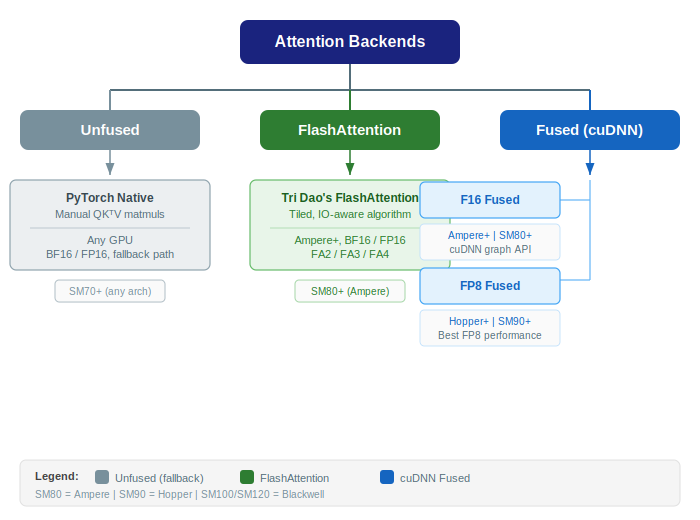

..
    Copyright (c) 2022-2026, NVIDIA CORPORATION & AFFILIATES. All rights reserved.

    See LICENSE for license information.

.. _attention-backends:

Attention Backends
==================

Transformer Engine supports multiple attention backends, each optimized for different
hardware, precision, and feature combinations.

   Taxonomy of attention backends with architecture annotations.

..
   Diagram description for ``attention_backends.svg``:
   Tree/taxonomy diagram:
   "Attention Backends"
     ├── "Unfused" (FlashAttention via torch)
     │     └── Any GPU, no FP8, fallback
     ├── "Flash Attention" (Tri Dao's FlashAttention)
     │     └── Ampere+, BF16/FP16, fastest for non-FP8
     └── "Fused Attention" (cuDNN-based)
           ├── "F16 Fused" — cuDNN with BF16/FP16
           │     └── Ampere+, supports arbitrary seq len
           ├── "FP8 Fused" — cuDNN with FP8
           │     └── Hopper+, best perf with FP8 training
           └── "Custom" — TE's own CUDA kernels
                 └── Legacy, limited feature support

Overview
--------

.. list-table::
   :header-rows: 1
   :widths: 20 15 15 15 35

   * - Backend
     - Precision
     - Min Arch
     - cuDNN Required
     - Notes
   * - Unfused
     - BF16/FP16
     - Any
     - No
     - Fallback; uses PyTorch's native attention or manual QK^TV
   * - FlashAttention
     - BF16/FP16
     - Ampere
     - No
     - Tri Dao's FlashAttention; fast, memory-efficient
   * - Fused F16 (max512)
     - BF16/FP16
     - Ampere
     - Yes
     - cuDNN graph-based; sequence length ≤ 512
   * - Fused F16 (arbitrary)
     - BF16/FP16
     - Ampere
     - Yes
     - cuDNN graph-based; arbitrary sequence length, supports all mask types
   * - Fused (FP8)
     - FP8
     - Hopper
     - Yes
     - FP8 Q/K/V with cuDNN; sequence length ≤ 512; best throughput for FP8 training
   * - Custom/THD
     - BF16/FP16
     - Hopper
     - No
     - TE custom kernels; used for specific context-parallel patterns

Backend Details
---------------

Unfused Attention
^^^^^^^^^^^^^^^^^

The simplest backend. Computes attention as separate matrix multiplications:

.. code-block:: text

   scores = Q @ K^T / sqrt(d)
   scores = mask(scores)
   weights = softmax(scores)
   output = weights @ V

Used as a fallback when no fused backend supports the requested configuration. Also
useful for debugging (produces identical numerics to textbook attention).

FlashAttention
^^^^^^^^^^^^^^

Uses Tri Dao's FlashAttention algorithm, which tiles the computation to avoid
materializing the full attention matrix. Key properties:

- O(N) memory instead of O(N²) for the attention matrix.
- IO-aware: optimized for GPU memory hierarchy.
- Supports causal masks, variable-length sequences.
- No FP8 support (BF16/FP16 only).

cuDNN Fused Attention (F16 and FP8)
^^^^^^^^^^^^^^^^^^^^^^^^^^^^^^^^^^^^

Uses cuDNN's graph API to fuse the entire attention computation (QK^T, scaling, masking,
softmax, dropout, V multiply) into a single cuDNN operation. Key properties:

- **F16 variant**: BF16/FP16 inputs, Ampere and later.
- **FP8 variant**: FP8 Q/K/V inputs with per-tensor or block scales, Hopper and later.
- Supports: arbitrary masks (causal, padding, sliding window), GQA/MQA, dropout.
- Requires cuDNN 9.3+ for FP8.

The cuDNN backend is the recommended choice for production FP8 training.

Custom/THD Kernels
^^^^^^^^^^^^^^^^^^

TE's own CUDA attention kernels, used for specific context-parallel patterns
(THD = Token-Head-Dimension layout). These handle cases where cuDNN doesn't support the
required distributed communication pattern.

See :doc:`fused_attn_kernels` for the C++ kernel organization.

See Also
--------

- :doc:`backend_selection` — How the backend is chosen at runtime
- :doc:`pytorch_attention` — PyTorch DotProductAttention and MultiheadAttention modules
- :doc:`fused_attn_kernels` — C++ kernel organization and cuDNN integration
