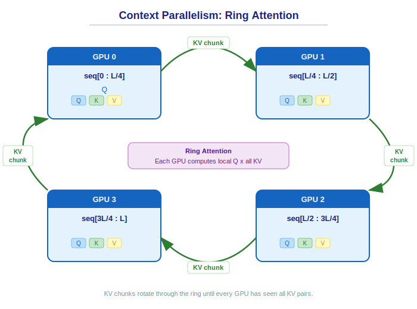

..
    Copyright (c) 2022-2026, NVIDIA CORPORATION & AFFILIATES. All rights reserved.

    See LICENSE for license information.

.. _context-parallel:

Context Parallelism
===================

Context Parallelism (CP) distributes the sequence dimension across multiple GPUs,
enabling training with very long sequences that don't fit in a single GPU's memory. It is
the most complex part of the attention subsystem.

**Implementation**: ``transformer_engine/pytorch/attention/dot_product_attention/context_parallel.py``
(~4300 lines). Entry point: ``attn_forward_func_with_cp()``, which dispatches to the
appropriate strategy class based on ``cp_comm_type``.

Overview
--------

In CP, each GPU holds a shard of the sequence for Q, K, and V. To compute full attention,
each GPU needs access to the K and V from *all* sequence shards. CP achieves this by
exchanging KV (or QKV) chunks between GPUs using one of several communication strategies.

The key challenge is **load balancing**: with causal attention, GPUs holding later sequence
positions must attend to more KV positions than GPUs holding earlier ones. Without
balancing, later GPUs would be idle while earlier ones compute. TE addresses this with
**dual chunk** distribution — see :ref:`cp-load-balancing` below.

Communication Strategies
------------------------

TE implements four CP communication strategies, selected via the ``cp_comm_type``
parameter on ``DotProductAttention``:

**P2P (Point-to-Point Ring)**

- **Class**: ``AttnFuncWithCPAndKVP2P``
- KV chunks are passed around a ring of GPUs using asynchronous ``isend``/``irecv``.
  Each GPU computes attention for its local Q against the currently-held KV chunk, then
  sends its KV to the next GPU while receiving the next chunk. This overlaps communication
  with computation.
- For causal attention, the computation is divided into **sections** based on the
  relationship between Q and KV positions:

  - **Diagonal** (step 0): Q attends to its own KV shard (causal mask applies).
  - **Lower-triangle** (steps where KV is from earlier positions): Q's second half
    attends to full KV.
  - **Upper-triangle** (steps where KV is from later positions): Q's first half attends
    to full KV.

  Each section computes a partial attention output and softmax LSE (log-sum-exp).
  **Output correction** merges these partial results:
  ``out = out + out_per_step * exp(lse_per_step - lse_combined)``. The correction
  functions (``flash_attn_fwd_out_correction()``,
  ``flash_attn_fwd_softmax_lse_correction()``) handle the numerically stable
  accumulation.
- Works with both FusedAttention and FlashAttention backends.

**All-Gather**

- **Class**: ``AttnFuncWithCPAndKVAllGather``
- All GPUs perform an all-gather to collect the full K and V tensors, then compute
  attention locally. Simpler than P2P but requires more memory (full K and V on each GPU)
  and cannot overlap communication with computation.
- Reference: Section 3.3.2 of `The Llama 3 Herd of Models <https://arxiv.org/abs/2407.21783>`_.

**All-to-All (A2A)**

- **Class**: ``AttnFuncWithCPAndQKVOA2A``
- Follows the `DeepSpeed Ulysses <https://arxiv.org/abs/2309.14509>`_ approach: scatters
  attention heads across the CP group and gathers to get the full sequence of QKV. Unlike
  P2P and all-gather, this exchanges Q in addition to KV — each GPU ends up with a
  subset of heads but the full sequence.

**A2A + P2P (Hierarchical)**

- Uses a two-level CP group: ``cp_group = [cp_group_a2a, cp_group_p2p]``. A2A is applied
  within subgroups (e.g., via NVLink), then P2P between subgroups (e.g., via IB).
- Reference: `USP <https://arxiv.org/abs/2405.07719>`_ and
  `LongVILA <https://arxiv.org/abs/2408.10188>`_.

.. _cp-load-balancing:

Load Balancing
--------------

With causal attention, naively assigning contiguous sequence shards would leave GPUs with
early positions idle while GPUs with late positions compute more. TE uses two load
balancing strategies — **dual chunk** (PyTorch) and **striped** (JAX) — that both ensure
each GPU processes a balanced mix of early and late sequence positions.

   Dual chunk distribution for P2P ring with 4 GPUs.

..
   Diagram description for ``context_parallel_ring.svg``:
   Horizontal bar representing a sequence of length L, divided into 8 chunks
   (2 × cp_size, where cp_size=4), numbered 0-7 left to right.
   Below, 4 GPU boxes showing which chunks each GPU holds:
     GPU 0: chunks 0 and 7 (start and end)
     GPU 1: chunks 2 and 5
     GPU 2: chunks 4 and 3
     GPU 3: chunks 6 and 1
   Arrows between GPUs form a P2P ring: GPU0 → GPU1 → GPU2 → GPU3 → GPU0.
   Each arrow labeled "KV chunks".

**Dual Chunk (PyTorch)**

The dual chunk strategy splits the sequence into ``2 × cp_size`` chunks and assigns each
GPU two discontiguous chunks — one from the start and one from the end of the sequence:

- GPU rank ``r`` receives chunks ``[2r, 2×cp_size - 2r - 1]``.
- For ``cp_size=4``: GPU 0 gets chunks {0, 7}, GPU 1 gets {2, 5}, GPU 2 gets {4, 3},
  GPU 3 gets {6, 1}.

The reordering logic is in ``get_seq_chunk_ids_for_reordering_before_attn()`` and
``get_seq_chunk_ids_for_reordering_after_attn()`` in ``context_parallel.py``.

**Striped (JAX)**

Distributes tokens in a round-robin (interleaved) pattern across GPUs. For ``cp_size=4``
and a 16-token sequence:

- GPU 0 gets tokens {0, 4, 8, 12}
- GPU 1 gets tokens {1, 5, 9, 13}
- GPU 2 gets tokens {2, 6, 10, 14}
- GPU 3 gets tokens {3, 7, 11, 15}

GPU rank ``r`` holds tokens at original positions ``[r, r + cp_size, r + 2×cp_size, ...]``.
The reordering reshapes the sequence dimension into
``[S/(cp_size × stripe_size), cp_size, stripe_size]`` and swaps the middle two axes. The
``stripe_size`` parameter (default 1) controls the granularity of the interleaving.

Dual chunk is used in PyTorch (with both BSHD and THD layouts), while the striped
strategy is used in JAX. Implementation:
``reorder_causal_striped()`` in ``transformer_engine/jax/cpp_extensions/attention.py``,
dispatched via ``reorder_causal_load_balancing()`` in ``transformer_engine/jax/attention.py``.

Differences from Regular Attention Flow
---------------------------------------

CP attention differs from the non-CP flow (described in :doc:`/developer/linear_walkthrough`)
in several key ways:

1. **Multi-step computation**: Instead of a single attention call, P2P CP iterates over
   ``cp_size`` steps, computing partial attention at each step against a different KV
   chunk.

2. **Output correction**: Partial outputs from each step are merged using softmax LSE
   correction. This is mathematically equivalent to computing attention over the full
   sequence but requires tracking per-step LSE statistics.

3. **Overlapped communication**: P2P uses separate CUDA streams to overlap KV
   communication with attention computation. While step ``i`` computes, step ``i+1``'s
   KV is being transferred.

4. **Section-based computation (causal)**: For causal attention, each P2P step computes
   only the relevant portion of the attention matrix (diagonal, lower-triangle, or
   upper-triangle section), not the full Q×KV product.

THD Layout Considerations
-------------------------

THD (Token-Head-Dimension) is a variable-length sequence layout, not a CP strategy. Each
of the strategies above must handle THD inputs specially because:

- Sequence metadata (``cu_seqlens``) is a GPU tensor, not part of the tensor shape.
  Chunking logic must use index operations rather than view/reshape.
- Token partitioning must respect sequence boundaries (cannot split within a sequence).
- Softmax LSE tensors have different shapes (``TH1`` packed vs ``BHS1`` dense).
- C++ helper kernels in ``context_parallel.cu`` (``thd_partition_indices_kernel``,
  ``thd_read_half_tensor_kernel``, ``thd_lse_kernel``, ``thd_out_correction_kernel``)
  handle the THD-specific index and correction operations.

Integration with Attention Backends
------------------------------------

CP support varies by attention backend:

- **cuDNN Fused**: Full CP support via P2P, all-gather, and A2A strategies.
- **FlashAttention**: CP support via P2P and A2A.
- **Unfused**: No CP support.

.. note::

   On SM120 (Blackwell), the ragged softmax stats optimization used for THD layout in
   context parallelism is not available (cuDNN limitation). The implementation falls back
   to the dense stats format on SM120.

The CP strategy is configured via ``DotProductAttention``:

.. code-block:: python

   attn = te.DotProductAttention(
       num_attention_heads=32,
       kv_channels=128,
       cp_group=cp_process_group,
       cp_stream=cuda_stream,
   )

Key Entry Points for Developers
---------------------------------

- **Strategy dispatch**: ``attn_forward_func_with_cp()`` in ``context_parallel.py`` —
  selects P2P, all-gather, A2A, or A2A+P2P based on ``cp_comm_type``.
- **P2P forward**: ``AttnFuncWithCPAndKVP2P.forward()`` — the step loop, section logic,
  and output correction.
- **Communication**: ``flash_attn_p2p_communicate()`` (P2P isend/irecv),
  ``flash_attn_a2a_communicate()`` (all-to-all with reordering).
- **Output correction**: ``flash_attn_fwd_out_correction()`` and
  ``flash_attn_fwd_softmax_lse_correction()``.
- **Load balancing**: ``get_seq_chunk_ids_for_reordering_before_attn()`` and
  ``get_seq_chunk_ids_for_reordering_after_attn()``.
- **THD C++ kernels**: ``transformer_engine/common/fused_attn/context_parallel.cu``.

See Also
--------

- :doc:`backends` — Backend support for context parallelism
- :doc:`/developer/distributed/sequence_parallel` — Sequence parallelism (different from CP)
