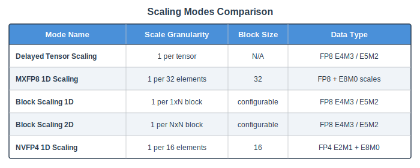

..
    Copyright (c) 2022-2026, NVIDIA CORPORATION & AFFILIATES. All rights reserved.

    See LICENSE for license information.

.. _scaling-modes:

Scaling Modes
=============

Transformer Engine supports multiple quantization scaling strategies, each offering
different trade-offs between precision, performance, and hardware requirements. The
scaling mode is selected via the ``NVTEScalingMode`` enum and propagated through the
``Tensor.scaling_mode`` field.

For user-facing documentation on recipes and how to select scaling modes, see
:doc:`/features/low_precision_training/index`. For state management details (amax
history, scale updates, recipe-to-quantizer mapping), see
:doc:`/developer/quantization/scaling_recipes`. This page focuses on what the C++ core
needs to know: data layouts, scale tensor shapes, and GEMM constraints.

   Comparison of scale granularity across scaling modes.

..
   Diagram description for ``scaling_modes_comparison.svg``:
   A table/matrix with 5 rows (one per scaling mode) and columns:
   Mode Name | Enum Value | Scale Granularity | Block Size | Data Type | Min Arch.
   DELAYED_TENSOR_SCALING | 0 | 1 scale per tensor | N/A | FP8 E4M3/E5M2 | Ada
   MXFP8_1D_SCALING | 1 | 1 scale per 32 elements | 32 | FP8 + E8M0 scales | Blackwell
   BLOCK_SCALING_1D | 2 | 1 scale per 1×128 block | 128 | FP8 E4M3/E5M2 | Blackwell
   BLOCK_SCALING_2D | 3 | 1 scale per 128×128 block | 128 | FP8 E4M3/E5M2 | Blackwell
   NVFP4_1D_SCALING | 4 | 1 scale per 16 elements | 16 | FP4 E2M1 + E8M0 | Blackwell

Non-TN GEMM Support
---------------------

A cross-cutting concern that affects all scaling modes is non-TN GEMM support.
cuBLASLt traditionally required FP8 GEMMs to use TN (transpose-normal) layout, which
is why the forward pass needs rowwise data for one operand and columnwise data for
the other. On architectures that support non-TN FP8 GEMM (compute capability 10.x and
13.0+, i.e. Blackwell), this constraint is relaxed — cuBLASLt can consume rowwise data
for both operands.

This has a significant impact on data layout: when non-TN GEMM is supported,
``data`` and ``columnwise_data`` may point to the same buffer (since a separate
transposed copy is no longer needed for the GEMM). When non-TN is not supported, they
must be separate buffers with physically transposed data.

Tensor Scaling (``NVTE_DELAYED_TENSOR_SCALING``)
--------------------------------------------------

A single scale factor applies to the entire tensor. Minimum architecture: Ada (sm89).

.. note::

   The enum name ``NVTE_DELAYED_TENSOR_SCALING`` is a legacy misnomer. This mode is
   used for all per-tensor scaling (delayed and current) as well as for high-precision
   (unquantized) tensors. The C++ core does not distinguish between delayed and current
   scaling — both use the same code paths. The distinction only matters at the framework
   level (see :doc:`/developer/quantization/scaling_recipes`).

Data layout:

- ``data``: row-major, one scale for the entire tensor
- ``columnwise_data``: column-major (physically transposed), same single scale
- ``scale_inv``: shape ``[1]`` (one element) for FP8 tensors, empty for high-precision
- ``amax``: populated by delayed scaling (framework responsibility), unused by current
  scaling

C++ helpers:

.. code-block:: cpp

   // True for NVTE_DELAYED_TENSOR_SCALING (per-tensor scaling, including current)
   bool is_tensor_scaling(const NVTEScalingMode &mode);
   // Alias — identical behavior
   bool is_delayed_tensor_scaling(const NVTEScalingMode &mode);

MXFP8 1D Scaling (``NVTE_MXFP8_1D_SCALING``)
----------------------------------------------

Microscaling FP8 format per the OCP MX specification. Each block of 32 contiguous
elements shares a single E8M0 (8-bit exponent-only) scale factor. Minimum architecture:
Blackwell.

Data layout:

- ``data``: row-major FP8, shape ``[M, N]``
- ``columnwise_data``: the physically transposed data, shape ``[N, M]`` — this is a
  separate buffer with independently quantized blocks along the transposed dimension
- ``scale_inv`` (rowwise): shape ``[ceil(M), ceil(N/32)]``, padded to ``[128, 4]``
  multiples for GEMM alignment
- ``columnwise_scale_inv``: shape ``[ceil(N), ceil(M/32)]``, padded to ``[128, 4]``
  multiples

Scales may need "GEMM swizzling" — a specific memory layout that cuBLASLt expects for
block-scaled operands. See the `cuBLAS documentation on block scaling factors layout
<https://docs.nvidia.com/cuda/cublas/index.html#d-block-scaling-factors-layout>`_.
The ``with_gemm_swizzled_scales`` flag on ``Tensor`` tracks whether scales have been
swizzled.

C++ helper:

.. code-block:: cpp

   bool is_mxfp8_scaling(const NVTEScalingMode &mode);

Block Scaling (``NVTE_BLOCK_SCALING_1D`` / ``NVTE_BLOCK_SCALING_2D``)
----------------------------------------------------------------------

Per-block FP8 scaling with a fixed block size of 128 (matching the DeepSeek v3 recipe).
``1D`` uses 1×128 blocks (one scale per row-slice of 128 elements), while ``2D`` uses
128×128 blocks. The block size itself is not configurable — only the 1D vs 2D aspect is
selectable via the recipe. Minimum architecture: Blackwell.

Scales are FP32 (more precise than MXFP8's E8M0). Like MXFP8, scales may require GEMM
swizzling.

C++ helper:

.. code-block:: cpp

   bool is_block_scaling(const NVTEScalingMode &mode);
   // Returns true for all non-tensor-scaling modes (MXFP8, block 1D/2D, NVFP4).
   // For finer discrimination, use is_mxfp8_scaling() or is_nvfp4_scaling().

NVFP4 1D Scaling (``NVTE_NVFP4_1D_SCALING``)
----------------------------------------------

4-bit floating point with E8M0 block scales, targeting maximum compression. Minimum
architecture: Blackwell.

Data layout:

- ``data``: FP4 E2M1 format, packed 2 elements per byte (uint8 storage)
- ``columnwise_data``: physically transposed FP4 data
- ``scale_inv`` (rowwise): E8M0 format, shape ``[ceil(M/16), ceil(N/16)]``, padded to
  ``[4, 128]`` multiples for GEMM alignment
- ``columnwise_scale_inv``: shape ``[ceil(N/16), ceil(M/16)]``, padded to ``[128, 4]``

Like MXFP8, scales may require GEMM swizzling.

C++ helper:

.. code-block:: cpp

   bool is_nvfp4_scaling(const NVTEScalingMode &mode);

Scale Storage and Layout
------------------------

For all block-scaling modes, scale tensors are stored alongside the data tensor.
The ``Tensor`` struct provides separate scale inverse fields for rowwise and columnwise
layouts:

- ``scale_inv`` — scale inverses for decoding rowwise data (used in forward GEMM).
- ``columnwise_scale_inv`` — scale inverses for decoding columnwise data (used in wgrad
  GEMM).

See :doc:`/developer/quantization/rowwise_columnwise` for how these layouts interact
with GEMM execution.

Checking Scaling Mode in Code
-----------------------------

The ``common.h`` header provides inline helpers that should be preferred over direct
enum comparison:

.. code-block:: cpp

   // Prefer this:
   if (is_mxfp8_scaling(tensor.scaling_mode)) { ... }

   // Over this:
   if (tensor.scaling_mode == NVTE_MXFP8_1D_SCALING) { ... }

This makes code resilient to future additions to the ``NVTEScalingMode`` enum.

Invalid Scaling Sentinel
^^^^^^^^^^^^^^^^^^^^^^^^

The enum includes a sentinel value ``NVTE_INVALID_SCALING = 100`` used to detect
uninitialized or misconfigured scaling modes. Code that switches on scaling mode should
handle this case explicitly (e.g., with an error or assertion).
