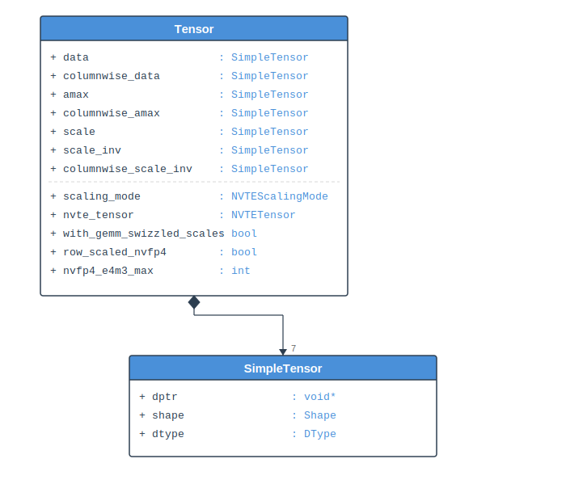

..
    Copyright (c) 2022-2026, NVIDIA CORPORATION & AFFILIATES. All rights reserved.

    See LICENSE for license information.

.. _type-system:

Type System
===========

Transformer Engine maintains two parallel type systems: a C type system for the public
API and a C++ type system for internal use.

The C++ core exposes a **C API** (not C++) for ABI stability. Framework bindings interact
with opaque ``NVTETensor`` handles rather than C++ objects directly. The C++ ``Tensor``
and ``SimpleTensor`` structs in ``common.h`` are internal implementation details —
they are never exposed across the API boundary.

This design means there are **two dtype enums** (``NVTEDType`` in C, ``DType`` in C++)
and **two tensor abstractions** (``NVTEBasicTensor`` in C, ``SimpleTensor`` in C++). They
mirror each other but are not implicitly convertible. The rest of this page documents both
systems and the conversion patterns between them.

C Types (Public API)
--------------------

Defined in ``transformer_engine/common/include/transformer_engine/transformer_engine.h``.

NVTEDType
^^^^^^^^^

A plain C ``enum`` representing data types at the API boundary:

.. code-block:: c

   enum NVTEDType {
       kNVTEByte = 0,
       kNVTEInt16 = 1,
       kNVTEInt32 = 2,
       kNVTEInt64 = 3,
       kNVTEFloat32 = 4,
       kNVTEFloat16 = 5,
       kNVTEBFloat16 = 6,
       kNVTEFloat8E4M3 = 7,
       kNVTEFloat8E5M2 = 8,
       kNVTEFloat8E8M0 = 9,
       kNVTEFloat4E2M1 = 10,
       kNVTENumTypes
   };

NVTEBasicTensor
^^^^^^^^^^^^^^^

A lightweight, non-owning tensor descriptor used to populate ``NVTETensor`` parameters:

.. code-block:: c

   struct NVTEBasicTensor {
       void *data_ptr;      // Raw pointer to data buffer
       NVTEDType dtype;     // Data type
       NVTEShape shape;     // Shape (up to 15 dimensions)
   };

NVTETensor
^^^^^^^^^^

An opaque handle (``typedef void *NVTETensor``) to the internal ``Tensor`` object.
Created with ``nvte_create_tensor()`` and populated via ``nvte_tensor_set()`` with
``NVTETensorParam`` keys:

.. code-block:: c

   enum NVTETensorParam {
       kNVTERowwiseData = 0,
       kNVTEColumnwiseData = 1,
       kNVTEScale = 2,
       kNVTEAmax = 3,
       kNVTERowwiseScaleInv = 4,
       kNVTEColumnwiseScaleInv = 5,
       kNVTEColumnwiseAmax = 6,
       kNVTEWithGEMMSwizzledScales = 7,
   };

NVTEScalingMode
^^^^^^^^^^^^^^^

Controls the quantization granularity — see :doc:`scaling_modes` for details.

C++ Types (Internal)
--------------------

Defined in ``transformer_engine/common/common.h``.

DType
^^^^^

A C++ ``enum class`` in the ``transformer_engine`` namespace, mirroring ``NVTEDType``:

.. code-block:: cpp

   namespace transformer_engine {
   enum class DType {
       kByte, kInt16, kInt32, kInt64,
       kFloat32, kFloat16, kBFloat16,
       kFloat8E4M3, kFloat8E5M2, kFloat8E8M0,
       kFloat4E2M1, kNumTypes
   };
   }

.. warning::

   ``DType`` and ``NVTEDType`` have the same numeric values but are **not** implicitly
   convertible. Use ``static_cast`` for conversions.

SimpleTensor
^^^^^^^^^^^^

A C++ wrapper around ``NVTEBasicTensor`` that provides constructors, implicit conversions,
and utility methods:

.. code-block:: cpp

   struct SimpleTensor {
       void *dptr;
       std::vector<size_t> shape;
       DType dtype;

       // Implicit conversion from NVTEBasicTensor
       SimpleTensor(const NVTEBasicTensor &tensor);
       // Implicit conversion to NVTEBasicTensor
       operator NVTEBasicTensor() const;

       size_t numel() const;
       bool has_data() const;
       size_t buffer_size_bytes() const;
   };

``SimpleTensor`` converts freely to/from ``NVTEBasicTensor``, handling the
``NVTEDType`` ↔ ``DType`` cast internally.

Tensor
^^^^^^

The main internal tensor type, composed of multiple ``SimpleTensor`` members:

   UML-style diagram of the Tensor struct and its SimpleTensor members.

..
   Diagram description for ``tensor_struct.svg``:
   UML struct box labeled "Tensor":
   Fields:
     + data : SimpleTensor              [rowwise quantized data]
     + columnwise_data : SimpleTensor   [columnwise quantized data]
     + amax : SimpleTensor              [absolute maximum]
     + columnwise_amax : SimpleTensor   [columnwise amax]
     + scale : SimpleTensor             [quantization scale]
     + scale_inv : SimpleTensor         [rowwise scale inverse]
     + columnwise_scale_inv : SimpleTensor [columnwise scale inverse]
     + scaling_mode : NVTEScalingMode
     + nvte_tensor : NVTETensor (opaque handle)
     + with_gemm_swizzled_scales : bool
   Below, a smaller UML box for "SimpleTensor":
     + dptr : void*
     + shape : vector<size_t>
     + dtype : DType
   Arrow from each SimpleTensor field in Tensor to the SimpleTensor box (composition).

.. code-block:: cpp

   struct Tensor {
       SimpleTensor data;               // Rowwise data
       SimpleTensor columnwise_data;    // Columnwise data (for wgrad)
       SimpleTensor amax;               // Absolute maximum
       SimpleTensor columnwise_amax;    // Columnwise amax
       SimpleTensor scale;              // Quantization scale
       SimpleTensor scale_inv;          // Rowwise scale inverse
       SimpleTensor columnwise_scale_inv; // Columnwise scale inverse

       NVTEScalingMode scaling_mode;
       NVTETensor nvte_tensor;          // Opaque handle for C API
       bool with_gemm_swizzled_scales;  // MXFP8/NVFP4 scale format flag
   };

This structure holds all the metadata needed for a quantized tensor: the data itself,
scaling factors for both rowwise and columnwise layouts, and amax values for delayed
scaling.

DType / NVTEDType Conversion Patterns
--------------------------------------

When working across the C/C++ boundary, conversions are frequently needed. Here are the
common patterns:

**NVTEDType → DType** (e.g., reading from ``NVTEBasicTensor.dtype``):

.. code-block:: cpp

   NVTEDType nvte_type = tensor.dtype;
   DType dtype = static_cast<DType>(nvte_type);

**DType → NVTEDType** (e.g., writing to ``NVTEBasicTensor.dtype``):

.. code-block:: cpp

   DType dtype = DType::kFloat8E4M3;
   basic_tensor.dtype = static_cast<NVTEDType>(dtype);

**Comparison**: Overloaded ``==`` and ``!=`` operators exist, so direct comparison works:

.. code-block:: cpp

   if (nvte_dtype == DType::kFloat8E4M3) { ... }  // OK

**Function overloads**: Many utility functions accept both types:

.. code-block:: cpp

   // Both of these work:
   bool a = is_fp8_dtype(DType::kFloat8E4M3);
   bool b = is_fp8_dtype(kNVTEFloat8E4M3);

Overloaded functions include: ``is_fp8_dtype``, ``typeToSize``, ``typeToNumBits``,
``get_buffer_size_bytes``, ``get_cuda_dtype``, ``get_cudnn_dtype``, ``get_cudnn_fe_dtype``,
and ``to_string``.

Common Pitfalls
^^^^^^^^^^^^^^^

1. **auto deduction**: ``auto dtype = tensor.dtype;`` deduces ``NVTEDType`` for
   ``NVTEBasicTensor`` fields. If passed to a function expecting ``DType``, add an
   explicit cast.

2. **Ternary expressions**: ``condition ? nvte_val : dtype_val`` won't compile — wrap
   one side in ``static_cast``.

3. **ADL (Argument-Dependent Lookup)**: Functions in the ``transformer_engine`` namespace
   won't be found by ADL when called with ``NVTEDType`` arguments (which are in global
   scope). Use the namespace qualifier: ``transformer_engine::to_string(nvte_type)``.

4. **Custom switch macros**: Macros like ``TRANSFORMER_ENGINE_TYPE_SWITCH_ALL`` cast to
   ``DType`` internally, but custom switch macros (e.g., in ``fused_router/utils.h``)
   may need the same treatment.
