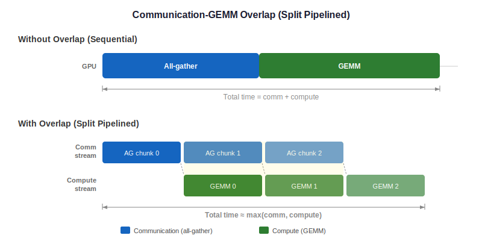

..
    Copyright (c) 2022-2026, NVIDIA CORPORATION & AFFILIATES. All rights reserved.

    See LICENSE for license information.

.. _comm-gemm-overlap:

Communication-GEMM Overlap
===========================

Transformer Engine can overlap NCCL collective communication with GEMM computation to
hide communication latency. This is critical for scaling TP across nodes where
inter-node bandwidth is limited.

   Timeline showing GEMM compute overlapping with all-gather/reduce-scatter.

..
   Diagram description for ``comm_gemm_overlap.svg``:
   Two horizontal timelines:
   Top "Without overlap":
     [All-gather (full)] → [GEMM (full)] — sequential, total time = comm + compute
   Bottom "With overlap":
     Chunk 0: [AG chunk 0] [GEMM chunk 0]
     Chunk 1:              [AG chunk 1] [GEMM chunk 1]
     Chunk 2:                           [AG chunk 2] [GEMM chunk 2]
     Total time ≈ max(comm, compute) — pipelined

Concept
-------

In tensor parallelism, a column-parallel linear requires an all-gather before GEMM, and
a row-parallel linear requires a reduce-scatter after GEMM. Normally these are
sequential:

.. code-block:: text

   all-gather → GEMM    (column-parallel forward)
   GEMM → reduce-scatter (row-parallel forward)

With overlap, the all-gather/reduce-scatter is split into chunks that execute on a
communication stream while GEMM chunks execute on the compute stream:

.. code-block:: text

   comm stream:  [AG chunk 0][AG chunk 1][AG chunk 2]...
   compute stream:           [GEMM 0]    [GEMM 1]   [GEMM 2]...

UserBuffers
-----------

**Location**: ``transformer_engine/common/comm_gemm/``

The overlap implementation uses pre-allocated ``UserBuffers`` — persistent GPU memory
buffers that are registered with NCCL for direct access. This avoids per-iteration
buffer allocation overhead and enables fine-grained pipelining.

Key components:

- ``UserBuffersManager``: Manages lifetime and allocation of persistent buffers.
- Multi-stream coordination via CUDA events for synchronization between communication
  and computation streams.

Overlap Modes
-------------

The ``CommOverlapAlgo`` enum defines the available overlap strategies:

.. list-table::
   :header-rows: 1
   :widths: 35 65

   * - Algorithm
     - Description
   * - ``BULK_OVERLAP_AG``
     - All-gather runs fully in parallel with GEMM (simplest)
   * - ``BULK_OVERLAP_RS``
     - Reduce-scatter runs fully in parallel with GEMM
   * - ``SPLIT_PIPELINED_AG_P2P``
     - All-gather split into fine-grained chunks with P2P, pipelined with GEMM chunks
   * - ``SPLIT_PIPELINED_RS``
     - Reduce-scatter split into chunks, pipelined with GEMM chunks
   * - ``SPLIT_PIPELINED_RS_P2P``
     - Reduce-scatter with P2P, pipelined with GEMM
   * - ``ATOMIC_GEMM_RS``
     - Uses CUDA atomics with reduce-scatter for producer-consumer overlap
   * - ``ATOMIC_GEMM_AG_P2P``
     - Uses CUDA atomics with all-gather P2P

Enabling Overlap
----------------

.. code-block:: python

   model = te.TransformerLayer(
       hidden_size=4096,
       ffn_hidden_size=16384,
       num_attention_heads=32,
       tp_group=tp_group,
       ub_overlap_rs=True,    # Overlap reduce-scatter
       ub_overlap_ag=True,    # Overlap all-gather
   )

Environment variables:

- ``NVTE_UB_OVERLAP``: Enable/disable UserBuffers overlap
- ``NVTE_UB_SPLIT_RS``: Enable split-pipelined reduce-scatter
- ``NVTE_UB_SPLIT_AG``: Enable split-pipelined all-gather

Performance Considerations
--------------------------

Overlap is most beneficial when:

- TP spans across nodes (high communication latency).
- GEMM is large enough to hide communication time.
- Multiple GEMM chunks can execute efficiently (not too small).

Overlap adds complexity (buffer management, stream synchronization) and may not help when
communication is already fast (e.g., within NVLink-connected nodes).

See Also
--------

- :doc:`tensor_parallel` — The TP collectives that are being overlapped
- :doc:`/developer/cpp_core/kernel_areas` — The comm_gemm kernel area
