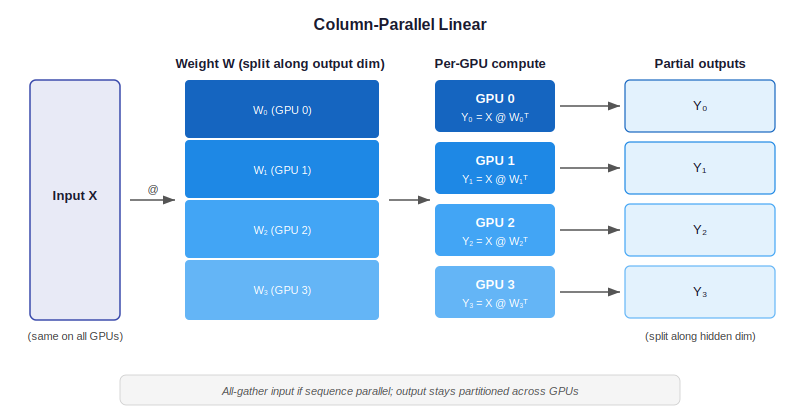
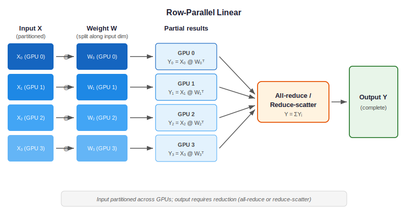

..
    Copyright (c) 2022-2026, NVIDIA CORPORATION & AFFILIATES. All rights reserved.

    See LICENSE for license information.

.. _tensor-parallel:

Tensor Parallelism
==================

Tensor Parallelism (TP) splits individual weight matrices across multiple GPUs,
enabling models too large for a single GPU's memory. Transformer Engine implements
Megatron-style column-parallel and row-parallel linear layers.

   Column-parallel linear: input is broadcast, weight columns are split across GPUs.

..
   Diagram description for ``column_parallel.svg``:
   Left: "Input X" (full tensor, same on all GPUs).
   Center: Weight matrix W split vertically into W_0, W_1, W_2, W_3 (4 GPUs).
   Each GPU computes Y_i = X @ W_i^T (partial output).
   Right: Partial outputs Y_0..Y_3 are concatenated (or kept split for next layer).
   Label: "All-gather input if needed; output is split along hidden dim"

   Row-parallel linear: input is split, weight rows are split, output is reduced.

..
   Diagram description for ``row_parallel.svg``:
   Left: "Input X" split into X_0, X_1, X_2, X_3 (one per GPU).
   Center: Weight matrix W split horizontally into W_0, W_1, W_2, W_3.
   Each GPU computes Y_i = X_i @ W_i^T (partial result).
   Right: "All-reduce (or reduce-scatter)" to produce final output Y = sum(Y_i).
   Label: "Input is partitioned; output requires reduction"

Column-Parallel Linear
----------------------

Used for the **first** linear layer in a pair (e.g., QKV projection, MLP FC1):

.. code-block:: python

   linear = te.Linear(
       in_features=hidden_size,
       out_features=4 * hidden_size,
       parallel_mode="column",
       tp_group=tp_process_group,
   )

**Forward**: Each GPU holds columns ``W[:, start:end]`` and computes partial output.
If the input is not already partitioned, an all-gather collects the full input first.

**Backward**: Gradient of the output is split; weight gradient is computed locally.
Input gradient requires an all-reduce (or reduce-scatter with sequence parallelism).

Row-Parallel Linear
-------------------

Used for the **second** linear layer in a pair (e.g., attention output projection,
MLP FC2):

.. code-block:: python

   linear = te.Linear(
       in_features=4 * hidden_size,
       out_features=hidden_size,
       parallel_mode="row",
       tp_group=tp_process_group,
   )

**Forward**: Each GPU holds rows ``W[start:end, :]`` and computes a partial result.
The partial results are summed via all-reduce (or reduce-scatter).

**Backward**: Gradient is broadcast (or all-gathered); weight gradient is computed locally.

Column + Row Pairing
--------------------

In a Transformer layer, column-parallel and row-parallel layers always appear in pairs:

.. code-block:: text

   MLP:    FC1 (column-parallel) → Activation → FC2 (row-parallel)
   Attn:   QKV (column-parallel) → Attention → Out (row-parallel)

This pairing ensures that only one all-reduce per pair is needed (at the row-parallel
layer's output), minimizing communication.

Implementation Details
----------------------

**Location**: ``transformer_engine/pytorch/distributed.py`` and
``transformer_engine/pytorch/module/linear.py``

Key functions:

- ``allreduce()``: Synchronous all-reduce across TP group.
- ``reduce_scatter_along_first_dim()``: For sequence parallelism integration.
- ``gather_along_first_dim()``: For sequence parallelism integration.

The ``parallel_mode`` parameter on ``Linear`` controls:

1. How the weight is sharded at initialization.
2. Which collective (all-gather, all-reduce, reduce-scatter) is inserted in forward/backward.
3. Whether sequence parallelism communication is used.

See Also
--------

- :doc:`sequence_parallel` — SP extends TP to the sequence dimension
- :doc:`comm_gemm_overlap` — Overlapping GEMM with TP communication
