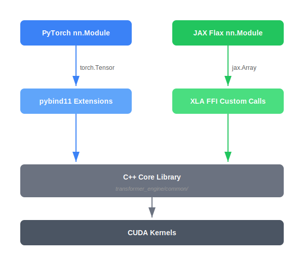

..
    Copyright (c) 2022-2026, NVIDIA CORPORATION & AFFILIATES. All rights reserved.

    See LICENSE for license information.

JAX Module System
=================

The JAX frontend provides Flax ``nn.Module`` wrappers that mirror the PyTorch frontend's
module hierarchy but use JAX idioms (functional transforms, XLA compilation, sharding
annotations).

   PyTorch and JAX frontends share the same C++ core via different binding mechanisms.

..
   Diagram description for ``jax_vs_pytorch_binding.svg``:
   Two parallel vertical paths:
   Left path: "PyTorch nn.Module" → "pybind11" → "C++ Core"
   Right path: "JAX Flax nn.Module" → "XLA FFI" → "C++ Core"
   Both paths converge at the "C++ Core" box at the bottom.
   Labels: "torch.Tensor" on left, "jax.Array" on right.

Module Location
---------------

**Location**: ``transformer_engine/jax/flax/module.py``

Flax Modules
------------

The JAX frontend provides these Flax modules. Core modules are in
``transformer_engine/jax/flax/module.py``, while attention and transformer composition
are in ``transformer_engine/jax/flax/transformer.py``.

.. list-table::
   :header-rows: 1
   :widths: 30 30 40

   * - JAX Module
     - PyTorch Equivalent
     - Description
   * - ``DenseGeneral``
     - ``Linear``
     - General linear layer with FP8 and flexible contracting dimensions
   * - ``LayerNorm``
     - ``LayerNorm`` / ``RMSNorm``
     - Normalization (supports both ``layernorm`` and ``rmsnorm`` types)
   * - ``LayerNormDenseGeneral``
     - ``LayerNormLinear``
     - Fused LN + Linear
   * - ``LayerNormMLP``
     - ``LayerNormMLP``
     - Fused LN + MLP
   * - ``DotProductAttention``
     - ``DotProductAttention``
     - Attention (fused/unfused auto-selection)
   * - ``MultiHeadAttention``
     - ``MultiheadAttention``
     - Full MHA block with projections
   * - ``TransformerLayer``
     - ``TransformerLayer``
     - Complete Transformer block

All FP8-capable modules inherit from ``TransformerEngineBase``, which provides
``generate_quantizer_set()`` for recipe-based quantizer creation.

Key Differences from PyTorch
-----------------------------

**Functional style**: JAX modules are stateless. Parameters are passed explicitly, not
stored as attributes:

.. code-block:: python

   # PyTorch: stateful
   layer = te.Linear(768, 3072)
   output = layer(input)

   # JAX: functional
   layer = te_jax.DenseGeneral(features=3072)
   params = layer.init(rng, input)
   output = layer.apply(params, input)

**Sharding via annotations**: Instead of ``parallel_mode`` constructor args, JAX modules
use logical axis annotations and a ``MeshResource`` set by ``global_shard_guard()`` or
``autocast()``. Within an active JAX ``Mesh``, logical axis rules map those annotations
to physical mesh axes, and XLA SPMD uses the mapping to insert communication:

.. code-block:: python

   import flax.linen as nn
   import transformer_engine.jax.flax as te_jax
   from transformer_engine.jax.sharding import MeshResource, global_shard_guard

   layer = te_jax.DenseGeneral(
       features=3072,
       kernel_axes=("input", "tp"),
   )

   mesh_resource = MeshResource(tp_resource="tp")
   axis_rules = te_jax.extend_logical_axis_rules((("input", None), ("tp", "tp")))
   with global_shard_guard(mesh_resource), nn.logical_axis_rules(axis_rules):
       params = layer.init(rng, input)
       output = layer.apply(params, input)

**Quantization context**: As in the PyTorch frontend, low-precision execution is selected
with ``autocast()``. JAX modules create their quantizer sets from the active recipe;
quantizers are not passed to ``Module.apply()`` explicitly:

.. code-block:: python

   from transformer_engine.common.recipe import MXFP8BlockScaling
   from transformer_engine.jax import autocast
   from transformer_engine.jax.sharding import MeshResource

   with autocast(
       enabled=True,
       recipe=MXFP8BlockScaling(),
       mesh_resource=MeshResource(),
   ):
       params = layer.init(rng, input)
       output = layer.apply(params, input)

See Also
--------

- :doc:`/developer/pytorch_frontend/module_hierarchy` — PyTorch module hierarchy for comparison
- :doc:`xla_ffi_primitives` — How JAX modules call into C++ kernels
- :doc:`sharding` — Detailed sharding configuration
