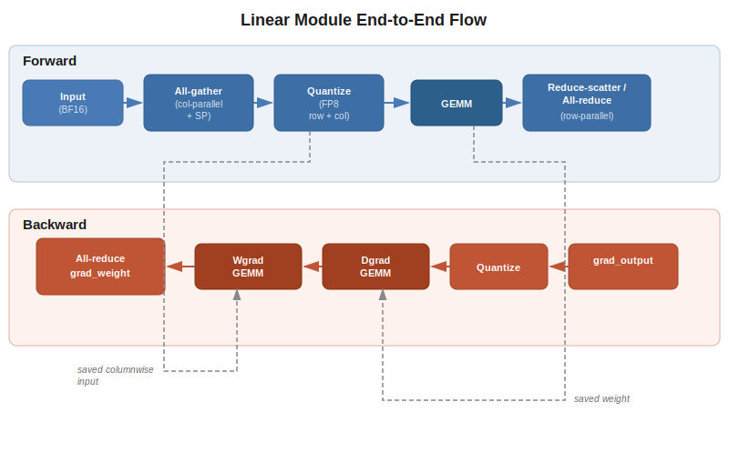

..
    Copyright (c) 2022-2026, NVIDIA CORPORATION & AFFILIATES. All rights reserved.

    See LICENSE for license information.

.. _linear-walkthrough:

Linear Module: End-to-End Walkthrough
======================================

This page traces a complete forward and backward pass through ``te.Linear``, the most
fundamental Transformer Engine module. It connects concepts from across the codebase:
quantization, GEMM, distributed communication, and autograd.

   End-to-end flow through Linear forward and backward with FP8 and tensor parallelism.

..
   Diagram description for ``linear_e2e_flow.svg``:
   Two horizontal swim lanes labeled "Forward" and "Backward".
   Forward lane (left to right):
     1. "Input (BF16)" →
     2. "input_quantizer(input)" producing "FP8 rowwise + columnwise" →
     3. "All-gather (if column-parallel + SP)" →
     4. "general_gemm(weight, input)" producing "Output (BF16)" →
     5. "Reduce-scatter (if row-parallel + SP) or All-reduce (if row-parallel)"
   Backward lane (right to left):
     1. "grad_output (BF16)" →
     2. "grad_output_quantizer(grad)" →
     3. "Dgrad GEMM: general_gemm(grad, weight)" producing "grad_input" →
     4. "Wgrad GEMM: general_gemm(input_columnwise, grad_columnwise)" producing "grad_weight" →
     5. "Reduce-scatter (if row-parallel + SP) or All-reduce (if row-parallel)grad_input"
   Dotted arrows from forward boxes 3→backward box 4 labeled "saved columnwise input"
   and forward weight→backward box 3 labeled "saved weight".

Why This Walkthrough Matters
-----------------------------

A standard ``torch.nn.Linear`` is straightforward: ``output = input @ weight.T + bias``.
TE's Linear does the same math, but introduces two major dimensions of complexity:

1. **Low-precision quantization** — Inputs and weights must be cast to a low-precision
   format (FP8, MXFP8, NVFP4) *before* GEMM, and the backward pass needs the data in a
   *different layout* (columnwise) than the forward pass (rowwise). This means the forward
   pass must proactively prepare data for backward.

2. **Tensor parallelism** — The weight matrix is sharded across GPUs, so collective
   communication (all-gather, reduce-scatter or all-reduce) must be interleaved with computation.
   The type and placement of communication relative to GEMM depends on whether this is a
   column-parallel or row-parallel linear.

These two concerns interact with each other at every step — for instance, quantizing
before an all-gather halves the communication volume. The walkthrough below makes these
interactions explicit.

The flow described here is recipe-agnostic: the same phases execute regardless of
whether the active recipe is MXFP8, current scaling, block scaling, or delayed scaling.
The quantizer abstraction (see :doc:`quantization/class_hierarchy`) hides recipe-specific
details — ``_Linear`` simply calls ``quantizer(tensor)`` and receives quantized data with
the appropriate scales, no matter how those scales were computed.

Setup
-----

Here is the basic example of how one could create and call the Linear layer:

.. code-block:: python

   import transformer_engine.pytorch as te
   from transformer_engine.common.recipe import MXFP8BlockScaling

   # Create a Linear module
   linear = te.Linear(4096, 16384, bias=True)

   # Enable FP8 with MXFP8 recipe
   recipe = MXFP8BlockScaling()
   with te.fp8_autocast(enabled=True, fp8_recipe=recipe):
       output = linear(input)  # Triggers the flow below

Phase 1: Module Forward Entry
------------------------------

**File**: ``transformer_engine/pytorch/module/linear.py``, ``Linear.forward()``

Before any math can happen, TE needs to set up the quantization
infrastructure. Unlike BF16 where you just call GEMM directly, low-precision formats
require quantizer objects that know how to cast data and manage scales. This setup phase
bridges the gap between the user-facing recipe configuration and the quantizer objects
that actually perform casts.

1. ``prepare_forward()`` is called (inherited from ``TransformerEngineBaseModule``):

   - Checks if FP8 is enabled via ``FP8GlobalStateManager`` — a global singleton that
     tracks whether we're inside an ``autocast`` context. This global state exists
     because FP8 behavior must be coordinated across all TE modules in the model and
     we want to be able to pass the information about the recipe the TE modules which
     could be multiple levels deep in the user's model hierarchy.
   - Creates or refreshes ``Quantizer`` instances from the active recipe. Each recipe
     type produces a different ``Quantizer`` subclass (``MXFP8Quantizer``,
     ``Float8CurrentScalingQuantizer``, ``Float8BlockQuantizer``, etc.).
   - Recipe-specific customization is applied — for example, current scaling configures
     ``amax_epsilon`` and ``power_2_scale`` on quantizers, while MXFP8 needs no such
     configuration.

2. Six quantizers are prepared — three for the forward pass and three for the backward
   pass:

   - ``input_quantizer`` — for the activation tensor (forward GEMM input)
   - ``weight_quantizer`` — for the weight parameter (forward GEMM input)
   - ``output_quantizer`` — for the forward output (optional, when ``fp8_output=True``)
   - ``grad_output_quantizer`` — for the backward gradient
   - ``grad_input_quantizer`` — for the backward gradient input (optional, when ``fp8_grad=True``)
   - ``grad_weight_quantizer`` — for the backward weight gradient (currently unused)

   All six are created here because the backward pass executes outside the
   ``fp8_autocast`` context and therefore no longer has access to the recipe
   configuration. By creating the backward quantizers during forward setup, we
   capture the recipe information while it is still available.

   Each tensor gets its own quantizer because activations, weights, and gradients have
   different value distributions — sharing a single scale would waste dynamic range.

3. ``_Linear.apply()`` is called, entering the custom ``torch.autograd.Function``. Using
   custom autograd functions enables us to hide the details of lower precision from
   PyTorch's autograd and implement a custom backward pass.

   All non-Tensor attributes (quantizers, flags, configuration) are packed into a single
   ``non_tensor_args`` tuple and passed as one parameter. This is a deliberate
   optimization: each additional parameter to an autograd function adds CPU overhead
   because PyTorch must inspect it. Packing everything into a single object avoids that
   cost.

Phase 2: _Linear.forward() — Input Quantization and Communication
-------------------------------------------------------------------

**File**: ``transformer_engine/pytorch/module/linear.py``, ``_Linear.forward()``

This is the most complex phase. The GEMM needs the full (ungathered) input, but
communication is expensive and we want to minimize it. A natural idea is to quantize
locally first and communicate the quantized data (1 byte per element for FP8 instead of 2
for BF16). However, the backward wgrad GEMM needs columnwise data while the forward GEMM
needs rowwise data — so both copies must exist somewhere. Because both layouts are needed,
the total data volume does not shrink if we communicate both together. The key insight is
that we can split the communication into two phases: all-gather only the rowwise data
during the forward pass, and all-gather only the columnwise data during the backward pass.
This also reduces the amount of data each GPU must save between forward and backward,
since only the local shard (before all-gather) needs to be retained.

**Column-parallel with sequence parallelism** (QKV projection, FC1):

Each GPU holds a shard of the input along the sequence dimension. The GEMM needs the
full sequence, so an all-gather is required. The key decision: quantize locally first,
then all-gather the quantized data — for FP8, this communicates 1 byte per element
instead of 2 (BF16), cutting communication volume in half.

.. code-block:: python

   # 1. Configure what quantization layouts we need.
   #    Rowwise: for the forward GEMM (this phase).
   #    Columnwise: for the backward wgrad GEMM (Phase 8, later).
   #    We quantize both now because the original BF16 input will be discarded
   #    to save GPU memory.
   input_quantizer.set_usage(rowwise=True, columnwise=backward_needs_input)

   # 2. Quantize the local shard.
   #    The quantizer's `internal` flag is set to True here, so it returns a lightweight
   #    QuantizedTensorStorage rather than a full QuantizedTensor (torch.Tensor subclass).
   #    See :doc:`quantization/class_hierarchy` for the internal flag and the distinction
   #    between these two types.
   inputmat = input_quantizer(inputmat)

   # 3. All-gather only the rowwise quantized data across TP ranks.
   #    The quantizer is passed to the gather with columnwise disabled so that only
   #    the rowwise data is communicated. Columnwise data stays local.
   input_quantizer.set_usage(rowwise=True, columnwise=False)
   inputmat_total, _ = gather_along_first_dim(
       inputmat, tp_group, quantizer=input_quantizer,
   )

.. note::

   The columnwise data is never all-gathered together with the rowwise data during the
   forward pass. Instead, it is all-gathered separately during the backward pass when
   it is actually needed (see Phase 8). This split is what allows each GPU to save only
   its local shard between forward and backward.

**No parallelism** (standalone Linear):

No communication needed — the full input is already local. Quantization still produces
both layouts because the backward pass will need columnwise data regardless.

.. code-block:: python

   # backward_needs_input is True when weight.requires_grad and gradients are enabled
   # (i.e., during training). During inference, no columnwise data is needed.
   input_quantizer.set_usage(rowwise=True, columnwise=backward_needs_input)
   inputmat = input_quantizer(inputmat)
   inputmat_total = inputmat  # No gather needed

Phase 3: _Linear.forward() — Weight Quantization
--------------------------------------------------

**File**: ``transformer_engine/pytorch/module/linear.py``, ``_Linear.forward()``

Before quantizing the weight, if CPU offloading is enabled, the code starts offloading
the input activation to CPU memory. This is done as early as possible so that the
host-to-device transfer can overlap with the weight quantization and the upcoming GEMM.

Weights are persistent parameters that don't
change between microbatches during gradient accumulation. Inputs change every microbatch.
This asymmetry enables an important optimization: quantized weight caching.

.. code-block:: python

   # Configure weight quantizer — rowwise for forward GEMM,
   # columnwise for backward dgrad GEMM (where the weight is the "other" operand).
   weight_quantizer.set_usage(rowwise=True, columnwise=columnwise_usage)

   # Get quantized weight, potentially from cache.
   # On the first microbatch: quantize and cache.
   # On subsequent microbatches: return cached quantized weight.
   weightmat = module.get_weight_workspace(
       tensor=weight,
       quantizer=weight_quantizer,
       cache_name=(None if is_first_microbatch is None else "weight"),
       update_workspace=is_first_microbatch is None or is_first_microbatch,
   )

In gradient accumulation with *N* microbatches, the weight
doesn't change until the optimizer step. Without caching, we'd quantize the same weight
*N* times. With caching, we quantize once and reuse the quantized version for all *N*
forward passes. The ``is_first_microbatch`` parameter controls this: ``True`` triggers a
fresh quantization, ``False`` returns the cached version, ``None`` disables caching
entirely (quantize every time).

The weight also needs a columnwise layout for the backward dgrad
GEMM (Phase 7). The quantizer produces both during the same quantization call, just like
the input quantizer. The columnwise weight data is saved for backward.

Phase 4: _Linear.forward() — GEMM
-----------------------------------

**File**: ``transformer_engine/pytorch/cpp_extensions/gemm.py``

.. code-block:: python

   # Forward GEMM: output = input @ weight^T
   # general_gemm can also accept an output quantizer to produce a quantized output
   # directly, avoiding a separate quantization step when the next layer needs FP8 input.
   gemm_out, *_, reduce_scatter_out = general_gemm(
       weightmat,           # A operand (quantized + scale_inv)
       inputmat_total,      # B operand (quantized + scale_inv)
       out_dtype=activation_dtype,
       bias=bias,           # Fused bias add (avoids separate kernel launch)
       use_split_accumulator=use_split_accumulator,
       ub=ub_obj,           # Userbuffers overlap (optional)
       ub_type=ub_type,
   )

The call traverses four layers, matching the :doc:`architecture_overview`:

1. **Python** (``cpp_extensions/gemm.py``): Passes the ``QuantizedTensorStorage`` objects
   through to the C++ layer. No data extraction happens here.
2. **pybind11** (``csrc/extensions/gemm.cpp``): Accepts inputs as ``py::handle`` /
   ``py::object`` types and converts them to opaque ``NVTETensor`` handles — the C API's
   tensor abstraction. The Python types always own the underlying memory;
   ``NVTETensor`` is a non-owning view.
3. **C API** (``common/gemm/``): Selects the cuBLASLt algorithm and configures compute
   types based on the input precision and scaling mode.
4. **cuBLASLt**: Executes the actual matrix multiply on the GPU.

``use_split_accumulator``: When ``True``, cuBLASLt uses higher-precision intermediate
accumulators, trading some performance for numerical accuracy. This is controlled by the
recipe and defaults to ``False`` for the forward pass (where some accumulation error is
acceptable) and ``True`` for backward (where gradient accuracy matters more). This setting
is Hopper-specific and is a no-op on Blackwell.

Phase 5: _Linear.forward() — Output Communication
----------------------------------------------------

For row-parallel (output projection, FC2):

Each GPU computes a partial sum (because the input is split across the inner dimension).
These partial results must be summed across GPUs to produce the correct output.

.. code-block:: python

   if sequence_parallel:
       # Reduce-scatter: sum partial results AND scatter the output along the
       # sequence dimension, so each GPU only stores its local sequence shard.
       # This is more memory-efficient than all-reduce because the output is
       # smaller on each GPU.
       out, _ = reduce_scatter_along_first_dim(out, tp_group)
   elif tensor_parallel:
       # All-reduce: sum partial results and replicate the full output.
       # Used when sequence parallelism is disabled.
       out, _ = allreduce(out, tp_group)

For column-parallel (QKV, FC1): No communication needed. Each GPU holds a different
slice of the output features, and these slices are independent — they don't need to be
summed or gathered until a downstream operation requires the full output.

Phase 6: _Linear.forward() — Save for Backward
--------------------------------------------------

PyTorch autograd requires saving tensors from the forward pass to compute gradients. For a
standard ``nn.Linear``, this means saving the full input and weight in BF16. With FP8, TE
saves quantized tensors — half the memory — but must carefully track which quantization
layouts to keep.

.. code-block:: python

   # Discard rowwise data — it was only needed for the forward GEMM (Phase 4)
   # and is no longer useful. Keep only columnwise data for the wgrad GEMM.
   if backward_needs_input and own_quantized_input:
       inputmat.update_usage(rowwise_usage=False, columnwise_usage=True)

   # Flatten QuantizedTensorStorage objects for save_for_backward.
   tensors_to_save, tensor_objects = prepare_for_saving(
       inputmat, weightmat, weight, bias,
   )
   ctx.save_for_backward(*tensors_to_save)
   ctx.tensor_objects = tensor_objects

The ``prepare_for_saving`` / ``restore_from_saved`` pair handles the fact that
``QuantizedTensorStorage`` is not a ``torch.Tensor`` and therefore cannot be passed
directly to ``ctx.save_for_backward()``. It splits each storage into metadata and raw
tensors so that PyTorch can manage their lifetime correctly. See
:doc:`pytorch_frontend/autograd_integration` for the full explanation of why this is
necessary and how it works.

The forward GEMM consumes rowwise input, but the backward wgrad GEMM needs columnwise
input (see :doc:`quantization/rowwise_columnwise`). Since TE quantized both layouts in
Phase 2, it can now discard the rowwise data, keeping only the columnwise data. This means
activation memory stored for backward with FP8 is roughly half of what it would be in
BF16 — one byte per element (FP8 columnwise) instead of two (BF16).

For column-parallel with sequence parallelism, only the local shard of the input is
saved, not the full all-gathered tensor. The all-gather will be repeated in the backward
pass. For BF16 training this trades communication for memory — a favorable trade-off in
large model training where activation memory is the binding constraint. For FP8 the total
communication volume is the same as BF16: the forward all-gathers only rowwise data and
the backward all-gathers only columnwise data, so we would need to communicate both pieces
regardless.

Phase 7: _Linear.backward() — Dgrad (Activation Gradient)
-----------------------------------------------------------

**File**: ``transformer_engine/pytorch/module/linear.py``, ``_Linear.backward()``

In the default execution mode, both dgrad and wgrad run within the same autograd function,
so PyTorch cannot overlap dgrad consumers with wgrad. However, TE provides a special
option to delay wgrad and run it outside this function entirely, which allows overlapping
wgrad with pipeline-parallel communication bubbles. This is not the default behavior.

.. code-block:: python

   # Quantize grad_output for the backward GEMMs.
   # Rowwise: needed for dgrad GEMM (this phase).
   # Columnwise: needed for wgrad GEMM (Phase 8).
   # Both are computed now because the BF16 grad_output will be discarded.
   grad_output_quantizer.set_usage(rowwise=True, columnwise=True)
   grad_output = grad_output_preprocess(ctx, grad_output, ...)

   # Dgrad GEMM: grad_input = grad_output @ weight
   # Uses rowwise grad_output and columnwise weight (saved from forward).
   dgrad, *_ = general_gemm(
       weight_fp8,       # Columnwise weight saved in Phase 6
       grad_output,      # Rowwise grad_output
       layout="NN",
       grad=True,        # Signals this is a backward GEMM (affects accumulator)
       out_dtype=activation_dtype,
   )

Communication overlap opportunity: For column-parallel, the dgrad output must be
reduce-scattered (or all-reduced) back to each GPU's local shard. This communication is
launched *asynchronously* — it runs on a separate CUDA stream while the wgrad GEMM
(Phase 8) executes on the compute stream. Similarly, if the wgrad needs a re-gathered
input (column-parallel + SP), that all-gather is launched asynchronously during dgrad
and synchronized before wgrad begins.

Phase 8: _Linear.backward() — Wgrad (Weight Gradient)
-------------------------------------------------------

The wgrad GEMM computes ``grad_weight = input^T @ grad_output``. The transpose of rowwise
data is columnwise data, so the pre-computed columnwise layout from Phase 2 is used here.
Transposing at this point would cause both performance and numerics problems — for
block-wise formats, the transpose requires requantization with different block boundaries,
introducing additional quantization error (see :doc:`quantization/rowwise_columnwise`).

.. code-block:: python

   # Synchronize any async communication from Phase 7
   if inputmat_total_work is not None:
       inputmat_total_work.wait()

   # Ensure columnwise data is available
   inputmat_total.update_usage(columnwise_usage=True)

   # Wgrad GEMM: grad_weight = input^T @ grad_output
   wgrad, *_ = general_gemm(
       inputmat_total,    # Columnwise input saved from forward
       grad_output,       # Columnwise grad_output from Phase 7
       out_dtype=activation_dtype,
       grad=True,
       ub=ub_obj_wgrad,
       ub_type=ub_type_wgrad,
   )

``fuse_wgrad_accumulation``: When enabled (common in Megatron-LM), the wgrad GEMM
accumulates directly into ``weight.main_grad`` instead of allocating a separate gradient
tensor. This avoids an extra memory allocation and addition kernel.

Phase 9: Post-Backward Cleanup
--------------------------------

After both GEMMs complete, the backward pass handles recipe-specific bookkeeping.

For most recipes (MXFP8, current scaling, block scaling), there is no post-backward state
to update — scales are computed inline during quantization and don't carry state across
iterations. This is one of the advantages of these recipes: they are stateless.

Delayed scaling only: The delayed scaling recipe is an exception. It maintains an
amax history — a rolling window of observed maximum values — that feeds forward into
the next iteration's scale computation. After the backward pass completes, the first FP8
module in the autocast region triggers
``FP8GlobalStateManager.reduce_and_update_fp8_tensors()``, which all-reduces amax values
across TP ranks and updates the history buffer. This ensures all ranks agree on scales. If
you're not using delayed scaling, this code path is skipped. See
:doc:`quantization/scaling_recipes` for details on the amax update flow and important
caveats about distributed correctness.

See Also
--------

- :doc:`architecture_overview` — High-level system architecture
- :doc:`quantization/class_hierarchy` — Quantizer/Storage/Tensor design
- :doc:`quantization/rowwise_columnwise` — Why both layouts exist
- :doc:`pytorch_frontend/autograd_integration` — Autograd patterns
- :doc:`distributed/tensor_parallel` — TP communication in Linear
- :doc:`/features/low_precision_training/index` — User-facing recipe documentation and examples
