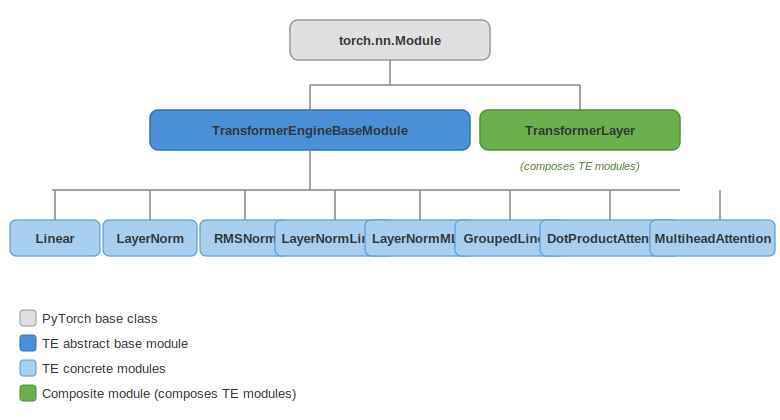

..
    Copyright (c) 2022-2026, NVIDIA CORPORATION & AFFILIATES. All rights reserved.

    See LICENSE for license information.

.. _module-hierarchy:

Module Hierarchy
================

All PyTorch modules in Transformer Engine extend a common base class that provides
FP8 state management, quantizer lifecycle, and distributed training hooks.

   Inheritance tree of TransformerEngine PyTorch modules.

..
   Diagram description for ``pytorch_module_hierarchy.svg``:
   Tree diagram with torch.nn.Module at the top.
   Below it: TransformerEngineBaseModule.
   Below that, branching to:
     ├── Linear
     ├── LayerNorm
     ├── RMSNorm
     ├── LayerNormLinear
     ├── LayerNormMLP
     ├── GroupedLinear
     ├── DotProductAttention
     └── MultiheadAttention
   A separate branch from torch.nn.Module: TransformerLayer (composes the above modules
   rather than inheriting from BaseModule).

TransformerEngineBaseModule
---------------------------

**Location**: ``transformer_engine/pytorch/module/base.py``

``TransformerEngineBaseModule`` extends ``torch.nn.Module`` and is the foundation for all
TE modules that support FP8 quantization. Key responsibilities:

**FP8 State Management**

- ``init_fp8_metadata()``: Creates quantizer instances and amax history buffers based on
  the active recipe.
- ``pre_forward()``: Called at the start of each forward pass to update FP8 state (refresh
  scales from amax history, check if FP8 is enabled).
- ``post_forward()``: Called after forward to record amax values.
- FP8 metadata is registered as module buffers for serialization.

**Quantizer Access**

- Maintains quantizers for each quantized tensor (input, weight, gradient).
- Quantizer instances are recreated when the recipe changes.

**Distributed Hooks**

- ``set_tensor_parallel_group()``: Configure TP process group.
- ``set_sequence_parallel()``: Enable sequence parallelism.
- Manages all-reduce of amax values across distributed ranks.

**Parameter Management**

- ``weight`` parameter with optional FP8 storage.
- ``bias`` parameter (optional).
- Weight caching for FP8 weights that persist across iterations.

Module Subclasses
-----------------

Linear
^^^^^^

**Location**: ``transformer_engine/pytorch/module/linear.py``

The workhorse module. Performs ``output = input × weight^T + bias`` with optional FP8
quantization of both input and weight.

- Defines a ``_Linear`` autograd function (see :doc:`autograd_integration`).
- Supports tensor parallelism (column-parallel and row-parallel modes).
- Can fuse with preceding LayerNorm (via ``LayerNormLinear``).

LayerNorm / RMSNorm
^^^^^^^^^^^^^^^^^^^^

**Location**: ``transformer_engine/pytorch/module/layernorm.py``,
``transformer_engine/pytorch/module/rmsnorm.py``

Normalization modules that can fuse their output quantization with the normalization
kernel (single kernel pass for norm + cast to FP8).

LayerNormLinear
^^^^^^^^^^^^^^^

**Location**: ``transformer_engine/pytorch/module/layernorm_linear.py``

Fuses LayerNorm (or RMSNorm) with a subsequent Linear. The normalization output is
produced directly in FP8, avoiding a round-trip through high precision.

LayerNormMLP
^^^^^^^^^^^^

**Location**: ``transformer_engine/pytorch/module/layernorm_mlp.py``

Fuses LayerNorm + Linear + Activation + Linear (the full MLP block). This is the most
aggressively fused module, combining up to 4 operations.

GroupedLinear
^^^^^^^^^^^^^

**Location**: ``transformer_engine/pytorch/module/grouped_linear.py``

Batched linear operations for Mixture-of-Experts (MoE) where multiple smaller linear
layers execute as a single grouped GEMM.

DotProductAttention
^^^^^^^^^^^^^^^^^^^

**Location**: ``transformer_engine/pytorch/attention/dot_product_attention/dot_product_attention.py``

Computes scaled dot-product attention with automatic backend selection
(see :doc:`/developer/attention/backends`). Supports FP8 attention on Hopper+.

MultiheadAttention
^^^^^^^^^^^^^^^^^^

**Location**: ``transformer_engine/pytorch/attention/multi_head_attention.py``

Composes QKV projection (Linear), DotProductAttention, and output projection (Linear)
into a complete multi-head attention block. Handles the split into heads and optional
key-value caching for inference.

TransformerLayer
^^^^^^^^^^^^^^^^

**Location**: ``transformer_engine/pytorch/transformer.py``

Composes a full Transformer block (see :doc:`transformer_layer`). Note that
``TransformerLayer`` does **not** inherit from ``TransformerEngineBaseModule`` — it
composes TE modules rather than being one.

Module Lifecycle
----------------

A typical forward pass through a TE module:

.. code-block:: text

   1. fp8_autocast() sets global FP8 state
   2. module.forward() called
      a. pre_forward() — refresh FP8 scales, create quantizers
      b. Quantize input via input_quantizer(input)
      c. Get quantized weight (cached or quantize via weight_quantizer)
      d. Call _Linear.forward() autograd function
         i.  general_gemm(quantized_input, quantized_weight)
         ii. Save tensors for backward
      e. post_forward() — record amax values
   3. Return output

See :doc:`autograd_integration` for details on step (d).
