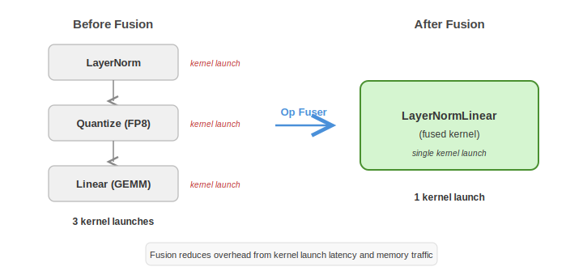

..
    Copyright (c) 2022-2026, NVIDIA CORPORATION & AFFILIATES. All rights reserved.

    See LICENSE for license information.

.. _ops-framework:

Op Fusion Framework (``te.ops``)
================================

Transformer Engine includes an operation fusion framework (``transformer_engine/pytorch/ops/``)
that enables composing and automatically fusing operations for better performance.

For **user-facing** documentation (basic usage, examples), see :doc:`/examples/op_fuser/op_fuser`.
This page covers the **internal architecture** for developers working on the framework itself.

   Before and after op fusion: separate ops become a single fused op.

..
   Diagram description for ``ops_fusion.svg``:
   Left side "Before Fusion":
     Three sequential boxes: "LayerNorm" → "Quantize" → "Linear"
     Each box has a separate kernel launch arrow.
   Right side "After Fusion":
     Single box: "LayerNormLinear (fused)"
     Single kernel launch arrow.
   Arrow between left and right labeled "Op Fuser".

Motivation
----------

TE's monolithic modules (``LayerNormLinear``, ``LayerNormMLP``) achieve high performance
through hand-tuned fusion, but they are rigid — adding a new model architecture or
experimenting with different fusion patterns requires modifying large, complex modules.

The ops framework takes the opposite approach: users compose small, atomic operations
and the framework **automatically discovers and applies fusions** via a sliding-window
pattern matcher. The same fused kernels are used either way.

Architecture
------------

The framework has five key components:

.. code-block:: text

   Sequential                    User-facing container (like torch.nn.Sequential)
     └── OperationFuser          Manages fusion pipeline for a group of ops
           └── _OperationFuserAutogradFunction    Custom autograd for fused forward/backward
                 └── FusibleOperation             Abstract base for all ops
                       ├── BasicOperation          Atomic op (holds params, implements fwd/bwd)
                       └── FusedOperation          Compound op (wraps multiple BasicOperations)

**Sequential** (``ops/sequential.py``)
   Drop-in replacement for ``torch.nn.Sequential``. On first forward call, lazily groups
   consecutive ``FusibleOperation`` instances into ``OperationFuser`` objects. Non-fusible
   ``torch.nn.Module`` instances remain standalone between groups.

**OperationFuser** (``ops/fuser.py``)
   Manages one group of fusible operations. On first call, applies registered fusion
   functions to discover fusible patterns. Executes the fused pipeline via a custom
   ``torch.autograd.Function``.

**BasicOperation** (``ops/op.py``)
   An atomic operation that holds parameters and implements ``op_forward()`` /
   ``op_backward()`` with an ``OperationContext`` (similar to ``torch.autograd.Function``'s
   ``ctx``). All quantization state (``Quantizer`` instances, FP8 metadata) lives here.

**FusedOperation** (``ops/op.py``)
   A compound operation that replaces one or more ``BasicOperation`` instances with a
   fused implementation. It is **stateless** — it accesses parameters and quantizers
   through its constituent basic ops. Forward and backward may use different fusions
   (e.g., ``ForwardLinearBiasActivation`` for forward, ``BackwardActivationBias`` for
   backward).

**OperationContext** (``ops/op.py``)
   Lightweight dataclass for caching state between forward and backward, per basic op:

   .. code-block:: python

      @dataclasses.dataclass
      class OperationContext:
          saved_tensors: Optional[tuple[Optional[torch.Tensor], ...]]
          to_save: Optional[tuple[Optional[torch.Tensor], ...]]
          requires_grad: bool = True

          def save_for_backward(self, *tensors): ...

Execution Flow
--------------

**First call** through ``Sequential.forward()``:

.. code-block:: text

   Sequential.forward(input)
     │
     ├─ _make_module_groups(modules)
     │    Group consecutive FusibleOps → [OperationFuser, Module, OperationFuser, ...]
     │
     └─ for group in module_groups:
          if OperationFuser:
            group(input)
              │
              ├─ maybe_fuse_ops(...)
              │    ├─ Reset recipe state for all basic ops
              │    ├─ Apply forward_fusion_functions (sliding window pattern match)
              │    └─ Apply backward_fusion_functions
              │
              ├─ op.pre_fuser_forward() for each op
              │
              └─ _OperationFuserAutogradFunction.apply(input, fuser, ...)
                   │
                   ├─ Forward: for (op, basic_op_idxs) in forward_ops:
                   │    op.fuser_forward(ctxs, input, quantizers_from_neighbors, ...)
                   │
                   └─ Backward: for (op, basic_op_idxs) in reversed(backward_ops):
                        op.fuser_backward(ctxs, grad_output, ...)

**Subsequent calls** reuse the cached fusion state unless invalidated (recipe change,
gradient requirements change, etc.).

Fusion Pipeline
---------------

Fusion is driven by **registered fusion functions** — callables that scan a list of ops
with a sliding window and replace matching patterns:

.. code-block:: python

   # Type signature for fusion functions
   OperationFusionFunction = Callable[
       [list[FusibleOperation], ...],  # ops to scan
       list[FusibleOperation],         # ops after fusion (same or fewer)
   ]

Fusion functions are registered globally and applied in order:

.. code-block:: python

   from transformer_engine.pytorch.ops import register_forward_fusion

   register_forward_fusion(my_fusion_function)
   register_forward_fusion(another_fusion, prepend=True)  # Higher priority

**Forward and backward have separate fusion registries.** This is important because the
optimal fusion pattern can differ between passes. For example, a forward pass might fuse
``[BasicLinear, Bias, GELU]`` into ``ForwardLinearBiasActivation``, while the backward
fuses ``[GELU_bwd, Bias_bwd]`` into ``BackwardActivationBias``.

**Sliding window pattern matching** is the standard approach. Each fusion function scans
with a window of 2-3 ops, checks if the pattern matches (including constraints like
dtype, parallel mode, etc.), and replaces with a ``FusedOperation`` if so.

Quantizer Passing Between Ops
------------------------------

A key mechanism for enabling fused quantization: the fuser passes quantizers between
adjacent ops during execution.

.. code-block:: python

   # In _OperationFuserAutogradFunction.forward():
   for i, (op, idxs) in enumerate(forward_ops):
       # Get quantizer from previous op's backward
       prev_quantizer = forward_ops[i-1].get_grad_output_quantizer()
       # Get quantizer from next op's forward
       next_quantizer = forward_ops[i+1].get_input_quantizer()

       op.fuser_forward(
           ...,
           prev_op_grad_output_quantizer=prev_quantizer,
           next_op_input_quantizer=next_quantizer,
       )

This allows an op to **quantize its output eagerly** using the next op's quantizer,
enabling fused cast kernels. For example, a LayerNorm op receiving the next Linear's
input quantizer can fuse the normalization and FP8 cast into a single kernel.

Catalog of Basic Operations
----------------------------

.. list-table::
   :header-rows: 1
   :widths: 25 40 35

   * - Operation
     - File
     - Description
   * - ``BasicLinear``
     - ``basic/basic_linear.py``
     - Core GEMM (no bias). Supports FP8, TP, SP.
   * - ``Bias``
     - ``basic/bias.py``
     - Additive bias parameter.
   * - ``LayerNorm``
     - ``basic/layer_norm.py``
     - Layer normalization with learnable scale/bias.
   * - ``RMSNorm``
     - ``basic/rmsnorm.py``
     - Root mean square normalization.
   * - ``GELU``, ``SiLU``, ``ReLU``, ``QGELU``
     - ``basic/activation.py``
     - Element-wise activation functions.
   * - ``GEGLU``, ``SwiGLU``, ``ReGLU``, ``SReGLU``, ``QGEGLU``, ``GLU``,
       ``ClampedSwiGLU``, ``ScaledSwiGLU``
     - ``basic/activation.py``, ``basic/swiglu.py``
     - Gated activation functions (2× input split).
   * - ``Quantize``
     - ``basic/quantize.py``
     - Explicit FP8 cast (identity if FP8 disabled).
   * - ``AllGather``
     - ``basic/all_gather.py``
     - Distributed all-gather along first dim.
   * - ``AllReduce``
     - ``basic/all_reduce.py``
     - Distributed all-reduce.
   * - ``ReduceScatter``
     - ``basic/reduce_scatter.py``
     - Distributed reduce-scatter along first dim.
   * - ``AddExtraInput``
     - ``basic/add_extra_input.py``
     - Add an extra tensor input (for residual connections).
   * - ``MakeExtraOutput``
     - ``basic/make_extra_output.py``
     - Export intermediate tensor as extra output.
   * - ``Dropout``
     - ``basic/dropout.py``
     - Random zeroing.
   * - ``Reshape``
     - ``basic/reshape.py``
     - Tensor reshape.
   * - ``Identity``
     - ``basic/identity.py``
     - Pass-through (useful as fusion anchor).
   * - ``ConstantScale``
     - ``basic/constant_scale.py``
     - Multiply by constant factor.
   * - ``L2Normalization``
     - ``basic/l2normalization.py``
     - L2 normalization.
   * - ``GroupedLinear``
     - ``basic/grouped_linear.py``
     - Multiple parallel GEMMs (MoE).

Catalog of Fused Operations
----------------------------

**Forward fusions** (registered in ``ops/fused/__init__.py``):

.. list-table::
   :header-rows: 1
   :widths: 30 35 35

   * - Fused Operation
     - Pattern
     - Description
   * - ``ForwardLinearBiasActivation``
     - ``BasicLinear`` + ``Bias`` + activation
     - Fused GEMM + bias + activation
   * - ``ForwardLinearBiasAdd``
     - ``BasicLinear`` + ``Bias`` + ``AddExtraInput``
     - Fused GEMM + bias + residual add
   * - ``ForwardLinearScaleAdd``
     - ``BasicLinear`` + ``ConstantScale`` + ``AddExtraInput``
     - Fused GEMM + scale + add
   * - ``UserbuffersForwardLinear``
     - ``BasicLinear`` + ``Bias`` + ``ReduceScatter``
     - GEMM overlapped with TP communication

**Backward fusions**:

.. list-table::
   :header-rows: 1
   :widths: 30 35 35

   * - Fused Operation
     - Pattern
     - Description
   * - ``BackwardActivationBias``
     - Backward of activation + bias
     - Fused activation and bias gradients
   * - ``BackwardAddRMSNorm``
     - Backward of add + RMSNorm
     - Fused residual add and norm gradients
   * - ``BackwardLinearAdd``
     - ``MakeExtraOutput`` + ``BasicLinear``
     - Fused dgrad GEMM + residual add
   * - ``BackwardLinearScale``
     - Backward GEMM + scale
     - Fused backward GEMM and scaling
   * - ``UserbuffersBackwardLinear``
     - Backward with Userbuffers
     - Backward GEMM overlapped with TP communication

Extra Inputs and Outputs
-------------------------

Most ops are purely sequential (one input, one output). Some ops need branching:

- ``AddExtraInput`` (``num_extra_inputs=1``): Accepts an additional tensor and adds it
  to the intermediate value. Used for residual connections.
- ``MakeExtraOutput`` (``num_extra_outputs=1``): Copies the intermediate value to an
  extra output. Used to extract residual before a transformation.

Extra inputs are passed as additional arguments to ``Sequential.forward()``, and extra
outputs are returned as additional values:

.. code-block:: python

   # MLP with residual
   mlp = te.ops.Sequential(
       te.ops.LayerNorm(4096),
       te.ops.MakeExtraOutput(),  # Branch: emit residual
       te.ops.Linear(4096, 16384),
       te.ops.SwiGLU(),
       te.ops.Linear(8192, 4096),
       te.ops.AddExtraInput(),    # Merge: add residual
   )

   y, residual = mlp(x)  # Extra output from MakeExtraOutput
   # Or split across two Sequentials:
   # y = mlp2(mlp1_out, residual)  # Extra input to AddExtraInput

Ops with extra inputs/outputs must override ``fuser_forward`` / ``fuser_backward``
(the default ``BasicOperation`` wrappers raise an error for these).

The ``te.ops.Linear`` Composition
----------------------------------

``te.ops.Linear`` (``ops/linear.py``) is a ``FusedOperation`` that serves as a drop-in
replacement for ``torch.nn.Linear``. It composes basic ops based on the parallelism
configuration:

.. code-block:: text

   No TP:        BasicLinear → Bias
   Column TP:    BasicLinear → Bias
   Row TP:       BasicLinear → Bias → ReduceScatter (if SP) or AllReduce

The weight and bias parameters are registered on the ``Linear`` and forwarded to the
underlying ``BasicLinear`` and ``Bias`` ops. State dict methods are overridden for
backward compatibility with ``torch.nn.Linear`` checkpoints.

Relationship to Monolithic Modules
------------------------------------

The ops framework and the monolithic modules (``module/linear.py``,
``module/layernorm_mlp.py``, etc.) are **two parallel implementations** of the same
functionality:

.. list-table::
   :header-rows: 1
   :widths: 25 37 38

   * - Aspect
     - Monolithic Modules (``module/``)
     - Ops Framework (``ops/``)
   * - Fusion
     - Hand-coded in ``_Linear``, ``_LayerNormMLP``
     - Automatic via pattern-matching fuser
   * - Flexibility
     - Fixed compositions
     - Arbitrary op sequences
   * - Performance
     - Maximum (hand-tuned)
     - Comparable (same kernels)
   * - Complexity
     - High (400+ line autograd functions)
     - Distributed across small ops
   * - Maturity
     - Production
     - Experimental

Both approaches call the same C++ extensions and CUDA kernels. The ops framework is
intended to eventually replace the monolithic modules as the primary implementation,
once it reaches feature parity.

See Also
--------

- :doc:`/examples/op_fuser/op_fuser` — User-facing documentation with usage examples
  and how to implement new operations
- :doc:`autograd_integration` — How ``_Linear`` autograd works (monolithic approach)
- :doc:`/developer/quantization/class_hierarchy` — Quantizer classes used by the ops
