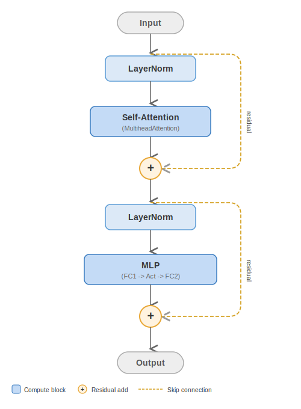

..
    Copyright (c) 2022-2026, NVIDIA CORPORATION & AFFILIATES. All rights reserved.

    See LICENSE for license information.

.. _transformer-layer:

TransformerLayer
================

``TransformerLayer`` (``transformer_engine/pytorch/transformer.py``) composes TE modules
into a complete Transformer block. Unlike other TE modules, it does **not** inherit from
``TransformerEngineBaseModule`` — it is a pure composition of TE sub-modules.

   Data flow through a TransformerLayer.

..
   Diagram description for ``transformer_layer.svg``:
   Vertical flow diagram:
   "Input" → "LayerNorm" → "Self-Attention (MHA)" → "+" (residual add) →
   "LayerNorm" → "MLP (LayerNormMLP)" → "+" (residual add) → "Output"
   Residual connections shown as arrows bypassing the attention and MLP blocks.

Architecture
------------

A standard ``TransformerLayer`` contains:

.. code-block:: text

   TransformerLayer
   ├── self_attention: MultiheadAttention
   │   ├── qkv_projection: LayerNormLinear    # Fused LN + QKV projection
   │   ├── core_attention: DotProductAttention # Attention computation
   │   └── output_projection: Linear          # Output projection
   ├── layernorm_mlp: LayerNormMLP            # Fused LN + FC1 + Act + FC2
   └── (optional) cross_attention: MultiheadAttention

Configuration
-------------

Key constructor parameters:

.. list-table::
   :header-rows: 1
   :widths: 30 70

   * - Parameter
     - Description
   * - ``hidden_size``
     - Model hidden dimension
   * - ``ffn_hidden_size``
     - Feed-forward network intermediate size
   * - ``num_attention_heads``
     - Number of attention heads
   * - ``num_gqa_groups``
     - Number of GQA groups (for grouped-query attention)
   * - ``layer_type``
     - ``"encoder"`` or ``"decoder"`` (controls cross-attention)
   * - ``self_attn_mask_type``
     - ``"causal"``, ``"padding"``, ``"no_mask"``, etc.
   * - ``normalization``
     - ``"LayerNorm"`` or ``"RMSNorm"``
   * - ``activation``
     - ``"gelu"``, ``"swiglu"``, ``"geglu"``, etc.

Distributed Training
--------------------

When ``set_tensor_parallel_group()`` is called, the sub-modules automatically configure:

- QKV projection as **column-parallel** (split heads across ranks).
- Attention output projection as **row-parallel** (each rank has partial output, reduced
  via all-reduce or reduce-scatter).
- MLP FC1 as **column-parallel**, FC2 as **row-parallel**.

With sequence parallelism enabled, the LayerNorm and residual additions operate on
sequence-partitioned data.

See :doc:`/developer/distributed/tensor_parallel` for details on the parallelism patterns.
