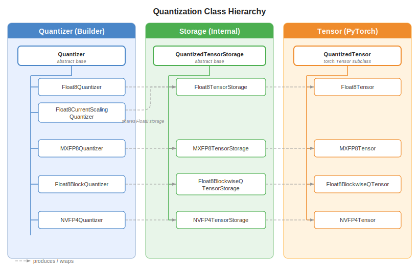

..
    Copyright (c) 2022-2026, NVIDIA CORPORATION & AFFILIATES. All rights reserved.

    See LICENSE for license information.

.. _quantization-class-hierarchy:

Class Hierarchy
===============

The quantization system is built around three parallel class hierarchies that work
together: **Quantizers** (builders), **Storage** (lightweight internal), and **Tensors**
(full PyTorch integration).

   The three-column quantization class hierarchy.

..
   Diagram description for ``quantizer_hierarchy.svg``:
   Three columns side by side:
   Column 1 "Quantizer (Builder)":
     Quantizer (abstract base)
       ├── Float8Quantizer (delayed tensor scaling)
       ├── Float8CurrentScalingQuantizer (current tensor scaling)
       ├── MXFP8Quantizer (MXFP8 block scaling)
       ├── Float8BlockQuantizer (1D/2D block scaling)
       └── NVFP4Quantizer (NVFP4 scaling)
   Column 2 "Storage (Internal)":
     QuantizedTensorStorage (abstract base)
       ├── Float8TensorStorage
       ├── MXFP8TensorStorage
       ├── Float8BlockwiseQTensorStorage
       └── NVFP4TensorStorage
   Column 3 "Tensor (PyTorch)":
     QuantizedTensor (torch.Tensor subclass)
       ├── Float8Tensor
       ├── MXFP8Tensor
       ├── Float8BlockwiseQTensor
       └── NVFP4Tensor
   Arrows from each Quantizer to its corresponding Storage and Tensor.

Design Rationale
----------------

The three-class design exists because quantized data has two distinct consumers:

1. **Internal kernel code** needs lightweight access to raw data + scales, without
   PyTorch autograd overhead. This is served by ``QuantizedTensorStorage``.
2. **User-facing code** needs a full ``torch.Tensor`` subclass that participates in
   autograd, supports ``__torch_dispatch__``, and can be passed to standard PyTorch APIs.
   This is served by ``QuantizedTensor``.
3. **Configuration and creation** needs a stateful builder that knows how to compute
   scales, manage amax history, and produce both storage and tensor forms. This is the
   ``Quantizer``.

Quantizer (Base: ``transformer_engine/pytorch/quantized_tensor.py``)
---------------------------------------------------------------------

The ``Quantizer`` abstract class is the entry point for all quantization. Key
responsibilities:

- **Configure** what kind of quantization to apply (data type, scaling mode, block size).
- **Track usage** mode (rowwise, columnwise, or both) via ``set_usage()``.
- **Produce** quantized tensors via ``__call__()`` (or ``quantize()``).
- **Manage state** for delayed scaling (amax history, scale update).

.. code-block:: python

   class Quantizer:
       # Core interface
       def __call__(self, tensor, *, noop=False) -> QuantizedTensor: ...
       def quantize(self, tensor, *, noop=False) -> QuantizedTensorStorage: ...

       # Usage control
       def set_usage(self, *, rowwise=False, columnwise=False): ...

The ``internal`` Flag
^^^^^^^^^^^^^^^^^^^^^

The ``Quantizer.internal`` flag controls whether ``__call__()`` returns a
``QuantizedTensorStorage`` (lightweight, no autograd overhead) or a full
``QuantizedTensor`` (``torch.Tensor`` subclass with autograd support):

- ``internal=True`` → returns ``QuantizedTensorStorage``. Used for tensors that stay
  within the boundaries of a custom ``torch.autograd.Function`` (e.g., the activation
  inside ``_Linear``). Because these tensors never escape to user code or participate in
  autograd, the storage-only form avoids the CPU overhead of ``torch.Tensor`` subclass
  mechanics.
- ``internal=False`` → returns ``QuantizedTensor``. Used for tensors that are visible
  outside the autograd function (e.g., returned to the user as a quantized output).

Concrete Quantizers
^^^^^^^^^^^^^^^^^^^

.. list-table::
   :header-rows: 1
   :widths: 30 20 50

   * - Class
     - Location
     - Description
   * - ``Float8Quantizer``
     - ``tensor/float8_tensor.py``
     - Delayed tensor scaling with amax history
   * - ``Float8CurrentScalingQuantizer``
     - ``tensor/float8_tensor.py``
     - Current (just-in-time) tensor scaling
   * - ``MXFP8Quantizer``
     - ``tensor/mxfp8_tensor.py``
     - MXFP8 with 32-element E8M0 block scales
   * - ``Float8BlockQuantizer``
     - ``tensor/float8_blockwise_tensor.py``
     - 1D or 2D block scaling with configurable block size
   * - ``NVFP4Quantizer``
     - ``tensor/nvfp4_tensor.py``
     - NVFP4 with 16-element E8M0 block scales

QuantizedTensorStorage (Base: ``transformer_engine/pytorch/quantized_tensor.py``)
----------------------------------------------------------------------------------

``QuantizedTensorStorage`` is a lightweight wrapper around quantized data and its
associated scales. It is **not** a ``torch.Tensor`` subclass — it has no autograd
support and minimal overhead.

.. code-block:: python

   class QuantizedTensorStorage:
       # Key internal attributes (accessed directly, not via properties)
       _data: torch.Tensor           # Raw quantized data
       _scale_inv: torch.Tensor      # Scale inverse for dequantization

       # Public interface
       def update_usage(self, *, rowwise_usage=None, columnwise_usage=None): ...
       def get_usages(self) -> tuple[bool, bool]: ...
       def prepare_for_saving(self) -> tuple: ...   # For autograd save_for_backward
       def restore_from_saved(cls, saved) -> "QuantizedTensorStorage": ...
       def quantize_(self, tensor, quantizer): ...  # In-place quantization
       def copy_from_storage(self, other): ...

Storage objects are used internally by:

- C++ extension calls (converted to ``NVTETensor`` for kernel dispatch)
- The GEMM pipeline (directly passes internal data + scale tensors)
- Op fusion internals (avoids autograd overhead in fused kernels)

.. note::

   ``_data`` and ``_scale_inv`` are internal attributes, not public properties. Subclasses
   (e.g., ``Float8TensorStorage``) access them directly. External code should use the
   ``get_data_tensors()`` method on ``QuantizedTensor`` or pass storage objects to GEMM
   APIs that know how to extract the internal data.

QuantizedTensor (Base: ``transformer_engine/pytorch/quantized_tensor.py``)
---------------------------------------------------------------------------

``QuantizedTensor`` is a ``torch.Tensor`` subclass that wraps a
``QuantizedTensorStorage`` and adds PyTorch integration:

.. code-block:: python

   class QuantizedTensor(torch.Tensor):
       # torch.Tensor subclass machinery
       def __torch_dispatch__(cls, func, types, args, kwargs): ...

       # Data access (get_data_tensors() is on concrete Storage subclasses, not here)
       def get_metadata(self) -> dict: ...      # Scaling metadata

       # Dequantize
       def dequantize(self) -> torch.Tensor: ...
       def float(self) -> torch.Tensor: ...
       def bfloat16(self) -> torch.Tensor: ...
       def half(self) -> torch.Tensor: ...

       # Lifecycle
       def quantize_(self, tensor, quantizer): ...
       def clear(self): ...

Key behaviors:

- **Dequantize on access**: Most ``torch`` operations trigger automatic dequantization
  via ``__torch_dispatch__``, so quantized tensors "just work" in standard PyTorch code
  (at the cost of a dequantize).
- **GEMM fast path**: The GEMM implementation checks for ``QuantizedTensor`` inputs and
  uses ``get_data_tensors()`` to extract raw data directly, avoiding dequantization.
- **Autograd compatible**: Can be saved in autograd's ``ctx.save_for_backward()``.

Lifecycle
---------

A typical quantization lifecycle:

.. code-block:: python

   # 1. Create quantizer (usually done once per module)
   quantizer = Float8Quantizer(fp8_dtype=tex.DType.kFloat8E4M3)
   quantizer.set_usage(rowwise=True, columnwise=True)

   # 2. Quantize a tensor (returns QuantizedTensor for autograd)
   qinput = quantizer(input_tensor)

   # 3. Inside GEMM, extract data tensors for kernel call
   data_tensors = qinput.get_data_tensors()
   # Pass raw data and scale_inv to C++ kernel

   # 4. Dequantize if needed for non-optimized ops
   fp32_data = qinput.dequantize()

See Also
--------

- :doc:`scaling_recipes` — How scaling parameters (amax, scale) are managed globally
- :doc:`rowwise_columnwise` — Why both layouts exist and when each is used
- :doc:`adding_new_type` — Step-by-step guide to implementing a new quantization format
