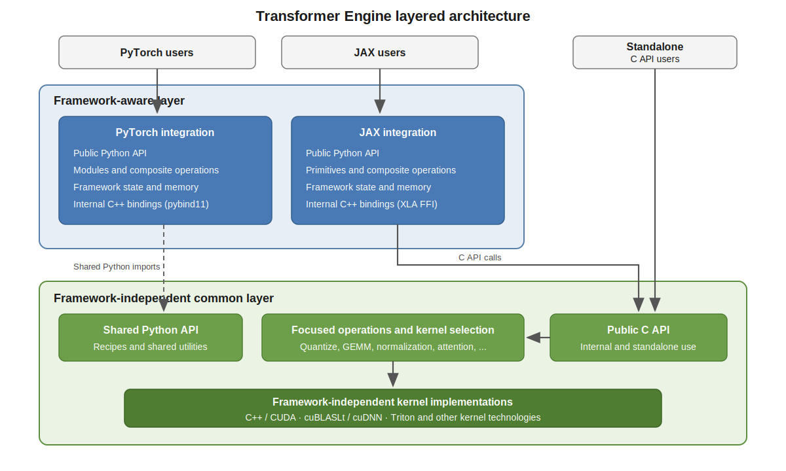

Layered Architecture and Component Relationships
================================================

Transformer Engine has two ownership layers: a framework-independent common
layer and framework-aware integrations for PyTorch and JAX. Calls cross several
interfaces within those layers, but the ownership boundary is consistent:
framework-specific behavior stays in the framework integration, while reusable
operations and kernel implementations stay in the common layer.

   Framework-aware integrations compose operations and manage framework state,
   while the common layer provides public interfaces, focused operations, and
   framework-independent kernel implementations.

..
   Diagram description for ``layered_architecture.svg``:
   PyTorch and JAX users enter separate framework-aware integrations. Each
   integration contains its public Python API, modules or primitives, composite
   operations, framework state and memory, and internal C++ bindings. The
   integrations import the shared common Python API and call the public C API.
   Standalone clients can call the C API directly without a framework. The
   framework-independent common layer contains the shared Python API, the public
   C API, focused operations and kernel selection, and kernel implementations
   written with C++, CUDA, CUDA libraries such as cuBLASLt and cuDNN, Triton, or
   other framework-independent kernel technologies.

The framework-aware layer
-------------------------

The PyTorch and JAX integrations expose public Python APIs using the constructs
that are natural to each framework. They are intended to provide broadly
symmetrical functionality, although their API shapes differ and feature gaps
may exist between them.

This layer owns composite operations. A module such as ``Linear`` interprets
the recipe and options selected by the user, then coordinates the sequence of
framework-native and Transformer Engine operations needed to produce the
result. That sequence may include quantization, communication, GEMM, and other
steps.

Both the Python and C++ code that interacts with a framework belong to this
layer. The C++ bindings translate framework tensors and execution conventions
into calls to the common C API. They do not contain GPU kernels. In particular,
the framework integrations are designed not to require NVCC; functionality
that requires kernel compilation belongs in the common layer.

The common layer
----------------

The common layer exposes focused operations with well-defined inputs and
outputs. The caller chooses what operation to perform and supplies the relevant
policy, such as the quantization type. The common layer selects and launches an
appropriate implementation of that operation.

Kernel technology does not change this ownership. C++ and CUDA kernels, calls
to CUDA libraries such as cuBLASLt and cuDNN, Triton implementations, and other
framework-independent kernel technologies all belong to the common layer. Its
shared Python API also defines concepts used by both framework integrations,
including the common definition of a quantization recipe.

The C API is public. Transformer Engine's framework integrations use it
internally, and external software can use it directly without PyTorch or JAX.

Policy and dispatch
-------------------

Responsibility for a decision depends on its level:

.. list-table::
   :header-rows: 1
   :widths: 48 24 28

   * - Decision
     - Owner
     - Example
   * - User-visible policy and feature configuration
     - Framework-aware layer
     - Selecting a quantization recipe
   * - Composition of multiple operations
     - Framework-aware layer
     - Combining quantization, communication, and GEMM in ``Linear``
   * - Selection between framework-level implementations
     - Framework-aware layer
     - Choosing fused, FlashAttention, or unfused attention
   * - Parameters of a focused common operation
     - Caller
     - Passing the quantization type to a quantize operation
   * - Selection of the low-level kernel implementation
     - Common layer
     - Choosing a kernel for the requested quantize operation

Some features have more than one dispatch level. Attention is an important
example: the framework integration first chooses a high-level implementation.
If it selects the cuDNN-backed implementation, it calls the common fused
attention API, which then selects among the available cuDNN kernels. The
attention architecture documents that hierarchy in detail.

Memory and state ownership
--------------------------

The framework-aware layer owns nearly all device memory. Outputs, quantization
scales, amax values, workspaces, and other persistent or temporary data are
allocated and stored as ordinary framework tensors, then passed to common
operations.

The common layer allocates device memory only in rare cases where the required
allocation cannot be obtained through a framework API. Symmetric memory needed
by some JAX operations is one example. This is an exception rather than a
general allocation mechanism.

Execution plans and library handles are different: the common layer creates
and caches them because they are implementation details of the kernels and
libraries it manages.

Cross-cutting responsibilities
------------------------------

Several features span the two layers:

**Quantization recipes**
   The framework-independent recipe concepts are defined in the common Python
   API. The framework integrations interpret the selected recipe and realize
   it by composing framework-native behavior with common operations.

**Numerical debugging**
   Debugging is primarily a framework-layer concern and may call kernels in the
   common layer when needed. The design is intended to be cross-framework, but
   the current implementation supports PyTorch only.

**Distributed execution**
   Framework-native communication normally remains in the framework-aware
   layer. The common layer participates when communication is intertwined with
   computation, as in expert-parallel dispatch and combine operations or
   communication and GEMM overlap.

Distributed scope
-----------------

Distributed functionality is in scope when it changes computation within an
individual Transformer layer. This includes tensor, sequence, expert, and
context parallelism. Model- and optimizer-level orchestration, including
pipeline parallelism and distributed optimizers, belongs to higher-level
training toolkits.

Fully Sharded Data Parallel is also an external facility. Transformer Engine
does not implement FSDP, but it must understand FSDP behavior and provide the
integration required for Transformer Engine modules to work with it.

API boundaries and stability
----------------------------

The public C and Python APIs are compatibility boundaries. Existing C APIs are
not changed incompatibly; when a change is necessary, a new API version is
introduced and the previous version remains available until the next major
release. Public Python APIs evolve compatibly, normally through additions such
as new optional keyword arguments.

Private interfaces between a framework integration and its bindings are not
compatibility boundaries. PyTorch C++ extensions and similar internal
interfaces may change together with their callers.
