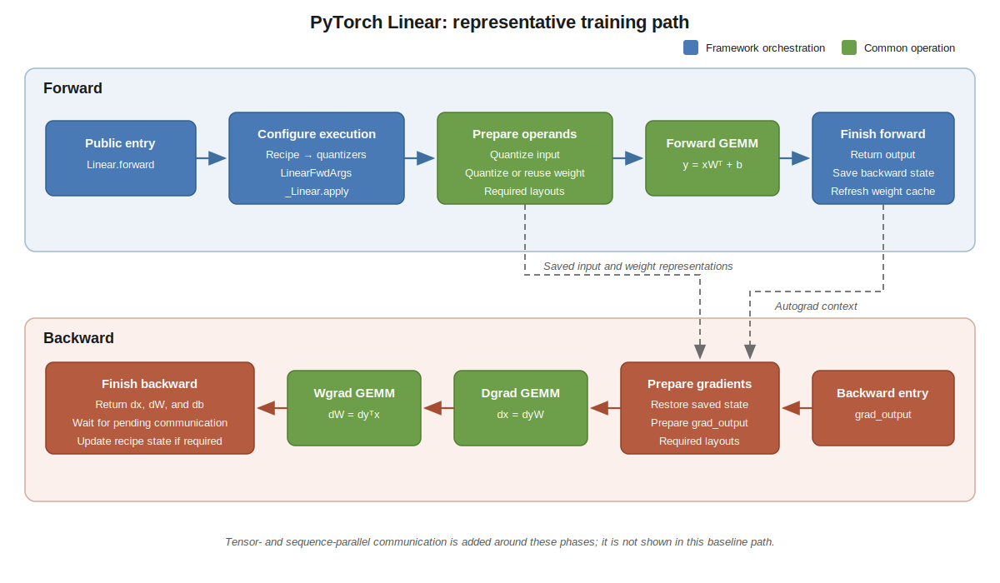

PyTorch Linear: End-to-End Walkthrough
======================================

``transformer_engine.pytorch.Linear`` is a useful guide through Transformer
Engine because one training step crosses nearly every important boundary: a
public framework API interprets a quantization recipe, framework code prepares
state and tensor representations, common operations quantize data and execute
GEMMs, and PyTorch autograd connects the forward and backward passes.

This walkthrough explains those relationships. It intentionally describes the
main execution path rather than every branch in the implementation.

Path traced here
----------------

The baseline path uses:

* the PyTorch ``Linear`` module in training mode;
* an MXFP8 block-scaling recipe;
* a platform for which ``te.is_mxfp8_available()`` reports support;
* BF16 inputs, parameters, and unquantized outputs;
* gradients for the input, weight, and bias; and
* a single process, without tensor or sequence parallelism.

FSDP, CPU offloading, communication overlap, output quantization, and delayed
weight-gradient computation are discussed later as variations. Establishing a
baseline keeps configuration-dependent branches from looking like universal
behavior.

The following example exercises the baseline path:

.. code-block:: python

   import torch
   import transformer_engine.pytorch as te
   from transformer_engine.common import recipe

   linear = te.Linear(
       4096,
       16384,
       bias=True,
       params_dtype=torch.bfloat16,
       device="cuda",
   )
   inp = torch.randn(
       32,
       4096,
       dtype=torch.bfloat16,
       device="cuda",
       requires_grad=True,
   )

   fp8_recipe = recipe.MXFP8BlockScaling()
   with te.autocast(enabled=True, recipe=fp8_recipe):
       out = linear(inp)

   out.sum().backward()

The computation is conceptually:

.. math::

   Y = XW^T + b, \qquad
   \frac{\partial L}{\partial X} = \frac{\partial L}{\partial Y} W, \qquad
   \frac{\partial L}{\partial W} = \left(\frac{\partial L}{\partial Y}\right)^T X.

The implementation adds quantized representations, saved state, and optional
communication around these three matrix multiplications.

   A representative local training path. Blue boxes are framework-layer
   orchestration; green boxes invoke focused operations from the common layer.

..
   Diagram description for ``pytorch_linear_walkthrough.svg``:
   The forward lane proceeds from ``Linear.forward`` to recipe and quantizer
   setup, construction of ``LinearFwdArgs``, and ``_Linear.apply``. Common
   operations prepare quantized input and weight representations and execute
   the forward GEMM. The framework layer returns the output, saves the state
   required by backward, and refreshes the cached weight workspace. Dashed
   arrows carry saved input and weight representations and the autograd context
   into the backward lane. Backward starts from ``grad_output``, restores saved
   state, and prepares the gradient representations. Common GEMMs compute dgrad
   and wgrad. The framework layer returns input, weight, and bias gradients,
   waits for pending communication, and updates recipe state when required.
   Tensor- and sequence-parallel communication is omitted from this baseline
   diagram and described separately below.

1. Public entry and execution configuration
-------------------------------------------

The public entry point is
``transformer_engine/pytorch/module/linear.py:Linear.forward``. It first calls
``TransformerEngineBaseModule.prepare_forward`` to establish the module's
execution context and activation dtype. It then obtains the current weight and
bias tensors and selects the quantizers required for this invocation through
``Linear._get_quantizers``.

The active recipe determines the concrete quantizer implementations and their
scaling behavior. ``Linear`` assigns those quantizers roles for the input,
weight, optional output, output gradient, and optional input and weight
gradients. Not every role is populated for every call; inference, output
quantization, debugging, custom recipes, and requested gradients all affect the
selection.

The module packages execution policy in ``LinearFwdArgs``. Differentiable
tensors remain explicit arguments to ``_Linear.apply`` so that PyTorch can
track them, while quantizers, parallel configuration, numerical options, and
cached workspaces travel in the structured argument object.

When gradients are enabled, ``_Linear.apply`` enters the custom autograd
function. With gradients disabled, ``Linear.forward`` calls ``_Linear.forward``
directly and does not construct backward state.

2. Input and weight preparation
-------------------------------

``transformer_engine/pytorch/module/linear.py:_linear_forward_impl`` performs
the forward computation.

For the local baseline, the input is already present in full and no collective
communication is needed. The input quantizer creates the representation needed
by the forward GEMM. When the weight requires a gradient, it also preserves or
can later recover the representation required by wgrad. For MXFP8, rowwise and columnwise forms are not numerically
equivalent transposes. When both are needed, the quantizer produces both directly from the
high-precision tensor to avoid a second quantization step. Other recipes may
use a different storage strategy; the invariant is that each GEMM receives a
representation compatible with its layout.

The weight follows a similar process through
``transformer_engine/pytorch/module/linear.py:quantize_weight``. A quantized
weight workspace may be cached because a parameter is normally unchanged
across the microbatches of a gradient-accumulation step. ``is_first_microbatch``
controls when the workspace is refreshed. The newly produced workspace is
returned through ``_Linear`` and stored by ``Linear.forward`` in
``Linear._fp8_workspaces``; it remains framework-owned state rather than hidden
allocation in the common layer.

Quantized storage can contain data, scales, and metadata for more than one
layout. Consequently, statements such as "FP8 uses half the memory" apply only
to the raw element payload and should not be interpreted as an exact total
memory ratio.

3. Forward GEMM and the common-layer boundary
---------------------------------------------

Once both operands are ready, ``_linear_forward_impl`` calls
``transformer_engine/pytorch/cpp_extensions/gemm.py:general_gemm``. In the
baseline it computes :math:`Y = XW^T + b`, returning BF16 output. The bias can
be fused into the GEMM. If the caller requests a quantized output, an output
quantizer is passed through ``quantization_params`` instead.

This call illustrates the boundary between the two architectural layers:

#. ``general_gemm`` prepares framework-owned output and workspace tensors and
   selects the appropriate framework binding.
#. ``transformer_engine/pytorch/csrc/extensions/gemm.cpp`` converts PyTorch and
   quantized-storage objects into the tensor handles expected by the public C
   API. These handles are views; the framework tensors retain ownership of the
   underlying memory.
#. A public C GEMM entry point declared in
   ``transformer_engine/common/include/transformer_engine/gemm.h`` receives the
   operation description.
#. The common implementation under ``transformer_engine/common/gemm/`` selects
   and launches the appropriate implementation, such as a cuBLASLt GEMM.

The PyTorch C++ extension is a private binding and can evolve with its Python
caller. The C API is a public compatibility boundary.

4. Output and saved backward state
----------------------------------

The local baseline returns the GEMM result directly. Parallel modes may insert
collective communication before the output is ready, as described below.

If gradients are required, ``_linear_forward_impl`` retains only the state that
backward needs. Depending on the quantizer, it may discard a rowwise input
representation after the forward GEMM while retaining a columnwise
representation for wgrad. Other configurations save the original input or
reconstruct the needed layout later, so this is an optimization rather than a
universal storage rule.

``transformer_engine/pytorch/module/linear.py:_linear_setup_ctx`` transfers the
required configuration into ``LinearBwdArgs``. The
``prepare_for_saving``/``restore_from_func_ctx`` mechanism separates
quantized-storage objects into PyTorch tensors and metadata so PyTorch can own
their lifetime through the autograd context.

5. Backward entry and gradient preparation
------------------------------------------

PyTorch invokes ``transformer_engine/pytorch/module/linear.py:_Linear.backward``
with the output gradient. It restores the saved tensors, attaches the gradient
to ``LinearBwdArgs``, and calls
``transformer_engine/pytorch/module/linear.py:_linear_backward``.

``TransformerEngineBaseModule.grad_output_preprocess`` prepares
``grad_output`` for the requested gradients. Dgrad consumes a rowwise
representation, while wgrad consumes a columnwise representation. The
quantizer may create both together or create them at different points,
depending on communication and storage capabilities. Bias-gradient computation
can also be fused into this preparation or a GEMM path.

6. Dgrad and wgrad
------------------

When the input requires a gradient, dgrad computes
:math:`\partial L / \partial X`. ``_linear_backward`` calls ``general_gemm``
with ``layout="NN"``, using the output gradient and the weight representation
saved or reconstructed from forward. In the local baseline, the result needs no
collective communication.

When the weight requires a gradient, wgrad computes
:math:`\partial L / \partial W`. Before the GEMM, the implementation makes sure
that both the input and output gradient have representations compatible with
the transposed access pattern. It then calls ``general_gemm`` with
``layout="NT"``.

Wgrad may write directly into ``weight.main_grad`` when fused gradient
accumulation is enabled. It may also be deferred through the weight-gradient
store so that a higher-level schedule can execute it later. Those modes change
the destination or timing of the GEMM, not the ownership boundary: framework
code schedules the work and the common layer executes the focused operation.

After the required GEMMs finish, the implementation completes outstanding
communication, releases temporary references, and returns the requested input,
weight, and bias gradients. The MXFP8 baseline computes its scales during
quantization and has no delayed amax-history update. Recipes with persistent
state may add recipe-specific bookkeeping after backward.

Parallel execution variants
---------------------------

Tensor and sequence parallelism insert communication around the same local
phases. A ``Linear`` instance is either column-parallel or row-parallel, so
these paths should not be combined into one unconditional flow.

.. list-table::
   :header-rows: 1
   :widths: 20 38 42

   * - Mode
     - Forward
     - Backward
   * - Column parallel
     - Each rank owns a shard of output features. With sequence parallelism,
       the input is gathered before the forward GEMM. No output reduction is
       required.
     - Dgrad partial results are all-reduced, or reduce-scattered with sequence
       parallelism. The input required by wgrad may be gathered again.
   * - Row parallel
     - Each rank owns a shard along the GEMM reduction dimension. Partial
       outputs are all-reduced, or reduce-scattered with sequence parallelism.
     - With sequence parallelism, ``grad_output`` is gathered before the
       backward GEMMs. Each rank produces its local input-gradient shard.

Quantizer capabilities determine whether communication operates on rowwise or
columnwise quantized data and whether a representation is produced before or
after a collective. Communication-overlap implementations may fuse or pipeline
the same logical operations, but they preserve the mathematical dependencies
shown above.

Other variations
----------------

The implementation contains additional branches for important features:

**Output and gradient quantization**
   ``fp8_output`` and ``fp8_grad`` request quantized boundaries between adjacent
   operations and add output quantizers to the corresponding GEMMs.

**FSDP and FSDP2**
   FSDP remains an external framework facility. Transformer Engine scatters or
   gathers saved state where needed and may reconstruct a weight workspace from
   an FSDP2-managed weight during backward.

**CPU offloading**
   Saved activations may be marked for offload while computation continues.

**Communication overlap**
   Userbuffers or cuBLASMp paths can overlap all-gather or reduce-scatter with a
   GEMM. They preserve the high-level data dependencies but change buffer and
   scheduling details.

**Backward overrides and saved inputs**
   A recipe may request high-precision or dequantized backward computation.
   ``save_original_input`` retains the original activation instead of relying
   on a saved quantized representation.

**Delayed scaling**
   Delayed scaling maintains amax history across iterations and reduces and
   updates that state after backward. This bookkeeping is not part of the
   MXFP8 baseline.

**Weight-gradient scheduling**
   Fused accumulation changes the wgrad destination, and delayed wgrad changes
   when the GEMM executes.

Architectural invariants
------------------------

The walkthrough illustrates several rules that apply beyond ``Linear``:

* The framework layer interprets user policy and composes framework-native and
  common operations.
* Kernel implementations remain in the framework-independent common layer.
* Framework tensors own outputs, workspaces, scales, amax values, and other
  operation state; common tensor handles are non-owning views.
* Forward prepares or preserves the information required by backward, but the
  optimal representation depends on the recipe and execution configuration.
* Public Python and C APIs are compatibility boundaries; internal framework
  bindings are not.

How the path is tested
----------------------

``tests/pytorch/test_numerics.py:test_linear_accuracy`` demonstrates the
preferred correctness pattern. It constructs equivalent Transformer Engine and
``torch.nn.Linear`` modules, copies identical parameters into the native
PyTorch reference, and runs both forward and backward.

``tests/pytorch/test_numerics.py:_test_granular_accuracy`` collects the output,
input gradient, and parameter gradients. The test compares each result with
dtype-appropriate tolerances. This is stronger than a smoke test: it establishes
the expected numerical relationship with the framework-native implementation.

Recipe-, layout-, distributed-, and hardware-specific tests extend this
baseline for paths that do not have an exact native equivalent.
