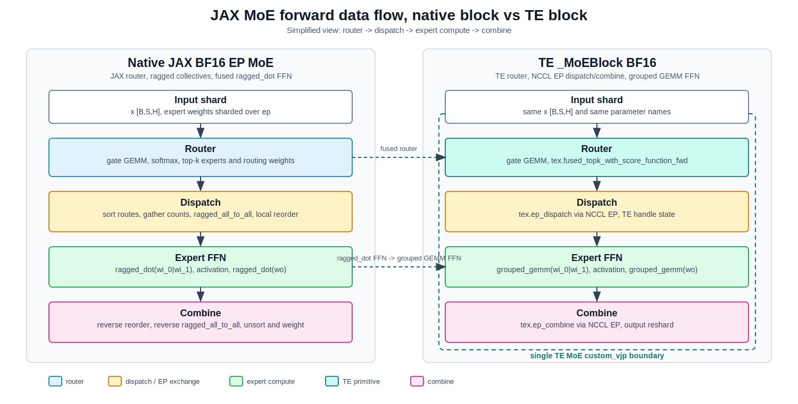

..
    Copyright (c) 2022-2026, NVIDIA CORPORATION & AFFILIATES. All rights reserved.

    See LICENSE for license information.

JAX: BF16 Mixture-of-Experts with TransformerEngine
===================================================

This document walks through replacing a native JAX/Flax expert-parallel MoE
block with TransformerEngine's experimental Flax ``_MoEBlock``.

**Baseline.** The reference path is pure JAX/Flax BF16. It uses
``jax.lax.ragged_all_to_all`` for expert-parallel token exchange and
``jax.lax.ragged_dot`` for the grouped expert FFNs. The low-level ragged
all-to-all setup lives in ``moe_native.py`` so the snippets below stay focused
on model-level code.

**TransformerEngine path.** This tutorial uses ``_MoEBlock`` in BF16 with the
wrapper's current no-op quantizer sets. Quantized MoE recipes are intentionally
out of scope here.

`<- Back to the JAX integration overview <../te_jax_integration.html>`_

The forward path below summarizes the data flow for the native baseline and the
TE replacement.

   Forward data flow for the tutorial's BF16 MoE block. TE keeps the same
   sharded inputs and weights, but routes through TE fused router and grouped
   GEMM primitives while keeping dispatch, expert compute, and combine inside
   one MoE VJP.

1. Baseline: native JAX BF16 EP MoE
-----------------------------------

The example uses a 2x2 mesh: expert parallelism on ``ep`` and FSDP-style batch
parallelism on ``fsdp``. The batch dimension is sharded over both axes, and
expert weights are sharded over ``ep``.

.. literalinclude:: moe.py
   :language: python
   :start-after: # MOE_IMPORTS_START
   :end-before: # MOE_IMPORTS_END

.. literalinclude:: moe.py
   :language: python
   :start-after: # MOE_CONFIG_START
   :end-before: # MOE_CONFIG_END

.. literalinclude:: moe.py
   :language: python
   :start-after: # MOE_MESH_SETUP_START
   :end-before: # MOE_MESH_SETUP_END

The native baseline is exposed as a normal Flax module. Its implementation in
``moe_native.py`` performs softmax top-k routing, forward
``ragged_all_to_all`` over ``ep``, local source-major to expert-major chunk
reordering, a concatenated ``wi_0|wi_1`` ``ragged_dot`` input projection,
activation, ``wo`` ``ragged_dot`` output projection, reverse
``ragged_all_to_all``, and weighted token combine.

2. TransformerEngine ``_MoEBlock``
----------------------------------

The TE replacement registers the same gate and expert parameter names as the
baseline, then delegates routing, dispatch, grouped FFN, combine,
expert-parallel collectives, and VJP to ``transformer_engine.jax.moe.moe``.

``_MoEBlock`` is intentionally underscore-prefixed while the API stabilizes. Use
it as an experimental integration point.

.. literalinclude:: moe.py
   :language: python
   :start-after: # MOE_MODEL_SETUP_START
   :end-before: # MOE_MODEL_SETUP_END

.. literalinclude:: moe.py
   :language: python
   :start-after: # MOE_INPUTS_SETUP_START
   :end-before: # MOE_INPUTS_SETUP_END

3. Correctness check
--------------------

Both models use the same Flax variable dictionary, so the gate and expert
weights are identical. The comparison checks the BF16 forward result on the same
sharded input.

.. literalinclude:: moe.py
   :language: python
   :start-after: # MOE_CORRECTNESS_START
   :end-before: # MOE_CORRECTNESS_END

The two paths may not be bit-identical because the router and grouped matmul
implementations differ, but they should stay within ordinary BF16 tolerance for
the default no-bias, softmax top-k, ``silu`` path.

4. Performance comparison
-------------------------

``run_benchmarks`` runs a blocking JIT-compiled forward+backward loop with
warmup. The same sharded input, output gradient, and variables are used for
native BF16 and TE BF16. Even though quantization is disabled, the benchmark
passes the active ``MeshResource`` through TE's autocast context so
``_MoEBlock`` can resolve the ``ep`` axis.

.. literalinclude:: moe.py
   :language: python
   :start-after: # MOE_BENCH_START
   :end-before: # MOE_BENCH_END

Run the full example with:

.. code-block:: bash

   python docs/examples/jax/moe.py

Measured on four NVIDIA GB200 GPUs with the default tutorial shape
``batch=8``, ``seq=2048``, ``hidden=1024``, ``intermediate=4096``,
``num_experts=8``, and ``topk=2``:

.. csv-table::
   :header: "Path", "Mean fwd+bwd time", "Relative time"
   :widths: 35, 25, 25

   "Native JAX BF16", "17.320 ms", "1.00x"
   "TE ``_MoEBlock`` BF16", "13.601 ms", "0.79x"

The same run reported ``max |native BF16 - TE BF16| = 0.0604`` for the forward
correctness check. For this no-op-quantizer BF16 configuration, TE measured
``1.27x`` the native baseline throughput on this tutorial shape.

A larger-shape sweep with the same blocking timing loop found TE ahead for each
shape tried. The default shape appears in both tables; the values differ
slightly because the standalone tutorial run and sweep were timed separately.

.. csv-table::
   :header: "Batch", "Seq", "Hidden", "Intermediate", "Native BF16", "TE BF16", "TE speedup"
   :widths: 10, 10, 12, 16, 16, 16, 14

   "8", "1024", "1024", "4096", "8.369 ms", "7.346 ms", "1.14x"
   "8", "2048", "1024", "4096", "17.413 ms", "13.554 ms", "1.28x"
   "8", "4096", "1024", "4096", "34.809 ms", "32.878 ms", "1.06x"
   "16", "2048", "1024", "4096", "35.102 ms", "32.773 ms", "1.07x"
   "8", "1024", "2048", "8192", "19.656 ms", "14.566 ms", "1.35x"
   "8", "2048", "2048", "8192", "38.630 ms", "32.057 ms", "1.21x"
   "16", "2048", "2048", "8192", "85.549 ms", "66.793 ms", "1.28x"

Across the sweep, the forward max-absolute difference stayed between
``0.0598`` and ``0.0704``. The result depends on token distribution, hidden
size, intermediate size, and the target stack. Keep
``PermutationBackend.PURE_JAX`` until correctness is established; then compare
it with ``PermutationBackend.TRITON`` separately.

.. raw:: html

   

      Output:
   

.. container:: program-output

   .. literalinclude:: moe.out
      :language: text
      :start-after: # MOE_OUTPUT_START
      :end-before: # MOE_OUTPUT_END

Next steps
----------

* `Dense GEMMs <dense.html>`_: quantizing a single ``flax.linen.Dense`` GEMM.
* `Collective GEMM <collective_gemm.html>`_: further speedups by communicating
  between devices inside the GEMM.
* `<- Hub <../te_jax_integration.html>`_
