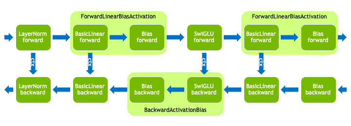
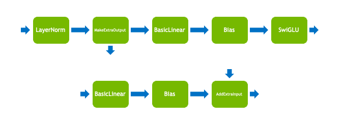
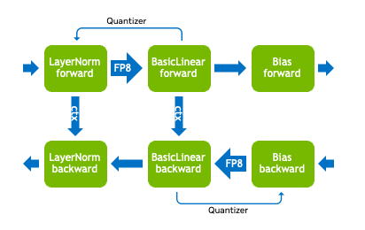

..
    Copyright (c) 2022-2026, NVIDIA CORPORATION & AFFILIATES. All rights reserved.

    See LICENSE for license information.

Operation fuser API
===================

Motivation
----------

Transformer Engine relies heavily on operation fusion to achieve high
performance. A typical training workload involves many memory-bound
operations such as activation functions and normalization, so
replacing them with fused kernels can deliver a significant
performance benefit. This is especially true for low-precision
training (e.g. FP8 and FP4) because it involves extra cast operations.

Managing these fusions can be challenging because they differ based on
operation types, communication patterns, data types, and GPU
architectures. The most straightforward solution is to provide
monolithic modules like ``Linear``, ``LayerNormLinear``, or
``TransformerLayer``. These conform to the interface of a standard
PyTorch module, but can perform arbitrary fusions internally. These
hand-tuned implementations can achieve maximum performance, but they
tend to be complicated and difficult to modify.

As an alternative to this "top-down" design, TE exposes a "bottom-up"
operation-based API. The user constructs individual operations and
passes them into a fuser, resulting in the same fused kernels as the
monolithic modules. This approach is more flexible, making it easier
to support new model architectures or to experiment with fusions.

Basic usage
-----------

Sequential operations
^^^^^^^^^^^^^^^^^^^^^

At the most basic level, the operation fuser API involves two classes
in the ``transformer_engine.pytorch.ops`` submodule:

- ``FusibleOperation``: An abstract base class for tensor operations.
  Examples include ``Linear``, ``LayerNorm``, and ``AllReduce``. It is
  a subclass of ``torch.nn.Module``, so it can hold trainable
  parameters and can be called to perform the operation's forward
  pass.
- ``Sequential``: A container of modules in sequential order. Its
  interface is very similar to ``torch.nn.Sequential``. If it contains
  any ``FusibleOperation`` s, then it may attempt to fuse them in the
  forward and backward passes.

Thus, using the operation fuser simply involves constructing
``FusibleOperation`` s and passing them into a ``Sequential``.

.. code-block:: python

    import torch
    import transformer_engine.pytorch as te

    # Options
    hidden_size = 4096
    ffn_size = 28672
    batch_size = 16384

    # Construct operations and fuse
    mlp = te.ops.Sequential(
        te.ops.LayerNorm(hidden_size),
        te.ops.Linear(hidden_size, ffn_size),
        te.ops.SwiGLU(),
        te.ops.Linear(ffn_size // 2, hidden_size),
    )

    # Forward pass
    x = torch.randn(batch_size, hidden_size, device="cuda")
    y = mlp(x)

   Operations that match ``LayerNormMLP`` module. Note that different
   fusions have been applied in the forward and backward passes.

Quantization
^^^^^^^^^^^^

The operation fuser respects TE's APIs for low-precision ("quantized")
data formats like FP8 and FP4. Constructing operations within a
``quantized_model_init`` context will enable quantized weights and
performing the forward pass within an ``autocast`` context will enable
quantized compute.

.. code-block:: python

    import torch
    import transformer_engine.pytorch as te

    # Construct layer with quantized weights
    with te.quantized_model_init():
        fc1 = te.ops.Sequential(
            te.ops.LayerNorm(4096),
            te.ops.Linear(4096, 28672),
        )

    # Forward pass within autocast context
    x = torch.randn(16384, 4096, device="cuda")
    with te.autocast():
        y = fc1(x)

    # Backward pass outside of autocast context
    y.sum().backward()

Branching operations
^^^^^^^^^^^^^^^^^^^^

The operation fuser supports very limited branching behavior. While
the operations must be in sequential order, some operations can accept
extra inputs or produce extra outputs. For example, ``AddExtraInput``
will add an extra input tensor to the intermediate tensor and
``MakeExtraOutput`` will return the intermediate tensor as an extra
output. When calling a ``Sequential`` that contains any of these
branching operations, the extra inputs should be passed in as
arguments and the extra outputs will be returned.

.. code-block:: python

    import torch
    import transformer_engine.pytorch as te

    # Construct MLP with residual connection
    fc1 = te.ops.Sequential(
        te.ops.LayerNorm(4096),
        te.ops.MakeExtraOutput(),  # Output residual
        te.ops.Linear(4096, 28672),
        te.ops.SwiGLU(),
    )
    fc2 = te.ops.Sequential(
        te.ops.Linear(14336, 4096),
        te.ops.AddExtraInput(),  # Add residual
    )

    # Forward pass
    x = torch.randn(16384, 4096, device="cuda")
    y, residual = fc1(x)
    y = fc2(y, residual)

   Operations for an MLP block with a residual connection. Note that
   the block has been split into two sections, each with one branching
   operation.

Developer guide
---------------

Infrastructure
^^^^^^^^^^^^^^

In addition to ``FusibleOperation`` and ``Sequential``, the fuser
infrastructure relies on the following classes:

- ``BasicOperation``: The most basic type of ``FusibleOperation``.
  Examples include ``BasicLinear``, ``Bias``, and ``ReLU``. It holds
  parameters and state, and it implements both a forward and backward
  pass. The ``op_forward`` and ``op_backward`` functions have an
  interface reminiscent of ``torch.autograd.Function``, e.g. they
  accept a context object that caches state from the forward pass to
  the backward pass.
- ``FusedOperation``: A ``FusibleOperation`` that can replace one or
  more ``BasicOperation`` s. Examples include
  ``ForwardLinearBiasActivation`` and ``BackwardActivationBias``. Its
  forward and backward passes (the ``fuser_forward`` and
  ``fuser_backward`` functions) must produce equivalent results as its
  corresponding ``BasicOperation`` s. This also means that the
  ``FusedOperation`` is stateless since it can access parameters and
  state from the ``BasicOperation`` s. Note that different fusions may
  be applied in the forward and backward pass, so a ``FusedOperation``
  may be missing its forward and/or backward implementation.
- ``OperationFuser``: This is the class that manages the operation
  fusions. It launches the forward and backward passes within a
  ``torch.autograd.Function``. It can also replace operations with
  equivalent ``FusedOperation`` s.

The first time that a ``Sequential`` is called, it will group adjacent
``FusibleOperation`` s together into ``OperationFuser`` s. The first
time an ``OperationFuser`` is called, it will attempt to fuse
operations for the forward pass and backward pass. Subsequent calls
will reuse the same state unless it has been invalidated, e.g. by
changing the quantization recipe.

Quantization
^^^^^^^^^^^^

Each operation that supports quantized compute holds one or more
``Quantizer`` s, which are builder classes for converting
high-precision tensors (e.g. in FP32 or BF16) to quantized tensors. In
order to enable fused quantization kernels, operations can access the
quantizers of neighboring operations and quantize eagerly.

   Operations that match ``LayerNormLinear`` module with FP8
   quantization.

In some situations, like when operations are split across multiple
``Sequential`` s, it may be helpful to encourage the fuser by manually
adding ``Quantize`` operations.

.. code-block:: python

    import torch
    import transformer_engine.pytorch as te

    # Construct layer with quantized weights
    with te.quantized_model_init():
        norm = te.ops.Sequential(
            te.ops.LayerNorm(4096),
            te.ops.Quantize(),
        )
        fc1 = te.ops.Sequential(
            te.ops.Linear(4096, 28672),
        )

    # Forward pass
    x = torch.randn(16384, 4096, device="cuda")
    with te.autocast():
        y = norm(x)  # y is a QuantizedTensor
        z = fc1(y)

.. warning::

   This is an expert technique. Quantizer configurations can be quite
   complicated, so the ``Quantize`` operation's quantizers may be
   suboptimal.

Implementing new operations
---------------------------

Implementing a basic operation
^^^^^^^^^^^^^^^^^^^^^^^^^^^^^^

Subclasses of ``BasicOperation`` must implement ``op_forward`` and
``op_backward``, which are reminiscent of the ``forward`` and
``backward`` methods of ``torch.autograd.Function``. They have an
argument for a context object that can be used to cache state from the
forward pass for use in the backward pass.

.. code-block:: python

    import torch
    import transformer_engine.pytorch as te

    class LearnableScale(te.ops.BasicOperation):

        def __init__(self) -> None:
            super().__init__()
            scale = torch.ones((), dtype=torch.float32, device="cuda")
            self.register_parameter("scale", torch.nn.Parameter(scale))

        def op_forward(self, ctx, input_: torch.Tensor, **unused) -> torch.Tensor:
            out = self.scale * input_
            ctx.save_for_backward(self.scale, input_)
            return out

        def op_backward(
            self,
            ctx,
            grad_output: torch.Tensor,
        ) -> tuple[torch.Tensor, Iterable[Optional[torch.Tensor]]]:
            scale, input_ = ctx.saved_tensors
            grad_scale = torch.inner(input_.reshape(-1), grad_output.reshape(-1)).reshape(())
            grad_input = scale * grad_output
            return (
                grad_input,     # Input gradient
                (grad_scale,),  # Param gradients
            )

Implementing a fused operation
^^^^^^^^^^^^^^^^^^^^^^^^^^^^^^

Subclasses of ``FusedOperation`` should declare their corresponding
``BasicOperation`` s in the constructor. They should also implement
``fuser_forward`` and ``fuser_backward``, depending on usage. These
functions are similar to ``op_forward`` and ``op_backward`` from
``BasicOperation``, but some arguments and returns are lists. For
example, instead of taking a single context object, they take a list
of context objects for all the corresponding ``BasicOperation`` s.

.. code-block:: python

    import torch
    import transformer_engine.pytorch as te
    from typing import Optional

    class ForwardAxpy(te.ops.FusedOperation):

        def __init__(self, scale: te.ops.ConstantScale, add: te.ops.AddExtraInput) -> None:
            super().__init__((scale, add))  # Equivalent basic ops

        def fuser_forward(
            self,
            basic_op_ctxs: list,
            input_: torch.Tensor,
            basic_op_extra_inputs: list[tuple[torch.Tensor, ...]],
            **unused,
        ) -> tuple[torch.Tensor, list[tuple[torch.Tensor, ...]]]:
            scale_op, add_op = self.basic_ops
            extra_input = basic_op_extra_inputs[1][0]  # Extra input to add op
            out = scale_op.scale * input_ + extra_input
            scale_ctx, add_ctx = basic_op_ctxs  # No state needed for backward
            return (
                out,       # Output
                [(), ()],  # Extra outputs for each basic op
            )

.. warning::

   Remember the contract that the fused operation must produce outputs
   that are interchangeable with the corresponding basic operation
   outputs.

In order to make these fused operations useful, they should be
registered with the operation fuser. To do this, first implement a
fusion function that can replace operations with the fused operation,
and then register it with the ``register_forward_fusion`` or
``register_backward_fusion`` functions.

.. code-block:: python

    def fuse_axpy_ops(
        ops: list[te.ops.FusibleOperation],
        **unused,
    ) -> list[te.ops.FusibleOperation]:
        """Sliding window scan to perform ForwardAxpy fusion"""
        out = []
        window, ops = ops[:2], ops[2:]
        while len(window) == 2:
            if (
                isinstance(window[0], te.ops.ConstantScale)
                and isinstance(window[1], te.ops.AddExtraInput)
            ):
                window = [ForwardAxpy(window[0], window[1])]
            else:
                out.append(window[0])
                window = window[1:]
            window, ops = window + ops[:1], ops[1:]
        out.extend(window + ops)
        return out

    # Register fusion with operation fuser
    te.ops.register_forward_fusion(fuse_axpy_ops)
