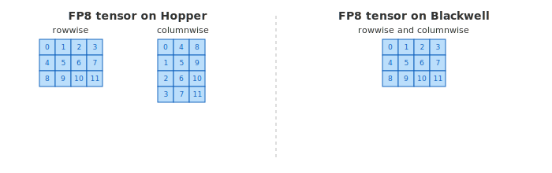

..
    Copyright (c) 2022-2026, NVIDIA CORPORATION & AFFILIATES. All rights reserved.

    See LICENSE for license information.

FP8 Current Scaling
===================================

FP8 current scaling recipe is the simplest low precision recipe provided by Transformer Engine. 
To understand how this recipe works, we first need to examine what the FP8 data type is and how it differs from other floating point formats.

FP8 data type
-------------

The FP8 datatype, introduced in Hopper architecture, is actually 2 distinct datatypes, useful in different parts of the training of neural networks:

* E4M3 -- consists of 1 sign bit, 4 exponent bits and 3 bits of mantissa. It can store values up to +/-448 and ``nan``.
* E5M2 -- consists of 1 sign bit, 5 exponent bits and 2 bits of mantissa. It can store values up to +/-57344, +/- ``inf`` and ``nan``. The tradeoff of the increased dynamic range is lower precision of the stored values.

.. raw:: html
   :file: img/fp8_formats.svg

*Figure 1: Structure of the floating point datatypes. All of the values shown (in FP16, BF16, FP8 E4M3 and FP8 E5M2) are the closest representations of value 0.3952.*

**E4M3 and E5M2 usage in training**

By default, Transformer Engine uses a hybrid approach:

* *Forward pass* - activations and weights require more precision, so E4M3 datatype is used to store them.
* *Backward pass* - gradients are less susceptible to precision loss but require higher dynamic range, so E5M2 datatype is preferred. 

The user can configure this behavior via the ``fp8_format`` parameter of the recipe.

Scaling factors
---------------

Limited dynamic range of FP8 datatype is insufficient for many tensors. 
To address this, values in the tensor are scaled. FP8 Current Scaling recipe uses one **FP32** scale factor per tensor. The representation of a tensor element ``x`` in FP8 precision is given by:

.. code-block:: python

    x = x_fp8 * s

where

* ``x_fp8`` is the FP8 value (E4M3 or E5M2),
* ``s`` is a global **FP32** scaling factor applied to the entire tensor.

**FP8 Current Scaling quantization**

Let's take a closer look at how quantization to FP8 with scaling factor is implemented in
the FP8 Current Scaling recipe.

.. raw:: html
   :file: img/fp8_scaling_concept.svg

*Figure 3: Quantization to FP8 consists of amax (absolute maximum) computation, scaling to fit the FP8 range and casting to the respective FP8 format.*

Quantization to FP8 consists of 3 steps:

1. Computation of the absolute maximum value of the tensor - we refer to it as ``amax``.
2. Applying the scaling factor of ``fp8_max / amax`` to the tensor, to fit it into the FP8 range
3. Casting into the respective FP8 format using *Round To Nearest Even (RTNE)*. Values round to the nearest representable FP8 value. When exactly halfway between two values, rounds to the one with even mantissa to minimize systematic bias.

**Performance analysis**

Quantization is a memory-bound operation that requires reading the tensor twice:

* First read: compute ``amax`` across all elements.
* Second read: apply the scaling factor and cast to FP8.

This is a significant overhead compared to other recipes, which typically require only a single memory read.

.. raw:: html
   :file: img/fp8_cast_process.svg

*Figure 4: FP8 quantization with current scaling recipe - two tensor reads are needed, one to compute amax and one to apply the scaling factor and cast to FP8.*

Transpose handling
------------------

*Ada and Hopper*

On Ada and Hopper, the backward pass requires a transposed FP8 tensor.
The columnwise layout is physically different from the rowwise layout, so a transpose operation is needed.
All 3 options from :ref:`Performance Considerations Transpose handling section <handling_transposes>` are supported.

*Blackwell and later*

Blackwell hardware supports multiple GEMM layouts natively, eliminating the need for explicit transposes.
The rowwise and columnwise tensors share the same physical memory layout.

   *Figure 6: On Blackwell, rowwise and columnwise usages share the same memory layout. On Hopper, columnwise usage requires a physical transpose.*

Distributed training 
--------------------

**Quantized all-gather**

FP8 all-gather is supported on all architectures (Ada and later).

**Amax reduction**

Tensors that are gathered across nodes (e.g. input and gradient in sequence parallelism) require amax synchronization before quantization.
Each node computes its local ``amax``, then a reduction produces the global maximum across all nodes.
All nodes use this synchronized amax to compute identical scaling factors, enabling quantized all-gather.

.. raw:: html
   :file: img/fp8_current_scaling_all_gather.svg

*Figure 7: Quantization and all-gather flow for FP8 current scaling showing amax computation and synchronization.*

Supported devices
-----------------

Ada and later (SM 8.9+)

Examples
--------

Here's how to use FP8 Current Scaling recipe in PyTorch and JAX:

.. tabs::

   .. tab:: PyTorch

      .. raw:: html

         

            Requires SM89 (Ada) or later
         

      .. literalinclude:: pytorch_current_scaling_example.py
         :language: python
         :start-after: # START_CURRENT_SCALING_EXAMPLE
         :end-before: # END_CURRENT_SCALING_EXAMPLE

   .. tab:: JAX

      .. raw:: html

         

            Requires SM89 (Ada) or later
         

      .. literalinclude:: jax_current_scaling_example.py
         :language: python
         :start-after: # START_CURRENT_SCALING_EXAMPLE
         :end-before: # END_CURRENT_SCALING_EXAMPLE

----

Developer Notes
---------------

This section contains implementation details that may be useful for developers
but are not required for using FP8 Current Scaling in practice.

All-gather of columnwise tensors
^^^^^^^^^^^^^^^^^^^^^^^^^^^^^^^^

On Blackwell and later, rowwise and columnwise tensors share the same memory layout,
so all-gather of columnwise tensors is directly supported.

For Hopper and Ada, all-gather of transposed FP8 tensors is not supported. 
The rowwise tensor is gathered first, then transposed to columnwise format.