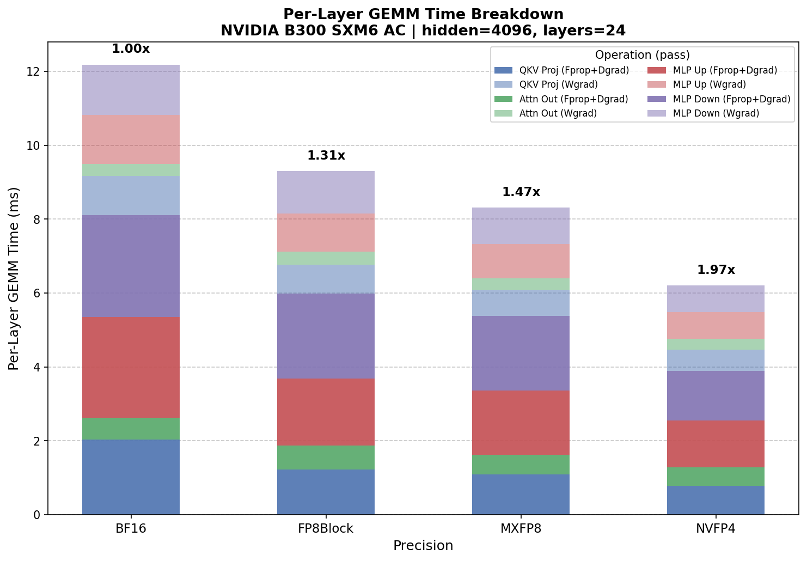
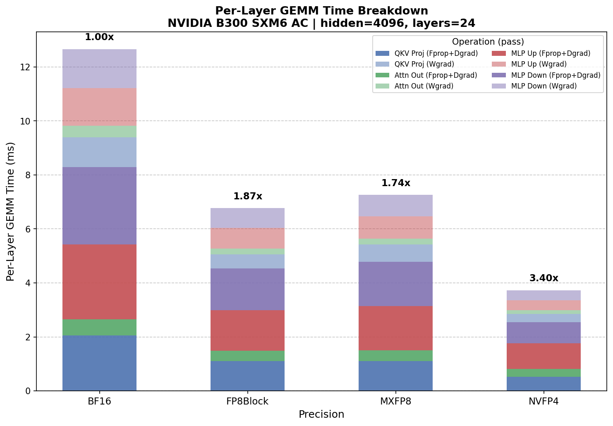

..
    Copyright (c) 2022-2026, NVIDIA CORPORATION & AFFILIATES. All rights reserved.

    See LICENSE for license information.

GEMM Profiling Across Precisions
===================================

This guide shows how to go from a transformer model config to concrete GEMM shapes,
benchmark them across precisions (BF16, FP8 Block, MXFP8, NVFP4), and compute
expected speedups. If you are using NVIDIA Transformer Engine -- which handles the
quantization and kernel dispatch for these precision modes -- this is how you derive
the matrix multiplications your model runs and measure where your time goes.

A companion benchmark tool is provided at ``benchmarks/gemm/benchmark_gemm.py``.

Quick Start: Model Config Mode
-------------------------------

The benchmark tool takes model hyperparameters directly and handles everything --
deriving GEMM shapes, benchmarking across precisions, and computing the full
speedup analysis -- in a single command:

.. code-block:: bash

    python benchmarks/gemm/benchmark_gemm.py \
      --hidden_size 4096 \
      --intermediate_size 16384 \
      --num_attention_heads 32 \
      --num_hidden_layers 24 \
      --micro_batch_size 31 \
      --sequence_length 512 \
      -o ./gemm_speedup.png

By default the tool runs in **autocast mode**, which is what Transformer Engine does
during training: inputs are dynamically quantized to the target precision before each
GEMM, so the measured time includes both the quantization cost and the GEMM kernel
itself. This gives the realistic end-to-end picture.

The tool computes ``M = 31 x 512 = 15,872`` tokens, derives all 12 GEMM shapes
(4 Fprop + 4 Dgrad + 4 Wgrad), benchmarks each across BF16, FP8 Block, MXFP8,
and NVFP4, and prints the full results.

By default, Dgrad times are approximated as equal to Fprop (since the FLOP count
is the same -- just with K and N swapped). To benchmark Dgrad shapes directly,
add ``--verify-dgrad``:

.. code-block:: bash

    python benchmarks/gemm/benchmark_gemm.py \
      --hidden_size 4096 \
      --intermediate_size 16384 \
      --num_attention_heads 32 \
      --num_hidden_layers 24 \
      --micro_batch_size 31 \
      --sequence_length 512 \
      --verify-dgrad \
      -o ./gemm_speedup.png

This benchmarks Fprop, Dgrad, and Wgrad shapes separately and prints a per-shape
comparison showing exactly how Dgrad times differ from Fprop:

.. code-block:: text

    GEMM Benchmark (Model Config Mode) on NVIDIA B300 SXM6 AC
    Timing method: CUDA events
    Warmup iterations: 10, Timed iterations: 100
    Mode: Autocast (includes quantization overhead)

    ==========================================================================================
    Model Config: hidden=4096, intermediate=16384, heads=32, layers=24
    Tokens per step: M = 31 x 512 = 15,872
    ==========================================================================================

    Fprop Shapes:
    ------------------------------------------------------------------------------------------
    Op                     Shape                       BF16 ms FP8Block ms   MXFP8 ms   NVFP4 ms
    ------------------------------------------------------------------------------------------
    QKV Proj               15872x4096x12288              1.018      0.611      0.544      0.390
    Attn Out               15872x4096x4096               0.296      0.324      0.265      0.253
    MLP Up                 15872x4096x16384              1.364      0.906      0.873      0.636
    MLP Down               15872x16384x4096              1.378      1.150      1.011      0.665
    ------------------------------------------------------------------------------------------
    Fprop sum (ms):                                     4.056      2.992      2.692      1.944

    ==========================================================================================
    Per-Layer GEMM Time:
                                      BF16 ms FP8Block ms   MXFP8 ms   NVFP4 ms
    Fprop:                              4.056      2.992      2.692      1.944
    Dgrad (measured):                   4.101      3.290      2.891      2.183
    Fprop + Dgrad (measured):           8.158      6.282      5.583      4.127
    Wgrad:                              4.070      3.317      2.924      2.312
    Per-layer total:                   12.227      9.598      8.507      6.439

    Full Model (24 layers):
    Total GEMM time (ms):             293.454    230.363    204.166    154.528

    Estimated GEMM Speedups:
      MXFP8 vs BF16:  1.44x
      NVFP4 vs MXFP8: 1.32x
      NVFP4 vs BF16:  1.90x
    ==========================================================================================

   Autocast model config benchmark on NVIDIA B300 -- per-layer GEMM time breakdown by
   precision and operation (Fprop+Dgrad and Wgrad).

Autocast vs Pre-quantized
^^^^^^^^^^^^^^^^^^^^^^^^^

To isolate raw GEMM kernel performance, add ``--pre-quantize``. This pre-quantizes all
inputs once before the timed loop, so the measured time reflects only the GEMM kernel
execution -- no dynamic quantization, no block scaling computation, no format conversion
during the timed region.

.. code-block:: bash

    python benchmarks/gemm/benchmark_gemm.py \
      --hidden_size 4096 \
      --intermediate_size 16384 \
      --num_attention_heads 32 \
      --num_hidden_layers 24 \
      --micro_batch_size 31 \
      --sequence_length 512 \
      --pre-quantize \
      -o ./gemm_speedup_prequant.png

.. code-block:: text

    ==========================================================================================
    Per-Layer GEMM Time:
                                      BF16 ms FP8Block ms   MXFP8 ms   NVFP4 ms
    Fprop:                              4.146      2.264      2.391      1.273
    Dgrad (measured):                   4.318      2.323      2.448      1.297
    Fprop + Dgrad (measured):           8.463      4.587      4.839      2.570
    Wgrad:                              4.372      2.243      2.485      1.184
    Per-layer total:                   12.835      6.830      7.324      3.754

    Full Model (24 layers):
    Total GEMM time (ms):             308.042    163.908    175.781     90.094

    Estimated GEMM Speedups:
      MXFP8 vs BF16:  1.75x
      NVFP4 vs MXFP8: 1.95x
      NVFP4 vs BF16:  3.42x
    ==========================================================================================

   Pre-quantized model config benchmark -- raw GEMM kernel throughput without
   quantization overhead.

Comparing the two tells you exactly how much quantization overhead costs: NVFP4 vs
BF16 goes from 1.90x (autocast) to 3.42x (kernel-only). The gap between these two
numbers is the overhead from dynamic quantization, Hadamard transforms, and block
scaling that occurs in each training step.

An interesting result: **FP8 Block Scaling beats MXFP8 in raw kernel throughput**
(6.830 ms vs 7.324 ms per layer), even though MXFP8 is faster in autocast mode
(8.507 ms vs 9.598 ms). This tells us FP8 Block's nvjet kernels are actually more
efficient, but its autocast quantization overhead (block-wise scaling computation)
is higher than MXFP8's microscaling overhead.

**When to use which:** Use autocast results for predicting real training speedups --
that is what Transformer Engine actually does during training. Use pre-quantized results
to understand whether quantization overhead is the bottleneck, or to compare raw tensor
core throughput across precisions independent of the quantization implementation.

How the Shapes Are Derived
---------------------------

.. note::

   This section is reference material -- the tool handles all of this automatically.
   Read on if you want to understand the mechanics behind the shape derivation
   and speedup calculation.

The first thing to establish is **M** -- the token dimension. Every linear layer in a
transformer operates on a 2D matrix of shape ``[tokens, features]``, where
``tokens = micro_batch_size * sequence_length``. For the example config:

.. code-block:: text

    M = 31 x 512 = 15,872

This is the batch dimension for every single GEMM in a forward or backward pass through
one layer. It stays constant across all ops.

The Linear Layer Convention
^^^^^^^^^^^^^^^^^^^^^^^^^^^^

Every linear layer computes ``Y = X @ W``, which is a matrix multiply ``C = A x B``
where:

- **A** is the activation: ``[M, K]``
- **B** is the weight: ``[K, N]``
- **C** is the output: ``[M, N]``

The mapping is:

.. table::
   :align: center

   =========== ============================================================
   Symbol      Meaning
   =========== ============================================================
   **M**       Number of tokens (``micro_batch_size * sequence_length``)
   **K**       Input feature dimension (contracted/summed over)
   **N**       Output feature dimension
   =========== ============================================================

Your model config gives you K and N. Your batch config gives you M. That is all
you need.

.. note::

   Throughout this guide and in the tool's output, GEMM shapes are written as
   **MxKxN** -- tokens x input features x output features. The ``--shapes`` flag
   uses the same ordering.

Forward Pass GEMMs
^^^^^^^^^^^^^^^^^^^

A standard transformer layer has four major linear projections.

**1. QKV Projection**

Projects the input into queries, keys, and values as a single fused linear layer:

- Input features (K) = ``hidden_size`` = 4096
- Output features (N) = 3 x ``hidden_size`` = 12,288

.. code-block:: text

    Y = X @ W_qkv
    [15872, 4096] x [4096, 12288] -> [15872, 12288]

    M = 15,872    K = 4,096    N = 12,288

**2. Attention Output Projection**

After attention, project back to the hidden dimension:

- Input features (K) = ``hidden_size`` = 4096
- Output features (N) = ``hidden_size`` = 4096

.. code-block:: text

    Y = X @ W_out
    [15872, 4096] x [4096, 4096] -> [15872, 4096]

    M = 15,872    K = 4,096    N = 4,096

**3. MLP Up Projection (Gate + Up)**

The MLP first projects up to the intermediate dimension. In gated architectures
(SwiGLU, etc.), this is typically fused into a single projection:

- Input features (K) = ``hidden_size`` = 4096
- Output features (N) = ``intermediate_size`` = 16,384

.. code-block:: text

    Y = X @ W_up
    [15872, 4096] x [4096, 16384] -> [15872, 16384]

    M = 15,872    K = 4,096    N = 16,384

**4. MLP Down Projection**

Projects back from intermediate dimension to hidden dimension:

- Input features (K) = ``intermediate_size`` = 16,384
- Output features (N) = ``hidden_size`` = 4096

.. code-block:: text

    Y = X @ W_down
    [15872, 16384] x [16384, 4096] -> [15872, 4096]

    M = 15,872    K = 16,384    N = 4,096

Forward Summary
""""""""""""""""

.. table::
   :align: center

   ===============  =======  ======  ======  ======  ================  ===============
   Op               Pass     M       K       N       Shape (MxKxN)     FLOPs (2*M*K*N)
   ===============  =======  ======  ======  ======  ================  ===============
   QKV proj         Forward  15,872  4,096   12,288  15872x4096x12288  ~1.60T
   Attn out proj    Forward  15,872  4,096   4,096   15872x4096x4096   ~0.53T
   MLP up           Forward  15,872  4,096   16,384  15872x4096x16384  ~2.13T
   MLP down         Forward  15,872  16,384  4,096   15872x16384x4096  ~2.13T
   **Total/layer**                                                     **~6.39T**
   ===============  =======  ======  ======  ======  ================  ===============

Backward Pass GEMMs
^^^^^^^^^^^^^^^^^^^^

The backward pass through each linear layer produces two GEMMs: one for the gradient
with respect to the input (**dX**), and one for the gradient with respect to the
weights (**dW**).

Given forward ``Y = X @ W`` where X is ``[M, K]`` and W is ``[K, N]``:

**dX = dY @ W^T** --
The gradient flows back through the transposed weight matrix. The contraction axis
is now N (the output features from the forward pass):

.. code-block:: text

    M = tokens    K = out_features (N from forward)    N = in_features (K from forward)

**dW = X^T @ dY** --
The weight gradient contracts over the token dimension:

.. code-block:: text

    M = in_features    K = tokens    N = out_features

Full Backward Table
""""""""""""""""""""

.. table::
   :align: center

   =========  ==============  ======  ======  ======  ================
   Op         Pass            M       K       N       Shape (MxKxN)
   =========  ==============  ======  ======  ======  ================
   QKV proj   Backward (dX)   15,872  12,288  4,096   15872x12288x4096
   QKV proj   Backward (dW)   4,096   15,872  12,288  4096x15872x12288
   Attn out   Backward (dX)   15,872  4,096   4,096   15872x4096x4096
   Attn out   Backward (dW)   4,096   15,872  4,096   4096x15872x4096
   MLP up     Backward (dX)   15,872  16,384  4,096   15872x16384x4096
   MLP up     Backward (dW)   4,096   15,872  16,384  4096x15872x16384
   MLP down   Backward (dX)   15,872  4,096   16,384  15872x4096x16384
   MLP down   Backward (dW)   16,384  15,872  4,096   16384x15872x4096
   =========  ==============  ======  ======  ======  ================

Total FLOP Budget
^^^^^^^^^^^^^^^^^^

Each backward GEMM has the same FLOPs as its corresponding forward GEMM (the dimensions
are just rearranged), and there are two per op, so:

.. code-block:: text

    Per layer: ~6.39T (fwd) + ~12.78T (bwd) = ~19.17 TFLOPS
    Full model (24 layers): ~460 TFLOPS per step

What Precision Does Each GEMM Run At?
--------------------------------------

Before plugging shapes into a benchmark, it is worth understanding what precision each
GEMM actually runs at in each Transformer Engine mode. Each linear layer has three GEMMs:

.. table::
   :align: center

   ================  =============  ============
   Pass              Operand A      Operand B
   ================  =============  ============
   Forward (Fprop)   activations    weights
   dX (Dgrad)        gradients      weights^T
   dW (Wgrad)        activations^T  gradients
   ================  =============  ============

According to the `NVFP4 training paper <https://arxiv.org/abs/2509.25149>`__,
in NVFP4 mode **all three GEMMs quantize both operands to NVFP4** -- not just the
weight-touching ones. The Wgrad GEMM quantizes the saved activations and incoming
gradients to NVFP4 as well, with stochastic rounding applied to gradients and
Random Hadamard transforms on both Wgrad inputs.

.. table:: Actual precision per GEMM in each TE mode
   :align: center

   ======  ===========  =============================================  ==============================  ============================================
   Pass    BF16 mode    FP8 Block mode                                 MXFP8 mode                      NVFP4 mode
   ======  ===========  =============================================  ==============================  ============================================
   Fprop   BF16         FP8 (block-scaled weights + activations)       FP8 (weights + activations)     FP4 (weights + activations)
   Dgrad   BF16         FP8 (block-scaled weights + gradients)         FP8 (weights + gradients)       FP4 (weights + gradients, with SR on grads)
   Wgrad   BF16         FP8 (block-scaled activations + gradients)     FP8 (activations + gradients)   FP4 (activations + gradients, with SR + RHT)
   ======  ===========  =============================================  ==============================  ============================================

The key takeaway: **all 12 GEMMs per layer benefit from each precision step.** Moving
from BF16 to MXFP8 speeds up all 12 GEMMs (4 Fprop + 4 Dgrad + 4 Wgrad). Moving from
MXFP8 to NVFP4 also speeds up all 12 -- there is no fixed-cost dilution from dW running
at the same precision in both configs.

Understanding the Speedup Calculation
--------------------------------------

The key insight: **do not multiply per-GEMM speedups -- sum execution times and divide
totals.** The forward and backward passes run sequentially, not compounded. The tool
handles this automatically, but here is what it does:

Each linear layer has three GEMM passes: Fprop, Dgrad, and Wgrad. The Dgrad GEMM
(``dX = dY @ W^T``) has the same FLOP count as Fprop but with K and N swapped.
Wgrad shapes have a different aspect ratio -- the token dimension moves from M to K --
so they must always be benchmarked separately.

By default, the tool approximates Dgrad time as equal to Fprop time (since the FLOP
count is the same), giving a per-layer total of ``(Fprop sum x 2) + Wgrad sum``.
However, swapping K and N changes the matrix aspect ratio, which can affect kernel
selection and memory access patterns. To measure this directly, use ``--verify-dgrad`` --
this benchmarks Dgrad shapes separately and reports the actual difference.

Speedup Is Shape-Dependent
^^^^^^^^^^^^^^^^^^^^^^^^^^^^

An important caveat: **the speedup from lower-precision GEMMs depends directly on
the matrix dimensions, which are determined by your model config.** Larger matrices
amortize the fixed overhead of quantization (format conversion, block scaling,
Hadamard transforms) over more compute, so they benefit more from FP8 and FP4.
Smaller matrices may see zero benefit -- or even a slowdown -- because the quantization
overhead costs more than the GEMM kernel saves.

This means your model's architecture directly determines how much you stand to gain
from precision scaling:

- **Models with large hidden dimensions and intermediate sizes** produce large GEMMs
  where FP4/FP8 tensor cores have enough work to overcome overhead. These models see
  meaningful speedups.
- **Models with smaller dimensions** (or individual projections like attention output,
  which has K=N=hidden_size and no expansion) may see little to no benefit from lower
  precision, because the GEMM is too small for the faster kernel to outrun the
  quantization cost.
- **Batch size and sequence length also matter** -- they determine M, the token
  dimension. A larger M means more rows in each GEMM, which again helps amortize
  overhead.

This is why benchmarking with your actual config matters. The theoretical tensor core
speedup (e.g., 2x for FP4 vs FP8) is an upper bound that assumes the GEMM is large
enough to saturate the hardware. This also makes the tool useful for architecture
co-design: run candidate configs through the tool before committing to a training
run to see how each choice affects low-precision gains.

Worked Example: 5B Model on B300
^^^^^^^^^^^^^^^^^^^^^^^^^^^^^^^^^^

Using a 5B-parameter model config (hidden=4096, intermediate=16384, MBS=31,
seq_len=512, 24 layers), the full model config benchmark was run on a B300 with
``--verify-dgrad`` to measure Dgrad times directly.

Looking at the per-shape NVFP4 vs MXFP8 speedups from the Fprop results:

.. code-block:: text

    QKV proj:   0.544 / 0.390  =  1.39x
    Attn out:   0.265 / 0.253  =  1.05x  (barely faster -- overhead nearly matches GEMM gain)
    MLP up:     0.873 / 0.636  =  1.37x
    MLP down:   1.011 / 0.665  =  1.52x

A few things stand out:

**The attn out GEMM (15872x4096x4096) gets minimal benefit from FP4.** At 0.253 ms
(NVFP4) vs 0.296 ms (BF16), the speedup is only 1.17x. This is the smallest weight
matrix (4096x4096), and it is barely large enough for lower precision to overcome the
overhead.

**The big GEMMs show real but sub-theoretical gains.** The FP4 tensor cores deliver
1.37--1.52x over MXFP8 on the large GEMMs -- well short of the theoretical 2--3x from
the hardware spec. Once you include the dead-weight attn out, the blended Fprop
speedup drops to 1.38x. After adding Wgrad times, non-GEMM overhead (attention,
layernorm, communication), and NVFP4-specific quantization costs (Hadamard transforms,
stochastic rounding, 2D scaling), a ~2--3% end-to-end gap between NVFP4 and MXFP8
in training is consistent with these kernel-level numbers.

**The pre-quantized results reveal the true kernel potential.** Running with
``--pre-quantize`` removes quantization overhead entirely, and NVFP4 vs BF16 jumps from
1.90x (autocast) to 3.42x (kernel-only). This shows the FP4 tensor cores are delivering
real speedup -- it is the quantization overhead in autocast mode that narrows the gap.

**The** ``--verify-dgrad`` **comparison reveals the x2 approximation is imprecise for
quantized formats.** While BF16 Dgrad is within 1% of Fprop, quantized formats show
7--12% slower Dgrad sums. The QKV Proj Dgrad is especially asymmetric -- 35--48% slower
than Fprop for FP8/FP4 -- because swapping K (4096) and N (12288) dramatically changes
the matrix aspect ratio and kernel selection.

Interpreting the Results
^^^^^^^^^^^^^^^^^^^^^^^^^

Once you have the GEMM-only speedup, compare it against your observed end-to-end
training speedup:

- **GEMM speedup ~ training speedup** -- GEMMs are the bottleneck, everything is
  working as expected.
- **GEMM speedup >> training speedup** -- overhead outside of GEMMs is eating the
  gains. For NVFP4 in particular, this overhead includes Random Hadamard transforms
  on Wgrad inputs, stochastic rounding on gradients, 2D block scaling for weights,
  and the extra memory pass for per-tensor amax computation.
- **GEMM speedup ~ 1.0** even in the microbenchmark -- the FP4 kernels are not
  actually faster at these shapes, or they are silently falling back to FP8.

The last case is especially worth checking. Set ``NVTE_LOG_LEVEL=1`` or inspect with
Nsight Systems to confirm that Transformer Engine is actually dispatching FP4 kernels.
TE can silently fall back to FP8 or BF16 for layers or ops that do not support FP4
yet.

What GEMMs Do Not Cover
-------------------------

The linear projection GEMMs are the only ops where Transformer Engine's precision
setting (BF16 vs FP8 Block vs MXFP8 vs NVFP4) affects compute performance. The other
major consumers in a transformer layer are **precision-agnostic** -- they run the same
regardless of which TE mode you use:

- **Attention (QK^T and softmax*V):** Runs in BF16/FP16 via FlashAttention regardless
  of linear layer precision.
- **LayerNorm / RMSNorm:** Typically in FP32, negligible cost.
- **Activation functions:** Element-wise, memory-bound, unaffected by weight precision.
- **AllReduce (DDP/FSDP):** Communication cost, independent of compute precision.

In addition, NVFP4 introduces **precision-specific overhead** that falls outside the
GEMM kernels but is unique to FP4 mode. These ops do not exist in BF16 or MXFP8 and
represent additional cost that NVFP4 must overcome to deliver a net speedup:

- **Random Hadamard transforms:** 16x16 batched matmuls applied to both Wgrad inputs
  to improve quantization quality.
- **Stochastic rounding:** Applied to gradients before FP4 quantization.
- **2D block scaling:** Weight scaling with finer granularity than MXFP8's 1D scaling.
- **Per-tensor amax passes:** Extra memory pass to compute scaling factors.

This distinction matters: the precision-agnostic ops dilute GEMM speedups equally
across all modes, but the NVFP4-specific ops actively widen the gap between NVFP4's
raw kernel speedup and its end-to-end speedup. This is why the autocast vs
pre-quantized comparison is informative -- the pre-quantized numbers show what the
tensor cores can do, while the autocast numbers include both categories of overhead.

Manual Shape Mode
------------------

If you need to benchmark shapes that do not map to a standard transformer config --
diffusion models, mixture-of-experts, or non-standard architectures -- or want to
profile individual GEMMs in isolation, you can pass explicit MxKxN triplets with the
``--shapes`` flag:

.. code-block:: bash

    # Fprop shapes for the 5B config
    python benchmarks/gemm/benchmark_gemm.py -o roofline_fprop.png \
      --shapes 15872x4096x12288,15872x4096x4096,15872x4096x16384,15872x16384x4096

    # Dgrad shapes (K and N swapped from Fprop)
    python benchmarks/gemm/benchmark_gemm.py -o roofline_dgrad.png \
      --shapes 15872x12288x4096,15872x4096x4096,15872x16384x4096,15872x4096x16384

    # Wgrad shapes
    python benchmarks/gemm/benchmark_gemm.py -o roofline_wgrad.png \
      --shapes 4096x15872x12288,4096x15872x4096,4096x15872x16384,16384x15872x4096

This mode prints per-shape TFLOPS and ms but does not compute per-layer or full-model
totals -- you would sum the ms values and compute speedups manually. The ``--shapes``
flag is mutually exclusive with model config arguments.
