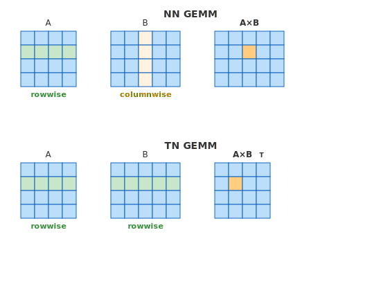

..
    Copyright (c) 2022-2026, NVIDIA CORPORATION & AFFILIATES. All rights reserved.

    See LICENSE for license information.

Performance Considerations
===================================

.. _handling_transposes:

Handling transposes
-------------------

In the last chapter we demonstrated that for FP8 on Hopper architecture,
some tensors need to be physically transposed in memory to perform needed GEMMs.
Dealing with transposes in Transformer low precision training is a bit tricky.
Let's start by introducing the concept of *tensor usages*.

**Tensor usages**

Each quantized tensor may have two usages:

- *rowwise usage* -- which is used for matrix multiplication, when the consecutive elements in row are accessed,
- *columnwise usage* -- which is used for matrix multiplication, when the consecutive elements in column are accessed,

To understand what access of consecutive elements means, let's consider two matrices ``A`` and ``B``
and analyze how their elements are accessed during multiplication.

For NN (non-transposed, non-transposed) multiplication ``C = A * B``, the formula is ``C_ij = sum_k(A_ik * B_kj)``. 
To compute element ``C_ij``, we iterate over the i-th row of ``A`` (elements ``A_i0, A_i1, ...``) 
and the j-th column of ``B`` (elements ``B_0j, B_1j, ...``). Thus, ``A`` is accessed rowwise 
and ``B`` is accessed columnwise.

For NT (non-transposed, transposed) multiplication ``C = A * B^T``, the formula changes to ``C_ij = sum_k(A_ik * B_jk)``.
Now we iterate over the i-th row of ``A`` and the j-th row of ``B`` (elements ``B_j0, B_j1, ...``).
Both tensors are accessed rowwise.

The figure below illustrates these access patterns:

   Figure 1: Access patterns in matrix multiplication for matrices in ``A * B`` and ``A * B^T`` operations.

Based on the visualization above, we can derive general rules for when each matrix 
is accessed in rowwise or columnwise fashion. The key insight is that:

- The **first tensor** in a matrix multiplication is accessed along its rows (rowwise) when non-transposed,
  or along its columns (columnwise) when transposed.
- The **second tensor** follows the opposite pattern: columnwise when non-transposed, rowwise when transposed.

.. table:: Table 1: Summary of tensor access patterns based on transpose state.
   :align: center

   +------------------+--------------+---------------+
   |                  | First tensor | Second tensor |
   +------------------+--------------+---------------+
   | Non-transposed   | rowwise      | columnwise    |
   +------------------+--------------+---------------+
   | Transposed       | columnwise   | rowwise       |
   +------------------+--------------+---------------+

**Input, weight and output gradient usages**

Now let's apply these rules to a Linear layer. During training, a Linear layer performs 
three GEMM operations: one in the forward pass and two in the backward pass.

.. table:: Table 2: Tensor access patterns for GEMM operations in a Linear layer during training.
   :align: center

   +-------------------+-------------------------------------+---------------------------+---------------------------+
   | GEMM              | Formula                             | First tensor usage        | Second tensor usage       |
   +===================+=====================================+===========================+===========================+
   | Forward           | ``output = input * weight^T``       | input: rowwise            | weight: rowwise           |
   +-------------------+-------------------------------------+---------------------------+---------------------------+
   | Weight gradient   | ``wgrad = output_grad^T * input``   | output_grad: columnwise   | input: columnwise         |
   +-------------------+-------------------------------------+---------------------------+---------------------------+
   | Input gradient    | ``dgrad = output_grad * weight``    | output_grad: rowwise      | weight: columnwise        |
   +-------------------+-------------------------------------+---------------------------+---------------------------+

An important observation is that the **forward pass uses only rowwise tensors** - both input 
and weight are accessed rowwise.

The backward pass introduces columnwise access. For weight gradient, both output gradient and input
are accessed columnwise. For input gradient, output gradient is rowwise while weight is columnwise.

As a result, each tensor (input, weight, output gradient) needs both rowwise and columnwise 
usages during training. This has implications for memory layout and transpose operations.

**Architecture differences**

The physical memory layout requirements for rowwise and columnwise usages differ between architectures 
and recipes. For FP8 tensors:

- *Hopper*: cannot efficiently access elements in columnwise fashion, so columnwise tensors need to be physically transposed in memory. Note that higher precision formats (BF16/FP16) do not have this limitation.
- *Blackwell*: supports columnwise access natively, so no transpose is needed.

We will see that for most of the recipes and devices, rowwise usage and columnwise usage need different tensors.
Thus by *rowwise tensor* and *columnwise tensor* we mean tensors that are used in rowwise and columnwise usages respectively.

.. figure:: img/hopper_vs_blackwell_layout.svg
   :align: center
   :alt: Comparison of rowwise and columnwise tensor layouts on Blackwell vs Hopper

   Figure 2: On Blackwell, rowwise and columnwise usages share the same memory layout. 
   On Hopper, columnwise usage requires a physical transpose.

**Quantization fusions**

This section is relevant only for recipes for which columnwise tensors
are different from rowwise tensors. 

Note that performing rowwise and columnwise quantization at the same time
enables some fusions, which usually lead to better performance.
We showcase 3 example scenarios of producing quantized tensors in rowwise and columnwise usages,
TE will use best possible fusion for given recipe and TE module configuration:

1. *Computation of quantized tensor in both rowwise and columnwise usages in a single kernel in forward pass*. 

   This is the fastest one,
   but since the columnwise usage is saved for backward pass, it may lead to increased memory usage, 
   if the high precision tensor also needs to be saved for backward - for example if it is the attention output which is saved anyway.

2. *Computation of quantized tensor in rowwise usage in forward pass and fused quantization to produce columnwise usage in backward pass*. 

   This is usually slower than the previous one, since high precision tensor needs to be read twice.
   It is used for example when high precision tensor is gathered both in forward and in backward 
   and quantized tensor gather is not implemented for such recipe.

3. *Computation of quantized tensor in rowwise usage in forward pass and transpose to columnwise usage in backward pass*. 

   It is more memory efficient than Option 1, but not all recipes can utilize it (otherwise
   the quantization accuracy would drop due to double quantization errors).

Transformer Engine chooses the best possible fusion internally taking the recipe and the operation into account.

.. raw:: html
   :file: img/transpose_fusion.svg

*Figure 3: Three scenarios of producing quantized tensors in rowwise and columnwise usages.*

Memory usage
------------

This section discusses memory usage in low precision training. 
Contrary to intuition, FP8 training does not always reduce memory compared to BF16/FP16.

*Master weights*

Transformer Engine by default stores weights in high precision and quantizes them to low precision before each GEMM.
Moreover, one can specify which high precision should be used to store the weights in the
model (FP32/BF16/FP16) -- or choose not to store high precision weights in the model at all.
There are multiple scenarios to consider, three of them are listed below:

1. model weights are in FP32, quantized to low precision before each GEMM,
2. model weights are in BF16/FP16, quantized to low precision before each GEMM, master weights in optimizer are in FP32.
3. model weights are stored directly in low precision, and master weights in optimizer are in FP32.

Note that each of these scenarios may have different memory footprint.

*Activations saved for backward*

Unlike weights, activations do not require a high precision copy for optimizer updates. 
As shown in Table 2, the input needs rowwise usage in forward and columnwise usage 
for weight gradient computation in backward — so it must be saved between passes.

The memory impact depends on which scenario from Figure 3 is used.
Additionally, on architectures where rowwise and columnwise usage tensors share the same memory layout 
(e.g., FP8 on Blackwell, as shown in Figure 2), a single quantized tensor serves both usages, 
reducing memory overhead compared to architectures requiring separate tensors.

Output gradients, on the other hand, are computed during backward and do not need to be saved — 
both rowwise and columnwise usages are produced on the fly as needed.

The FP8 examples below are analyzed on Hopper (SM90) or Ada (SM89) architecture, where rowwise 
and columnwise tensors require separate memory layouts.

.. tabs::

   .. tab:: PyTorch

      **1. Baseline: high precision forward pass**

      Let's start with a forward pass in higher precision to establish a baseline.

      .. raw:: html

         

            Needs to be run on SM89 (Ada) or SM90 (Hopper)
         

      .. literalinclude:: memory_usage_1_pytorch.py
         :language: python
         :start-after: # START_MEMORY_USAGE_1
         :end-before: # END_MEMORY_USAGE_1

      .. raw:: html

         

            Output:
         

      
      .. container:: program-output
      
         .. literalinclude:: memory_usage_1_pytorch.out
            :language: text
            :start-after: # START_MEMORY_USAGE_1
            :end-before: # END_MEMORY_USAGE_1
      
      Layer size is ``1024 * 1024 * 2 (2 bytes per parameter) = 2MB``.
      Memory after forward pass is ``2 MB (weight) + 2 MB (input saved for backward) + 2 MB (output) = 6 MB``.
      
      **2. FP8 training with model weights in BF16**

      Now let's see the memory usage in FP8 training with high precision weights.

      .. raw:: html

         

            Needs to be run on SM89 (Ada) or SM90 (Hopper)
         

      
      .. literalinclude:: memory_usage_2_pytorch.py
         :language: python
         :start-after: # START_MEMORY_USAGE_2
         :end-before: # END_MEMORY_USAGE_2

      .. raw:: html

         

            Output:
         

      
      .. container:: program-output
      
         .. literalinclude:: memory_usage_2_pytorch.out
            :language: text
            :start-after: # START_MEMORY_USAGE_2
            :end-before: # END_MEMORY_USAGE_2
      
      Total memory usage is ``2 MB (weight) + 1 MB (weight in FP8) + 1 MB (input in FP8 saved for backward) + 2 MB (output) = 6 MB``.
      
      **3. FP8 inference with model weights stored directly in low precision**

      For inference scenarios, model weights can be stored directly in low precision. Since we are only 
      performing forward passes without gradient updates, master weights in high precision are not needed.

      .. raw:: html

         

            Needs to be run on SM89 (Ada) or SM90 (Hopper)
         

      .. literalinclude:: memory_usage_3_pytorch.py
         :language: python
         :start-after: # START_MEMORY_USAGE_3
         :end-before: # END_MEMORY_USAGE_3

      .. raw:: html

         

            Output:
         

      
      .. container:: program-output
      
         .. literalinclude:: memory_usage_3_pytorch.out
            :language: text
            :start-after: # START_MEMORY_USAGE_3
            :end-before: # END_MEMORY_USAGE_3

      Total memory usage is ``1 MB (weight in FP8) + 2 MB (output) = 3 MB``.
      This is lower than the BF16 baseline (6 MB) since no copies are saved for backward in inference mode.
      
      **4. Saving original input instead of quantized**

      By default, TE saves the columnwise quantized input for the backward pass (needed for weight gradient).
      However, when the high precision input is already being saved (e.g., for a residual connection),
      keeping an additional quantized copy wastes memory.

      The ``save_original_input=True`` option tells the layer to reference the original high precision input
      instead of caching a separate quantized copy. The input is re-quantized during backward when needed.
      Below is an example with a residual block where input is kept for the addition:

      .. raw:: html

         

            Needs to be run on SM89 (Ada) or SM90 (Hopper)
         

      .. literalinclude:: save_original_input_pytorch.py
         :language: python
         :start-after: # START_SAVE_ORIGINAL_INPUT
         :end-before: # END_SAVE_ORIGINAL_INPUT

      .. raw:: html

         

            Output:
         

      
      .. container:: program-output

         .. literalinclude:: save_original_input_pytorch.out
            :language: text
            :start-after: # START_SAVE_ORIGINAL_INPUT
            :end-before: # END_SAVE_ORIGINAL_INPUT

   .. tab:: JAX

      **1. Baseline: high precision forward pass**

      Let's start with a forward pass in higher precision to establish a baseline.

      .. raw:: html

         

            Needs to be run on SM89 (Ada) or SM90 (Hopper)
         

      .. literalinclude:: memory_usage_1_jax.py
         :language: python
         :start-after: # START_MEMORY_USAGE_1
         :end-before: # END_MEMORY_USAGE_1

      .. raw:: html

         

            Output:
         

      
      .. container:: program-output
      
         .. literalinclude:: memory_usage_1_jax.out
            :language: text
            :start-after: # START_MEMORY_USAGE_1
            :end-before: # END_MEMORY_USAGE_1
      
      Layer size is ``1024 * 1024 * 2 (2 bytes per parameter) = 2MB``.
      Memory after forward pass is ``2 MB (weight) + 2 MB (input saved for backward) = 4 MB``.
      
      **2. FP8 training with master weights in BF16**

      Now let's see the memory usage in FP8 training with high precision weights.

      .. raw:: html

         

            Needs to be run on SM89 (Ada) or SM90 (Hopper)
         

      
      .. literalinclude:: memory_usage_2_jax.py
         :language: python
         :start-after: # START_MEMORY_USAGE_2
         :end-before: # END_MEMORY_USAGE_2

      .. raw:: html

         

            Output:
         

      
      .. container:: program-output
      
         .. literalinclude:: memory_usage_2_jax.out
            :language: text
            :start-after: # START_MEMORY_USAGE_2
            :end-before: # END_MEMORY_USAGE_2
      
      Memory after forward pass is ``2 MB (weight in BF16) + 1 MB (input in FP8) + 1 MB (weight in FP8) = 4 MB``.

Fused layers
------------

Transformer Engine provides fused layers such as ``LayerNormLinear`` (``LayerNormDenseGeneral`` in JAX) and ``LayerNormMLP`` 
that enable kernel fusion optimizations. One key optimization is fusing layer normalization 
with quantization.

In a typical Transformer architecture, LayerNorm precedes a Linear layer. Without fusion, 
the LayerNorm outputs in high precision, and the Linear layer must then quantize this input before 
performing the GEMM — adding overhead. With ``LayerNormLinear``, these operations are fused 
into a single kernel: the LayerNorm output is quantized directly, eliminating the separate 
quantization step and reducing memory movement.

.. raw:: html
   :file: img/fused_layers.svg

*Figure 4: Comparison of separate LayerNorm and Linear layers versus fused LayerNormLinear layer, showing reduced quantization overhead.*

Let's see how we can use fused layers in different frameworks.

.. tabs::

   .. tab:: PyTorch

      In PyTorch, Transformer Engine provides fused layers like ``LayerNormLinear`` and ``LayerNormMLP``.
      These layers combine normalization and linear operations with optimized quantization.

      .. raw:: html

         

            Needs to be run on SM89+ (Ada, Hopper, Blackwell, or newer)
         

      .. literalinclude:: fused_layers_pytorch.py
         :language: python
         :start-after: # START_FUSED_LAYERS
         :end-before: # END_FUSED_LAYERS
      
      The fused ``LayerNormLinear`` layer is particularly efficient in FP8 training because 
      it avoids an intermediate quantization step. The LayerNorm output is directly quantized 
      for the GEMM operation, reducing memory movement and improving performance.

   .. tab:: JAX

      In JAX, Transformer Engine provides fused layers like ``LayerNormDenseGeneral`` and ``LayerNormMLP``.
      These layers combine normalization and dense operations with optimized quantization.

      .. raw:: html

         

            Needs to be run on SM89+ (Ada, Hopper, Blackwell, or newer)
         

      .. literalinclude:: fused_layers_jax.py
         :language: python
         :start-after: # START_FUSED_LAYERS
         :end-before: # END_FUSED_LAYERS
      
      The fused ``LayerNormDenseGeneral`` layer is particularly efficient in FP8 training because 
      it avoids an intermediate quantization step. The LayerNorm output is directly quantized 
      for the GEMM operation, reducing memory movement and improving performance.

Distributed training
--------------------

Transformer Engine handles collective operations internally, so users typically don't need to manage 
the interaction between communication and low precision computation.

Recall that each Linear layer involves six tensors: weight, input, output, and their gradients. 
Of these, output and gradients are returned in high precision, and weights are generally not 
communicated (except in FSDP, which is outside the scope of this section). This leaves two 
tensors where low precision communication matters: **input** and **output gradient**.

For sequence parallelism, TE supports all-gather of quantized tensors. This provides several benefits:

1. *Reduced memory usage* — no need to store high precision tensors for backward pass.
2. *Reduced communication* — smaller tensors mean less data to transfer.
3. *Parallelized quantization* — quantization work is distributed across GPUs.

Support varies by recipe — for example, columnwise quantized all-gather is not available 
for all configurations.

The figure below illustrates one possible all-gather scenario for input and output gradient tensors. 
Actual behavior depends on the recipe and module configuration.

.. raw:: html
   :file: img/sequence_parallel_quantization.svg

*Figure 5: All-gather of quantized tensors for input and gradient tensors. 
This is one possible scenario — actual behavior varies depending on the recipe and module configuration.*

