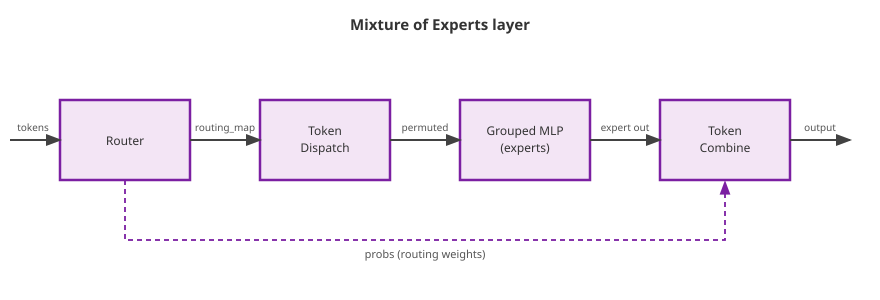
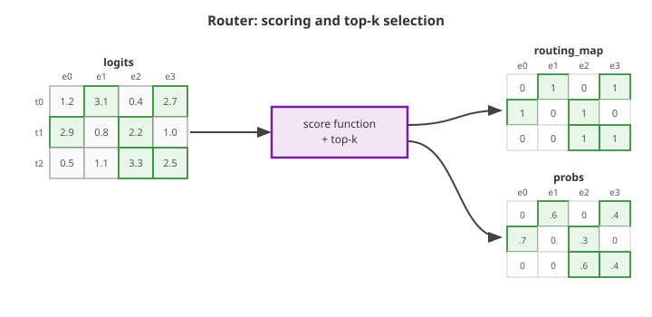
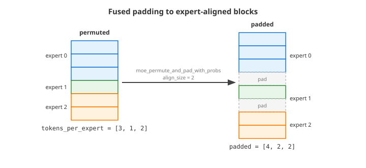
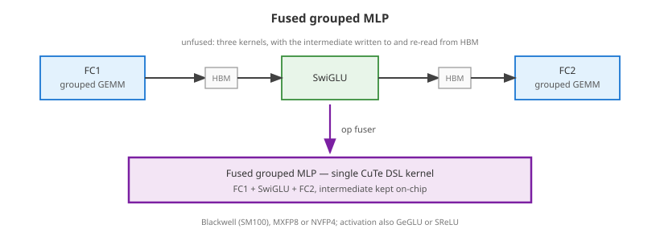
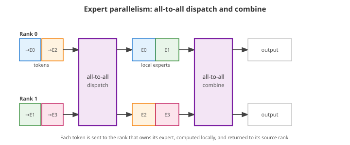

..
    Copyright (c) 2022-2026, NVIDIA CORPORATION & AFFILIATES. All rights reserved.

    See LICENSE for license information.

.. _moe-overview:

Mixture of Experts
==================

Mixture of Experts (MoE) layers replace a dense feed-forward network with a set
of expert networks and a router that sends each token to one or more experts.
This keeps the activated parameter count per token small while allowing the
model to scale to many more total parameters.

A token passes through an MoE layer in four stages:

#. The **router** scores the experts for each token and selects the top-k of
   them.
#. **Token dispatch** gathers the tokens into expert-contiguous order.
#. The **grouped MLP** (the experts) runs a single batched computation over all
   expert blocks.
#. **Token combine** scatters the expert outputs back into the original token
   order, merging the contributions when a token was sent to more than one
   expert.

   Figure 1: The four stages of an MoE layer. The router produces the
   ``routing_map`` consumed by token dispatch and the ``probs`` used as merging
   weights in token combine.

Transformer Engine provides an optimized building block for each stage. They are
exposed as standalone functions, so they can be assembled into a complete MoE
layer or dropped into an existing implementation one piece at a time:

* The **router** fuses the score function with the top-k selection, and provides
  a fused load-balancing loss.
* **Token dispatch and combine** move tokens between their original order and the
  expert-contiguous layout using optimized kernels instead of Python-level
  gather / sort / concatenate chains.
* **Grouped GEMM** primitives execute the expert linear layers efficiently once
  the tokens are laid out in expert-contiguous blocks.

The :ref:`end-to-end example <moe-putting-it-together>` at the bottom of this
page wires the four stages together; the sections in between describe each
building block on its own.

Router
------

The router decides which experts each token is sent to. It applies a score
function to the gating logits, selects the top-k experts per token, and produces
the two tensors that drive the rest of the layer:

* ``routing_map`` - a ``[num_tokens, num_experts]`` mask marking the selected
  experts. Token dispatch uses it to lay the tokens out by expert.
* ``probs`` - the routing weight of each selected expert. Token combine uses
  these as merging weights when a token was routed to more than one expert.

Transformer Engine fuses the score function and the top-k selection into a single
differentiable kernel, exposed as ``fused_topk_with_score_function`` in both
``transformer_engine.pytorch.router`` and ``transformer_engine.jax.router``. All
internal math runs in FP32 for numerical stability, regardless of the logits
dtype.

   Figure 2: The router scores the experts for each token and keeps the top-k.
   The selected entries populate ``routing_map`` (a 0/1 mask) and ``probs`` (the
   routing weights); all other entries are zero.

The kernel covers the score functions and selection variants used by common MoE
architectures:

* **Score function:** ``"softmax"`` or ``"sigmoid"`` (the PyTorch API also offers
  ``"sqrtsoftplus"``). With softmax, ``use_pre_softmax`` selects whether the
  softmax is applied before or after the top-k.
* **Grouped (device-limited) routing:** ``num_groups`` and ``group_topk`` restrict
  selection to a subset of expert groups, as in DeepSeek-style routing.
* **Expert bias:** with the sigmoid score function, ``expert_bias`` shifts the
  selection without changing the returned weights - the bias-adjustment scheme
  used for auxiliary-loss-free load balancing.
* **Scaling:** ``scaling_factor`` rescales the returned probabilities.

.. tabs::

   .. tab:: PyTorch

      .. literalinclude:: router_pytorch.py
         :language: python
         :start-after: # START_ROUTER_PYTORCH
         :end-before: # END_ROUTER_PYTORCH

   .. tab:: JAX

      .. literalinclude:: router_jax.py
         :language: python
         :start-after: # START_ROUTER_JAX
         :end-before: # END_ROUTER_JAX

Load balancing
~~~~~~~~~~~~~~~

Left unconstrained, a router tends to collapse onto a handful of experts. The
usual remedy is an auxiliary load-balancing loss that rewards spreading tokens
evenly across experts. Transformer Engine computes it with ``fused_moe_aux_loss``
from the per-expert token counts and the *dense* routing scores - one value per
expert rather than only the selected top-k - so the loss has a gradient with
respect to every expert's logit. Those dense scores come from
``fused_compute_score_for_moe_aux_loss`` in PyTorch, or from
``fused_topk_with_score_function(..., compute_aux_scores=True)`` in JAX.

.. tabs::

   .. tab:: PyTorch

      .. literalinclude:: router_pytorch.py
         :language: python
         :start-after: # START_ROUTER_AUX_PYTORCH
         :end-before: # END_ROUTER_AUX_PYTORCH

   .. tab:: JAX

      .. literalinclude:: router_jax.py
         :language: python
         :start-after: # START_ROUTER_AUX_JAX
         :end-before: # END_ROUTER_AUX_JAX

Routing Kernels
---------------

Once the router has produced a routing map, the tokens must be moved into the
expert-contiguous layout expected by the grouped GEMM (``GroupedLinear`` in
PyTorch, ``grouped_dense`` in JAX) and, afterwards, moved back. Transformer
Engine provides differentiable kernels for both directions. The rest of this
section focuses on the two core operations - token dispatch and token combine -
because they illustrate the layout transformation used by the other variants.

The snippets below show one concrete instance of this pattern: the mask-map
routing path, exposed in PyTorch as ``transformer_engine.pytorch.moe_permute``
and ``transformer_engine.pytorch.moe_unpermute``, and in JAX as
``transformer_engine.jax.permutation.token_dispatch`` and
``transformer_engine.jax.permutation.token_combine``. Other routing variants
(for example, index-map routing in PyTorch via ``map_type="index"``) are
available in both frameworks and follow the same pattern; see the
:doc:`PyTorch API reference <../api/pytorch>` and
:doc:`JAX API reference <../api/jax>` for the complete list and signatures.
The mask-map APIs have different framework-specific wrappers, but lower to the
same shared Triton permutation kernels, and both pairs are differentiable so they
can be used directly inside training graphs.

Token Dispatch
~~~~~~~~~~~~~~

Token dispatch is the canonical routing operation: given the original token
tensor and a routing map describing each token's destination expert, it returns
a permuted token buffer in which all rows assigned to the same expert are
stored contiguously. In PyTorch this operation is exposed as ``moe_permute``;
in JAX it is exposed as ``token_dispatch``. This is exactly the layout that
the grouped linear layer consumes via its per-expert token-count argument
(``m_splits`` in PyTorch ``GroupedLinear``, ``group_sizes`` in JAX
``grouped_dense``), so token dispatch followed by the grouped GEMM forms a
typical MoE forward block.

.. figure:: img/moe_permute.svg
   :align: center
   :alt: Token dispatch reorders tokens so that all tokens assigned to the same expert are contiguous

   Figure 3: Token dispatch consumes the input token tensor together with the
   routing map and produces an expert-contiguous token tensor; rows
   assigned to the same expert are stored back-to-back.

A typical call looks like:

.. tabs::

   .. tab:: PyTorch

      .. literalinclude:: moe_permute_pytorch.py
         :language: python
         :start-after: # START_MOE_PERMUTE_PYTORCH
         :end-before: # END_MOE_PERMUTE_PYTORCH

   .. tab:: JAX

      .. literalinclude:: moe_permute_jax.py
         :language: python
         :start-after: # START_MOE_PERMUTE_JAX
         :end-before: # END_MOE_PERMUTE_JAX

Both variants return the permuted token buffer of shape
``[num_out_tokens, hidden_size]`` together with a ``row_id_map`` that
carries enough information for token combine to restore the original token
order once the expert computation is done. Token dispatch and token combine
are typically used as a matched pair around the grouped GEMM call.

Token Combine
~~~~~~~~~~~~~

Token combine is the inverse routing operation: it takes the expert-contiguous
output produced by the grouped GEMM (or any per-expert computation) and the
``row_id_map`` returned by token dispatch, and returns a single tensor of
shape ``[num_tokens, hidden_size]`` with the rows written back into the
original token order. In PyTorch this operation is exposed as
``moe_unpermute``; in JAX it is exposed as ``token_combine``.

For top-1 routing each token has exactly one expert contribution, so
``merging_probs`` is omitted. For top-k routing pass the per-token expert
weights as ``merging_probs`` and the kernel computes a weighted sum of the
per-expert contributions in the same fused pass; without it the per-expert
contributions are summed unweighted. In PyTorch, also pass
``restore_shape=(num_tokens, hidden_size)`` whenever the permuted buffer has more
rows than the original tokens (top-k routing); JAX infers the original token
count from the ``row_id_map``.

.. figure:: img/moe_unpermute.svg
   :align: center
   :alt: Token combine restores expert outputs back into the original token order

   Figure 4: Token combine reads the expert-contiguous output tensor and the
   ``row_id_map``, and writes each row back to its original token slot. With
   ``merging_probs``, contributions from multiple experts to the same token are
   combined in the same fused kernel.

A typical call looks like:

.. tabs::

   .. tab:: PyTorch

      .. literalinclude:: moe_unpermute_pytorch.py
         :language: python
         :start-after: # START_MOE_UNPERMUTE_PYTORCH
         :end-before: # END_MOE_UNPERMUTE_PYTORCH

   .. tab:: JAX

      .. literalinclude:: moe_unpermute_jax.py
         :language: python
         :start-after: # START_MOE_UNPERMUTE_JAX
         :end-before: # END_MOE_UNPERMUTE_JAX

Token probabilities
~~~~~~~~~~~~~~~~~~~~

In top-k routing each token contributes to several experts, and those
contributions are recombined using the routing weights. There are two equivalent
places to apply the weights:

* **At combine (output side).** Pass the routing weights to token combine as
  ``merging_probs``; it forms the weighted sum of the per-expert contributions in
  the same fused pass. This is the path used in the examples above.
* **At dispatch (input side).** Scale each expert's input by its routing weight
  before the grouped GEMM. ``moe_permute_with_probs`` (PyTorch) and the ``probs``
  argument of ``token_dispatch`` (JAX) permute a probability tensor alongside the
  tokens, so the weights arrive already aligned with the expert-contiguous
  layout.

Padding and alignment
~~~~~~~~~~~~~~~~~~~~~~~

Grouped GEMM backends are most efficient when each expert's token block starts at
an aligned offset (for example, a multiple of 128 rows). Because the number of
tokens routed to an expert is data dependent, the blocks are generally ragged.
Transformer Engine can pad each block up to a multiple of ``align_size`` as part
of the dispatch kernel, avoiding a separate padding pass.

   Figure 5: Each expert's block is rounded up to a multiple of ``align_size``.
   The per-expert padding offsets are returned so that token combine can drop the
   padding again.

In PyTorch this is ``moe_permute_and_pad_with_probs``; in JAX it is the
``align_size`` argument of ``token_dispatch``. Both return the padded token
buffer, the aligned per-expert token counts (used as ``m_splits`` /
``group_sizes`` for the grouped GEMM), and the per-expert ``pad_offsets`` that
token combine needs in order to remove the padding.

.. tabs::

   .. tab:: PyTorch

      .. literalinclude:: moe_permute_pad_pytorch.py
         :language: python
         :start-after: # START_MOE_PERMUTE_PAD_PYTORCH
         :end-before: # END_MOE_PERMUTE_PAD_PYTORCH

   .. tab:: JAX

      .. literalinclude:: moe_permute_pad_jax.py
         :language: python
         :start-after: # START_MOE_PERMUTE_PAD_JAX
         :end-before: # END_MOE_PERMUTE_PAD_JAX

Reordering expert chunks
~~~~~~~~~~~~~~~~~~~~~~~~~

When experts are sharded across devices, the per-expert token blocks often have
to be reordered - for example, to regroup tokens by destination rank before an
all-to-all, or to restore the original grouping afterwards.
``moe_sort_chunks_by_index`` (PyTorch) and ``sort_chunks_by_index`` (JAX) permute
contiguous chunks of a token tensor according to a list of chunk sizes and a
permutation of chunk indices, without falling back to Python-level slicing and
concatenation. ``moe_sort_chunks_by_index_with_probs`` reorders an accompanying
probability tensor in the same call.

Grouped GEMM
------------

The straightforward way to apply per-expert linear layers is to loop over the
experts and call a separate ``Linear`` for each one. This is correct, but it
is not the most efficient way to execute many expert GEMMs.

Transformer Engine provides a grouped GEMM primitive
(``GroupedLinear`` in PyTorch and ``grouped_dense`` in JAX) - an optimized
replacement that produces the same outputs as the loop while using
implementations that are better suited for MoE workloads.

Let ``G`` be the number of experts. For expert ``i``, ``X_i`` is the routed
token block, ``W_i`` is the expert weight, and ``b_i`` is the optional bias:

.. math::

   Y_i = X_i W_i^T + b_i,\quad i = 0, \ldots, G - 1

The full layer output is the concatenation of all expert outputs:

.. math::

   Y = \mathrm{concat}(Y_0, Y_1, \ldots, Y_{G-1})

The grouped GEMM is told how many token rows belong to each expert via a
per-expert token-count argument: ``m_splits`` in PyTorch ``GroupedLinear`` and
``group_sizes`` in JAX ``grouped_dense``.

.. figure:: img/grouped_linear.svg
   :align: center
   :alt: Comparison between launching one Linear per expert and using one grouped GEMM call for all expert blocks

   Figure 6: Both paths produce the same outputs from the same inputs. The
   baseline launches one ``Linear`` per expert, while the grouped GEMM
   (``GroupedLinear`` in PyTorch, ``grouped_dense`` in JAX) is an optimized
   grouped implementation that replaces the loop.

The following snippets show how to replace the loop with the grouped GEMM.
They assume the tokens have already been permuted into expert-contiguous order.

.. tabs::

   .. tab:: PyTorch

      .. literalinclude:: grouped_linear_pytorch.py
         :language: python
         :start-after: # START_GROUPED_LINEAR_PYTORCH
         :end-before: # END_GROUPED_LINEAR_PYTORCH

   .. tab:: JAX

      .. literalinclude:: grouped_linear_jax.py
         :language: python
         :start-after: # START_GROUPED_LINEAR_JAX
         :end-before: # END_GROUPED_LINEAR_JAX

The grouped GEMM uses implementations tuned for grouped expert execution:

* **Optimized backends:** Transformer Engine selects from several grouped GEMM
  backends depending on the framework, datatype, and GPU architecture. This
  can be, for example, cuBLAS GEMMs launched on multiple CUDA streams or a
  single grouped GEMM kernel, among other backend-specific implementations.
* **Recipe compatibility:** the grouped GEMM is integrated with
  Transformer Engine's :doc:`low-precision training stack
  <low_precision_training/index>`, so the same recipes available to regular
  ``Linear`` layers - FP8 (delayed, current, and blockwise scaling), MXFP8, and
  NVFP4 - can be used for MoE experts.
* **Fused quantization:** Low-precision grouped GEMM paths can fuse
  quantization-related work such as scale computation, casting, and
  cast/transpose steps across experts instead of repeating the same work in a
  Python loop.
* **Fused expert MLP:** Through the :doc:`operation-based API
  <../examples/op_fuser/op_fuser>`, the two expert GEMMs and the activation
  between them can be fused into a single grouped operation on recent
  architectures, removing the intermediate round trips to memory.

The PyTorch ``GroupedLinear`` module also supports the features expected of a
Transformer Engine linear layer - tensor and sequence parallelism, gradient
accumulation fusion, and FP8 weight caching - so it can serve as a drop-in expert
layer. See the :doc:`PyTorch API reference <../api/pytorch>` for the full
signature.

.. _moe-putting-it-together:

Putting it together
-------------------

The building blocks assemble into the four-stage MoE layer from Figure 1: route,
dispatch, run the experts, and combine. The example below wires them together for
top-k routing.

.. tabs::

   .. tab:: PyTorch

      .. literalinclude:: moe_layer_pytorch.py
         :language: python
         :start-after: # START_MOE_LAYER_PYTORCH
         :end-before: # END_MOE_LAYER_PYTORCH

   .. tab:: JAX

      .. literalinclude:: moe_layer_jax.py
         :language: python
         :start-after: # START_MOE_LAYER_JAX
         :end-before: # END_MOE_LAYER_JAX

This uses dropless routing (``num_out_tokens = num_tokens * top_k``), so the
dispatch buffer is sized statically rather than from a device-to-host sync. The
expert step is the grouped MLP from the previous section; a full expert MLP
stacks two grouped GEMMs around an activation. Every stage is differentiable, so
the assembled layer trains end to end.

Fused grouped MLP
-----------------

An expert MLP is two grouped GEMMs with an activation between them: the first
projects into the (gated) feed-forward dimension, the activation is applied, and
the second projects back. Running these as separate kernels writes the large
intermediate activation out to HBM and reads it back for the second GEMM, and
re-quantizes it in a separate pass.

On Blackwell (SM100) GPUs, Transformer Engine can fuse the whole expert MLP -
both grouped GEMMs and the activation - into a single CuTe DSL kernel. The
intermediate stays on chip and the cross-expert quantization is folded into the
GEMMs, removing the HBM round-trip and the extra kernel launches.

   Figure 7: The operation fuser replaces the first grouped GEMM, the activation,
   and the second grouped GEMM with a single fused grouped-MLP kernel that keeps
   the intermediate on chip.

The fusion is exposed through the operation-based API and applied automatically
by the :doc:`operation fuser <../examples/op_fuser/op_fuser>`: when it sees a
grouped linear, a scaled GLU (or SReLU) activation, and another grouped linear in
sequence, it replaces them with one fused grouped-MLP operation. No change to the
forward code is needed to opt in.

.. literalinclude:: grouped_mlp_pytorch.py
   :language: python
   :start-after: # START_GROUPED_MLP_PYTORCH
   :end-before: # END_GROUPED_MLP_PYTORCH

The fused path is taken when all of the following hold; otherwise the three ops
run separately and produce identical results:

* **Architecture:** Blackwell (SM100) with cuDNN frontend 1.23 or newer.
* **Recipe:** a block-scaled low-precision recipe - MXFP8, or NVFP4 with the
  randomized Hadamard transform enabled.
* **Opt-in:** the environment variable ``NVTE_CUTEDSL_FUSED_GROUPED_MLP=1``.
* **Activation:** a scaled ``SwiGLU`` / ``GeGLU`` (gated) or ``SReLU`` (unary),
  with feature dimensions aligned to 64 and the token count to 128.

Expert parallelism
------------------

The grouped GEMM keeps all experts on a single device. When the experts no longer
fit there - or to add another dimension of parallelism - they are sharded across
devices, a scheme called expert parallelism (EP). Each device then owns only a
slice of the experts, so a token routed to a non-local expert has to travel to
the device that owns it.

That data movement is two all-to-all collectives wrapped around the local expert
computation: a **dispatch** all-to-all sends each token to the rank that owns its
expert, the local grouped GEMM runs, and a **combine** all-to-all returns the
results to the source rank. It is the distributed counterpart of the token
dispatch and token combine kernels described above.

   Figure 8: With experts sharded across ranks, a dispatch all-to-all routes each
   token to the rank owning its expert and a combine all-to-all returns the
   outputs to the source rank.

Transformer Engine provides expert parallelism at two levels:

* **JAX MoE layer.** ``transformer_engine.jax.moe.moe`` runs the entire layer -
  router, dispatch, grouped expert GEMMs, and combine - as a single
  differentiable call. Naming a mesh axis with ``ep_axis`` turns the dispatch and
  combine steps into ``jax.lax.ragged_all_to_all`` collectives over that axis.
  This API is currently experimental.
* **NCCL EP backend.** A common C API (``nvte_ep_dispatch`` / ``nvte_ep_combine``
  and their backward passes, declared in
  ``transformer_engine/common/include/transformer_engine/ep.h``) implements the
  dispatch and combine all-to-alls directly on NCCL, using NCCL symmetric-memory
  windows for zero-copy transfers. It is compiled in with ``NVTE_WITH_NCCL_EP``
  (Hopper or newer, NCCL 2.30.4+) and provides the high-performance communication
  path that the framework layers build on.

A minimal call to the JAX layer, with experts sharded over the ``"ep"`` mesh
axis:

.. literalinclude:: moe_expert_parallel_jax.py
   :language: python
   :start-after: # START_MOE_EXPERT_PARALLEL_JAX
   :end-before: # END_MOE_EXPERT_PARALLEL_JAX
