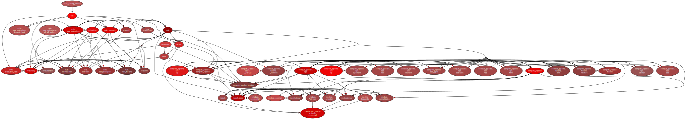

# Architecure

_Generated with `pydeps .\transformer_engine\pytorch\sequential\ --only transformer_engine.pytorch.sequential --rmprefix transformer_engine.pytorch.sequential.`_

## `ComputePipeline` and `Op`s

The provided modules are a PyTorch interface to a framework-oblivious implementation present in `ops`. All modules are decomposed into `Op`s. An `Op` models a practically atomic operation. For example, a `Linear` layer is split into either an `MMT` (MatMulTranspose) and `Add` `Op` or into just an `MMT` `Op`. Such an `Op` can be thought of as a combination of an `nn.Module` and an `autograd.Function`, in the sense that it:
1. Stores its trainable parameters (exposed through `require_grad`), like an `nn.Module`.
2. Provides a `forward`, `backward` (and `inference`) method, like an `autograd.Function`.
This is done to reduce the amount of needless boilerplate code. This allows for `Op` implementations to remain short, clean, and simple.

The `Sequential` module itself is just a wrapper around a `ComputePipeline` object that is actually responsible for executing its constituent `Op`s, as well as managing the interaction between them, such as type inference or model parallelism.

## Fusions

Fusions of `Op`s are declared separately from them, making individual `Op`s self-contained and oblivious to the existence of other `Op`s.

## Commands

The implementations of the `forward`, `backward`, and `inference` passes for `Op`s and fusions use types and functions defined in `nvte`. This makes them oblivious to the framework, as instead of using `torch.Tensor`s, they use `nvte.Tensor`s, which, contrary to `torch.Tensor`s support FP8 `dtype`s.

## Dependencies

Currently, the code is structured in such a way, to maintain separation of concerns and the principle of least knowledge. While writing new code, maintain the current dependency graph:

* `nvte` depends on `cpp_extensions`
* `cpp_extensions` depends on `cppsrc`
* `ops` depends on `nvte`
* `fusions` depends on `nvte`
* `fusions` depends on `ops`
* `compute_pipeline` depends on `ops`
* `compute_pipeline` depends on `fusions`
* `module` depends on `compute_pipeline`

For example:
* `torch` **must not** be imported anywhere inside of the `compute_pipeline` folder
* `cpp_extensions` **must not** be imported anywhere, except for inside `nvte`
* `fusions` **must not** be imported anywhere, except for `compute_pipeline.py`
